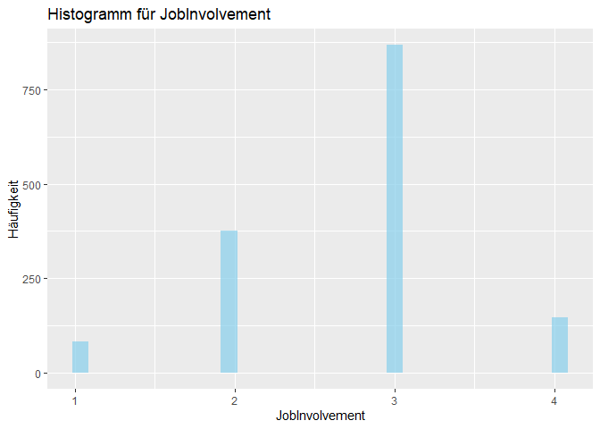
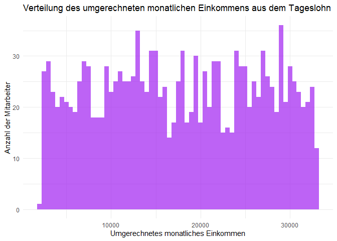

# 1. Business Understanding

## 1.1 Zielsetzung

Das übergeordnete Ziel dieses Berichts ist es, die Faktoren zu identifizieren und zu analysieren, die die Jobzufriedenheit von Mitarbeitern beeinflussen. Dabei möchten wir insbesondere verstehen, wie verschiedene Aspekte wie Gehalt, Arbeitsbedingungen, Mitarbeiterbeziehungen und anerkannte Arbeitsleistung die Zufriedenheit am Arbeitsplatz beeinflussen. Die Ergebnisse dieser Analyse sollen als Grundlage für HR-Entscheidungen und -Strategien dienen, um die Mitarbeiterzufriedenheit und -bindung zu verbessern.

## 1.2 Fragen, die beantwortet werden sollen

* Welche Faktoren haben den größten Einfluss auf die Jobzufriedenheit?  
* Wie korrelieren Gehalt, Arbeitsbedingungen und andere Variablen mit der Jobzufriedenheit?  
* Welche Empfehlungen können wir für die Personalabteilung ableiten, um die Mitarbeiterzufriedenheit zu verbessern?  

## 1.3 Aktualisierte These

Die zentrale These dieses Berichts lautet:  

**"Mitarbeiter, die ein höheres Gehalt erhalten, bessere Arbeitsbedingungen vorfinden, positive Mitarbeiterbeziehungen pflegen und deren Arbeitsleistung anerkannt wird bzw. deren Arbeitsanforderungen erfüllbar sind, haben eine höhere Jobzufriedenheit."**  

In diesem Zusammenhang werden spezifische Variablen wie **"MonthlyIncome"**, **"WorkLifeBalance"**, **"RelationshipSatisfaction"** und andere näher betrachtet und analysiert.

## 1.4 Methodik

Dieser Bericht wird nach dem **Cross-Industry Standard Process for Data Mining (CRISP-DM)** entwickelt. Dieses standardisierte Vorgehensmodell ermöglicht eine strukturierte und effiziente Analyse von Datensätzen und ist branchenübergreifend anerkannt. 

Der CRISP-DM-Leitfaden (Cross-Industry Standard Process for Data Mining) wurde ursprünglich im Jahr 1999 veröffentlicht. Dieser Leitfaden stellt ein Rahmenwerk für den Prozess der Datenanalyse und des Data Mining vor und hat zum Ziel, den gesamten Lebenszyklus eines Data-Mining-Projekts zu strukturieren. Der Leitfaden wurde von einem Konsortium entwickelt, das Unternehmen wie IBM, NCR Corporation und DaimlerChrysler AG umfasste.

**Der CRISP-DM-Leitfaden in Fokus: Phasen 1 und 2**

1. Business Understanding: Verständnis für die Anforderungen und Ziele.  
2. Data Understanding: Verständnis für die verfügbaren Daten und ihrer Qualität und Relevanz für die gestellte These.    

Dieser Leitfaden hat sich als sehr nützlich und anwendungsorientiert erwiesen und wird häufig in der Industrie sowie im akademischen Bereich verwendet. Er bietet eine strukturierte Herangehensweise, um Data-Mining-Projekte effizient und effektiv zu managen.

Jede dieser Phasen wird in diesem Bericht ausführlich behandelt, um einen ganzheitlichen Überblick und fundierte Schlussfolgerungen zu ermöglichen.

Nachdem ein solides Verständnis für die Anforderungen und die vorliegenden Daten erlangt wird, schließt sich in Kapitel 2 eine Explorative Datenanalyse mit Regressionsanalyse an, um die erzielten Ergebnisse im Kontext zu verstehen und eventuelle Unklarheiten oder Einschränkungen zu identifizieren.


# 2. Data Understanding

## 2.1 Einführung in den HR_Analytics-Datensatz

Der HR_Analytics-Datensatz ist eine reichhaltige Informationsquelle, welcher eine Vielzahl von Datenpunkten zur Belegschaft eines Unternehmens enthält. Dieser Datensatz ist für das Human Resource Management wichtig, da er einen detaillierten Einblick in verschiedene Aspekte des Mitarbeiterlebenszyklus gewährt. Das Spektrum der Variablen reicht von grundlegenden demografischen Informationen wie Alter ("Age") und Geschlecht ("Gender") bis hin zu komplexeren Metriken wie die Zufriedenheit mit der Arbeitsumgebung ("EnvironmentSatisfaction) und der Anzahl der Jahre im Unternehmen("YearsAtCompany").

Der zur Verfügung stehende Datensatz umfasst 38 Spalten und 1481 Zeilen.  
  
Es steht unter:  
<https://www.kaggle.com/datasets/paramitasen/powerbiproject?resource=download> zur Verfügung.  

Benutzt wird die CSV-Datei HR_Analytics unter:  
<https://www.kaggle.com/datasets/paramitasen/powerbiproject?resource=download&select=HR_Analytics.csv>.

Der Datensatz dient als Grundlage für eine breite Palette von Analysen, mit dem Ziel, die innerbetrieblichen Dynamiken besser zu verstehen. Zum Beispiel können die Daten genutzt werden, um herauszufinden, welche Faktoren die Fluktuation ("Attrition") beeinflussen oder wie sich die Entfernung zum Heim ("DistanceFromHome") auf die Zufriedenheit der Mitarbeiter auswirkt. Solche Erkenntnisse sind nicht nur für die akademische Forschung wertvoll, sondern auch für praktizierende HR-Manager, die darauf angewiesen sind, fundierte Entscheidungen auf der Grundlage solider Daten zu treffen.

Die Datenquelle könnte aus einem unternehmensinternen HR-Management-System stammen oder durch spezialisierte Umfragen und Mitarbeiterbefragungen erhoben worden sein. Die Strukturierung dieser Daten erfolgt in der Regel so, dass sie für maschinelles Lernen und fortgeschrittene statistische Analysen geeignet sind.

Zunächst importieren wir die Daten in R und nutzen die readr-Bibliothek:


```r
HR_Analytics <-read_csv("HR_Analytics.csv")
```

Um die Daten zu betrachten, verwenden wir die head()-Funktion:


```r
head(HR_Analytics)
```

<div data-pagedtable="false">
  <script data-pagedtable-source type="application/json">
{"columns":[{"label":["EmpID"],"name":[1],"type":["chr"],"align":["left"]},{"label":["Age"],"name":[2],"type":["dbl"],"align":["right"]},{"label":["AgeGroup"],"name":[3],"type":["chr"],"align":["left"]},{"label":["Attrition"],"name":[4],"type":["chr"],"align":["left"]},{"label":["BusinessTravel"],"name":[5],"type":["chr"],"align":["left"]},{"label":["DailyRate"],"name":[6],"type":["dbl"],"align":["right"]},{"label":["Department"],"name":[7],"type":["chr"],"align":["left"]},{"label":["DistanceFromHome"],"name":[8],"type":["dbl"],"align":["right"]},{"label":["Education"],"name":[9],"type":["dbl"],"align":["right"]},{"label":["EducationField"],"name":[10],"type":["chr"],"align":["left"]},{"label":["EmployeeCount"],"name":[11],"type":["dbl"],"align":["right"]},{"label":["EmployeeNumber"],"name":[12],"type":["dbl"],"align":["right"]},{"label":["EnvironmentSatisfaction"],"name":[13],"type":["dbl"],"align":["right"]},{"label":["Gender"],"name":[14],"type":["chr"],"align":["left"]},{"label":["HourlyRate"],"name":[15],"type":["dbl"],"align":["right"]},{"label":["JobInvolvement"],"name":[16],"type":["dbl"],"align":["right"]},{"label":["JobLevel"],"name":[17],"type":["dbl"],"align":["right"]},{"label":["JobRole"],"name":[18],"type":["chr"],"align":["left"]},{"label":["JobSatisfaction"],"name":[19],"type":["dbl"],"align":["right"]},{"label":["MaritalStatus"],"name":[20],"type":["chr"],"align":["left"]},{"label":["MonthlyIncome"],"name":[21],"type":["dbl"],"align":["right"]},{"label":["SalarySlab"],"name":[22],"type":["chr"],"align":["left"]},{"label":["MonthlyRate"],"name":[23],"type":["dbl"],"align":["right"]},{"label":["NumCompaniesWorked"],"name":[24],"type":["dbl"],"align":["right"]},{"label":["Over18"],"name":[25],"type":["chr"],"align":["left"]},{"label":["OverTime"],"name":[26],"type":["chr"],"align":["left"]},{"label":["PercentSalaryHike"],"name":[27],"type":["dbl"],"align":["right"]},{"label":["PerformanceRating"],"name":[28],"type":["dbl"],"align":["right"]},{"label":["RelationshipSatisfaction"],"name":[29],"type":["dbl"],"align":["right"]},{"label":["StandardHours"],"name":[30],"type":["dbl"],"align":["right"]},{"label":["StockOptionLevel"],"name":[31],"type":["dbl"],"align":["right"]},{"label":["TotalWorkingYears"],"name":[32],"type":["dbl"],"align":["right"]},{"label":["TrainingTimesLastYear"],"name":[33],"type":["dbl"],"align":["right"]},{"label":["WorkLifeBalance"],"name":[34],"type":["dbl"],"align":["right"]},{"label":["YearsAtCompany"],"name":[35],"type":["dbl"],"align":["right"]},{"label":["YearsInCurrentRole"],"name":[36],"type":["dbl"],"align":["right"]},{"label":["YearsSinceLastPromotion"],"name":[37],"type":["dbl"],"align":["right"]},{"label":["YearsWithCurrManager"],"name":[38],"type":["dbl"],"align":["right"]}],"data":[{"1":"RM297","2":"18","3":"18-25","4":"Yes","5":"Travel_Rarely","6":"230","7":"Research & Development","8":"3","9":"3","10":"Life Sciences","11":"1","12":"405","13":"3","14":"Male","15":"54","16":"3","17":"1","18":"Laboratory Technician","19":"3","20":"Single","21":"1420","22":"Upto 5k","23":"25233","24":"1","25":"Y","26":"No","27":"13","28":"3","29":"3","30":"80","31":"0","32":"0","33":"2","34":"3","35":"0","36":"0","37":"0","38":"0"},{"1":"RM302","2":"18","3":"18-25","4":"No","5":"Travel_Rarely","6":"812","7":"Sales","8":"10","9":"3","10":"Medical","11":"1","12":"411","13":"4","14":"Female","15":"69","16":"2","17":"1","18":"Sales Representative","19":"3","20":"Single","21":"1200","22":"Upto 5k","23":"9724","24":"1","25":"Y","26":"No","27":"12","28":"3","29":"1","30":"80","31":"0","32":"0","33":"2","34":"3","35":"0","36":"0","37":"0","38":"0"},{"1":"RM458","2":"18","3":"18-25","4":"Yes","5":"Travel_Frequently","6":"1306","7":"Sales","8":"5","9":"3","10":"Marketing","11":"1","12":"614","13":"2","14":"Male","15":"69","16":"3","17":"1","18":"Sales Representative","19":"2","20":"Single","21":"1878","22":"Upto 5k","23":"8059","24":"1","25":"Y","26":"Yes","27":"14","28":"3","29":"4","30":"80","31":"0","32":"0","33":"3","34":"3","35":"0","36":"0","37":"0","38":"0"},{"1":"RM728","2":"18","3":"18-25","4":"No","5":"Non-Travel","6":"287","7":"Research & Development","8":"5","9":"2","10":"Life Sciences","11":"1","12":"1012","13":"2","14":"Male","15":"73","16":"3","17":"1","18":"Research Scientist","19":"4","20":"Single","21":"1051","22":"Upto 5k","23":"13493","24":"1","25":"Y","26":"No","27":"15","28":"3","29":"4","30":"80","31":"0","32":"0","33":"2","34":"3","35":"0","36":"0","37":"0","38":"0"},{"1":"RM829","2":"18","3":"18-25","4":"Yes","5":"Non-Travel","6":"247","7":"Research & Development","8":"8","9":"1","10":"Medical","11":"1","12":"1156","13":"3","14":"Male","15":"80","16":"3","17":"1","18":"Laboratory Technician","19":"3","20":"Single","21":"1904","22":"Upto 5k","23":"13556","24":"1","25":"Y","26":"No","27":"12","28":"3","29":"4","30":"80","31":"0","32":"0","33":"0","34":"3","35":"0","36":"0","37":"0","38":"0"},{"1":"RM973","2":"18","3":"18-25","4":"No","5":"Non-Travel","6":"1124","7":"Research & Development","8":"1","9":"3","10":"Life Sciences","11":"1","12":"1368","13":"4","14":"Female","15":"97","16":"3","17":"1","18":"Laboratory Technician","19":"4","20":"Single","21":"1611","22":"Upto 5k","23":"19305","24":"1","25":"Y","26":"No","27":"15","28":"3","29":"3","30":"80","31":"0","32":"0","33":"5","34":"4","35":"0","36":"0","37":"0","38":"0"}],"options":{"columns":{"min":{},"max":[10]},"rows":{"min":[10],"max":[10]},"pages":{}}}
  </script>
</div>

Das Ergebnis liefert eine formatierte Tabelle der ersten sechs Zeilen des "HR_Analytics"-Datensatzes. Dadurch bekommen wir einen ersten Eindruck von den Daten bevor man die eigentliche Analyse beginnt. 


Der Datensatz hat **1480** Zeilen und **38** Spalten. Die Daten sind bereits *tidy*, das bedeutet:

1. Jede Variable bildet eine Spalte.
2. Jede Beobachtung bildet eine Zeile.
3. Jeder Zellwert repräsentiert eine Messung oder ein Merkmal.

Jede Zeile in der **HR_Analytics**-Tabelle repräsentiert einen individuellen Mitarbeiter innerhalb der Organisation, aus der die Daten stammen. Die Werte in den Spalten für jede Zeile bieten spezifische Informationen über den jeweiligen Mitarbeiter. 

Es ist wichtig zu erwähnen, dass der Datensatz zunächst einer explorativen Datenanalyse (EDA) unterzogen wurde. Dabei wurde festgestellt, dass 57 Einträge in der letzten Spalte Nullwerte aufweisen und dass es einige doppelte Einträge in der Spalte "employeeID" gibt. Diese Unregelmäßigkeiten wurden in der Datenaufbereitungsphase bereinigt.


## 2.2 Bezug zu PowerBI

Der Datensatz wird hauptsächlich verwendet, um ein Dashboard in PowerBI zu erstellen. Das Ziel ist, die Arbeitsabläufe im Unternehmen besser zu verstehen. Wir können z.B. schauen, warum Mitarbeiter gehen oder wie glücklich sie sind, wenn ihr Arbeitsplatz weit von ihrem Zuhause entfernt ist. Diese Infos sind wichtig für die Leute im Personalbereich des Unternehmens, um kluge Entscheidungen zu treffen.

Die Daten können von der Personalabteilung des Unternehmens oder aus Mitarbeiterumfragen kommen. Sie sind so aufgebaut, dass sie auch für komplexe Analysen und Computerprogramme gut zu nutzen sind.

Auch wenn wir den Datensatz hauptsächlich für ein PowerBI-Dashboard verwenden, passt er gut in den Ablauf des CRISP-DM-Modells. Das ist eine Methode, um Daten systematisch zu verstehen und zu nutzen. Besonders in der Phase, in der wir die Daten erst verstehen müssen, hilft uns dieser Datensatz dabei, das Problem, das wir lösen wollen, besser zu begreifen.


## 2.3 Beschreibung der Daten

Die Variablen im Datensatz bieten die Möglichkeit, komplexe Beziehungen und Muster zu erkennen, die für das Personalmanagement von entscheidender Bedeutung sein kann. Beispielsweise könnte eine gute Work-Life-Balance mit einer hohen Arbeitszufriedenheit korrelieren, was wiederum Auswirkungen auf die Mitarbeiterfluktuation haben könnte.

In der zweiten Phase "Data Understanding" soll ein tiefes Verständnis der Variablen und ihrer Bedeutung gelegt werden, um den Grundstein für die späteren Schritte des Data-Mining-Prozesses, insbesondere für die Datenaufbereitung und Modellierung, behandelt werden. 

Die Variablen haben folgende Bedeutungen:


```r
print(variable_definitions, n = Inf)
```

```
## # A tibble: 38 × 3
##    Variable                 Typ             Bedeutung                           
##    <chr>                    <chr>           <chr>                               
##  1 EmpID                    integer (int)   Mitarbeiter-ID                      
##  2 Age                      double (dbl)    Alter                               
##  3 AgeGroup                 character (chr) Altersgruppe                        
##  4 Attrition                character (chr) Fluktuation                         
##  5 BusinessTravel           character (chr) Geschäftsreisen                     
##  6 DailyRate                double (dbl)    Tagesrate                           
##  7 Department               character (chr) Abteilung                           
##  8 DistanceFromHome         double (dbl)    Entfernung zum Heim                 
##  9 Education                integer (int)   Bildungsgrad                        
## 10 EducationField           character (chr) Bildungsfeld                        
## 11 EmployeeCount            integer (int)   Mitarbeiteranzahl                   
## 12 EmployeeNumber           integer (int)   Mitarbeiternummer                   
## 13 EnvironmentSatisfaction  integer (int)   Zufriedenheit mit der Arbeitsumgebu…
## 14 Gender                   character (chr) Geschlecht                          
## 15 HourlyRate               double (dbl)    Stundenlohn                         
## 16 JobInvolvement           integer (int)   Arbeitsbeteiligung                  
## 17 JobLevel                 integer (int)   Joblevel                            
## 18 JobRole                  character (chr) Jobrolle                            
## 19 JobSatisfaction          integer (int)   Jobzufriedenheit                    
## 20 MaritalStatus            character (chr) Familienstand                       
## 21 MonthlyIncome            double (dbl)    Monatliches Einkommen               
## 22 SalarySlab               character (chr) Gehaltsstufe                        
## 23 MonthlyRate              double (dbl)    Monatliche Rate                     
## 24 NumCompanies             integer (int)   Anzahl der Unternehmen              
## 25 Over18                   character (chr) Über 18                             
## 26 OverTime                 character (chr) Überstunden                         
## 27 PercentSalaryHike        double (dbl)    Prozentuale Gehaltserhöhung         
## 28 PerformanceRating        integer (int)   Leistungsbewertung                  
## 29 RelationshipSatisfaction integer (int)   Zufriedenheit in der Beziehung      
## 30 StandardHours            integer (int)   Standardarbeitsstunden              
## 31 StockOptionLevel         integer (int)   Aktienoptionslevel                  
## 32 TotalWorkingYears        double (dbl)    Gesamtzahl der Arbeitsjahre         
## 33 TrainingTimesLastYear    integer (int)   Trainingszeiten im letzten Jahr     
## 34 WorkLifeBalance          integer (int)   Work-Life-Balance                   
## 35 YearsAtCompany           double (dbl)    Jahre im Unternehmen                
## 36 YearsInCurrentRole       double (dbl)    Jahre in aktueller Rolle            
## 37 YearsSinceLastPromotion  double (dbl)    Jahre seit letzter Beförderung      
## 38 YearsWithCurrManager     double (dbl)    Jahre mit aktuellem Manager
```


Zunächst verschaffen wir uns einen Überblick über die Daten.


```r
HR_Analytics %>% describe_tbl()
```

```
## 1 480 (1.5k) observations with 38 variables
## 57 observations containing missings (NA)
## 1 variables containing missings (NA)
## 3 variables with no variance
```
1. Im Datensatz gibt es 1480 Instanzen (Beobachtungen) mit 38 Variablen.
2. 57 Beobachtungen enthalten fehlende Werte (NA).
3. 1 Variable enthält fehlende Werte (NA)
4. 3 Variablen ohne Varianz.

Um diese Daten werden wir uns kümmern müssen.

Es ist wichtig, die Datenklassen (data types) und ihrem Datensatz zu kennen, da sie die Art der Operationen und Analysen bestimmen, die mit diesen Daten durchgeführt werden können. 
Obwohl die Datenklappsen bereits durch die head-Funktion sichtbar gemacht wurden, werden sie hier noch einmal hier explizit dargestellt:


```r
data_classes <- data.frame(Variable = names(HR_Analytics),
                           Class = sapply(HR_Analytics, class))
print(data_classes)
```

```
##                                          Variable     Class
## EmpID                                       EmpID character
## Age                                           Age   numeric
## AgeGroup                                 AgeGroup character
## Attrition                               Attrition character
## BusinessTravel                     BusinessTravel character
## DailyRate                               DailyRate   numeric
## Department                             Department character
## DistanceFromHome                 DistanceFromHome   numeric
## Education                               Education   numeric
## EducationField                     EducationField character
## EmployeeCount                       EmployeeCount   numeric
## EmployeeNumber                     EmployeeNumber   numeric
## EnvironmentSatisfaction   EnvironmentSatisfaction   numeric
## Gender                                     Gender character
## HourlyRate                             HourlyRate   numeric
## JobInvolvement                     JobInvolvement   numeric
## JobLevel                                 JobLevel   numeric
## JobRole                                   JobRole character
## JobSatisfaction                   JobSatisfaction   numeric
## MaritalStatus                       MaritalStatus character
## MonthlyIncome                       MonthlyIncome   numeric
## SalarySlab                             SalarySlab character
## MonthlyRate                           MonthlyRate   numeric
## NumCompaniesWorked             NumCompaniesWorked   numeric
## Over18                                     Over18 character
## OverTime                                 OverTime character
## PercentSalaryHike               PercentSalaryHike   numeric
## PerformanceRating               PerformanceRating   numeric
## RelationshipSatisfaction RelationshipSatisfaction   numeric
## StandardHours                       StandardHours   numeric
## StockOptionLevel                 StockOptionLevel   numeric
## TotalWorkingYears               TotalWorkingYears   numeric
## TrainingTimesLastYear       TrainingTimesLastYear   numeric
## WorkLifeBalance                   WorkLifeBalance   numeric
## YearsAtCompany                     YearsAtCompany   numeric
## YearsInCurrentRole             YearsInCurrentRole   numeric
## YearsSinceLastPromotion   YearsSinceLastPromotion   numeric
## YearsWithCurrManager         YearsWithCurrManager   numeric
```

Für eine detailliertere Analyse des Datensatzes, um Datentypen zu erkunden und zu kategorisieren wird der Datensatz mit der Funktion str() dargestellt. Sie bietet eine kompakte Darstellung der internen Struktur an:


```r
str(HR_Analytics)
```

```
## spc_tbl_ [1,480 × 38] (S3: spec_tbl_df/tbl_df/tbl/data.frame)
##  $ EmpID                   : chr [1:1480] "RM297" "RM302" "RM458" "RM728" ...
##  $ Age                     : num [1:1480] 18 18 18 18 18 18 18 18 19 19 ...
##  $ AgeGroup                : chr [1:1480] "18-25" "18-25" "18-25" "18-25" ...
##  $ Attrition               : chr [1:1480] "Yes" "No" "Yes" "No" ...
##  $ BusinessTravel          : chr [1:1480] "Travel_Rarely" "Travel_Rarely" "Travel_Frequently" "Non-Travel" ...
##  $ DailyRate               : num [1:1480] 230 812 1306 287 247 ...
##  $ Department              : chr [1:1480] "Research & Development" "Sales" "Sales" "Research & Development" ...
##  $ DistanceFromHome        : num [1:1480] 3 10 5 5 8 1 3 14 22 3 ...
##  $ Education               : num [1:1480] 3 3 3 2 1 3 2 3 1 1 ...
##  $ EducationField          : chr [1:1480] "Life Sciences" "Medical" "Marketing" "Life Sciences" ...
##  $ EmployeeCount           : num [1:1480] 1 1 1 1 1 1 1 1 1 1 ...
##  $ EmployeeNumber          : num [1:1480] 405 411 614 1012 1156 ...
##  $ EnvironmentSatisfaction : num [1:1480] 3 4 2 2 3 4 2 2 4 2 ...
##  $ Gender                  : chr [1:1480] "Male" "Female" "Male" "Male" ...
##  $ HourlyRate              : num [1:1480] 54 69 69 73 80 97 70 33 50 79 ...
##  $ JobInvolvement          : num [1:1480] 3 2 3 3 3 3 3 3 3 3 ...
##  $ JobLevel                : num [1:1480] 1 1 1 1 1 1 1 1 1 1 ...
##  $ JobRole                 : chr [1:1480] "Laboratory Technician" "Sales Representative" "Sales Representative" "Research Scientist" ...
##  $ JobSatisfaction         : num [1:1480] 3 3 2 4 3 4 4 3 3 2 ...
##  $ MaritalStatus           : chr [1:1480] "Single" "Single" "Single" "Single" ...
##  $ MonthlyIncome           : num [1:1480] 1420 1200 1878 1051 1904 ...
##  $ SalarySlab              : chr [1:1480] "Upto 5k" "Upto 5k" "Upto 5k" "Upto 5k" ...
##  $ MonthlyRate             : num [1:1480] 25233 9724 8059 13493 13556 ...
##  $ NumCompaniesWorked      : num [1:1480] 1 1 1 1 1 1 1 1 1 1 ...
##  $ Over18                  : chr [1:1480] "Y" "Y" "Y" "Y" ...
##  $ OverTime                : chr [1:1480] "No" "No" "Yes" "No" ...
##  $ PercentSalaryHike       : num [1:1480] 13 12 14 15 12 15 12 16 19 14 ...
##  $ PerformanceRating       : num [1:1480] 3 3 3 3 3 3 3 3 3 3 ...
##  $ RelationshipSatisfaction: num [1:1480] 3 1 4 4 4 3 3 3 4 4 ...
##  $ StandardHours           : num [1:1480] 80 80 80 80 80 80 80 80 80 80 ...
##  $ StockOptionLevel        : num [1:1480] 0 0 0 0 0 0 0 0 0 0 ...
##  $ TotalWorkingYears       : num [1:1480] 0 0 0 0 0 0 0 0 0 1 ...
##  $ TrainingTimesLastYear   : num [1:1480] 2 2 3 2 0 5 2 4 2 3 ...
##  $ WorkLifeBalance         : num [1:1480] 3 3 3 3 3 4 4 1 2 3 ...
##  $ YearsAtCompany          : num [1:1480] 0 0 0 0 0 0 0 0 0 1 ...
##  $ YearsInCurrentRole      : num [1:1480] 0 0 0 0 0 0 0 0 0 0 ...
##  $ YearsSinceLastPromotion : num [1:1480] 0 0 0 0 0 0 0 0 0 0 ...
##  $ YearsWithCurrManager    : num [1:1480] 0 0 0 0 0 0 0 0 0 0 ...
##  - attr(*, "spec")=
##   .. cols(
##   ..   EmpID = col_character(),
##   ..   Age = col_double(),
##   ..   AgeGroup = col_character(),
##   ..   Attrition = col_character(),
##   ..   BusinessTravel = col_character(),
##   ..   DailyRate = col_double(),
##   ..   Department = col_character(),
##   ..   DistanceFromHome = col_double(),
##   ..   Education = col_double(),
##   ..   EducationField = col_character(),
##   ..   EmployeeCount = col_double(),
##   ..   EmployeeNumber = col_double(),
##   ..   EnvironmentSatisfaction = col_double(),
##   ..   Gender = col_character(),
##   ..   HourlyRate = col_double(),
##   ..   JobInvolvement = col_double(),
##   ..   JobLevel = col_double(),
##   ..   JobRole = col_character(),
##   ..   JobSatisfaction = col_double(),
##   ..   MaritalStatus = col_character(),
##   ..   MonthlyIncome = col_double(),
##   ..   SalarySlab = col_character(),
##   ..   MonthlyRate = col_double(),
##   ..   NumCompaniesWorked = col_double(),
##   ..   Over18 = col_character(),
##   ..   OverTime = col_character(),
##   ..   PercentSalaryHike = col_double(),
##   ..   PerformanceRating = col_double(),
##   ..   RelationshipSatisfaction = col_double(),
##   ..   StandardHours = col_double(),
##   ..   StockOptionLevel = col_double(),
##   ..   TotalWorkingYears = col_double(),
##   ..   TrainingTimesLastYear = col_double(),
##   ..   WorkLifeBalance = col_double(),
##   ..   YearsAtCompany = col_double(),
##   ..   YearsInCurrentRole = col_double(),
##   ..   YearsSinceLastPromotion = col_double(),
##   ..   YearsWithCurrManager = col_double()
##   .. )
##  - attr(*, "problems")=<externalptr>
```

* "spec_tbl_ [1,480 x 38]" bedeutet, dass der Datensatz 1480 Zeilen und 38 Spalten besitzt.
* "(S3: spec_tbl_df/tbl_df/tbl/data.frame)" zeigt die Klassenhierarchie des Objekts an.
* Spalten und ihre Datentypen
* In "attr(*, 'spec')=" steht, welche Art von Information in jeder Spalte der Tabelle steckt.   
  Es hilft dem Computer zu verstehen, wie er die Daten behandeln soll.
* "attr(*, "problems")=<externalptr>" ist wie ein Hinweis, dass es vielleicht Probleme gab, als die Daten in den Computer geladen wurden.   
  Es sagt aber nicht, welche Probleme das sind. Es ist wie ein Ausrufezeichen, aber ohne weitere Erklärung.

## 2.4 Erstellen einer Kopie der Rohdaten

Bevor wir mit der detaillierten Datenanalyse beginnen, ist es wichtig, eine Kopie der Rohdaten zu erstellen. Dieser Schritt wird zu Beginn der "Data Understanding"-Phase durchgeführt, um sicherzustellen, dass die ursprünglichen Daten unverändert bleiben. Durch das Anfertigen dieser Kopie erhalten wir ein Backup und einen Referenzpunkt, auf den wir im weiteren Verlauf des Projekts zurückgreifen können.


```r
HR_Analytics_final <- HR_Analytics
```

## 2.5 Fehlende Daten

Um Fehlende Daten bzw. NAs zu finden, wird die Funktion colSums() mit der Funktion is.na() kombiniert:


```r
colSums(is.na(HR_Analytics_final))
```

```
##                    EmpID                      Age                 AgeGroup 
##                        0                        0                        0 
##                Attrition           BusinessTravel                DailyRate 
##                        0                        0                        0 
##               Department         DistanceFromHome                Education 
##                        0                        0                        0 
##           EducationField            EmployeeCount           EmployeeNumber 
##                        0                        0                        0 
##  EnvironmentSatisfaction                   Gender               HourlyRate 
##                        0                        0                        0 
##           JobInvolvement                 JobLevel                  JobRole 
##                        0                        0                        0 
##          JobSatisfaction            MaritalStatus            MonthlyIncome 
##                        0                        0                        0 
##               SalarySlab              MonthlyRate       NumCompaniesWorked 
##                        0                        0                        0 
##                   Over18                 OverTime        PercentSalaryHike 
##                        0                        0                        0 
##        PerformanceRating RelationshipSatisfaction            StandardHours 
##                        0                        0                        0 
##         StockOptionLevel        TotalWorkingYears    TrainingTimesLastYear 
##                        0                        0                        0 
##          WorkLifeBalance           YearsAtCompany       YearsInCurrentRole 
##                        0                        0                        0 
##  YearsSinceLastPromotion     YearsWithCurrManager 
##                        0                       57
```

Es wird angezeigt, wie viele fehlende Werte (NAs) es in jeder Spalte des Datensatzes gibt. In diesem Fall sind für falst alle Spalten die Werte 0, was bedeutet, dass in diesen Spalten keine fehlenden Werte vorhanden sind. Die einzige Ausnahme ist die Spalte "YearsWithCurrManager", in der 57 fehlende Werte angezeigt werden.

Ein solches Ergebnis ist wichtig, um die Qualität des Datensatzes zu beurteilen. Fehlende Werte können die Genauigkeit statistischer Analysen beeinflussen und die Interpretierbarkeit der Ergebnisse erschweren. Hier sind ein paar Punkte, die aus diesem Ergebnis hervorgehen:

### 2.5.2 Keine fehlenden Werte in den meisten Spalten

Fast alle Spalten haben 0 fehlende Werte, was darauf hindeutet, dass der Datensatz ziemlich vollständig ist. Das ist in der Regel ein gutes Zeichen, da es bedeutet, dass keine Imputation (das Ausfüllen fehlender Werte) oder andere Techniken zur Behandlung fehlender Daten erforderlich sind.

### 2.5.3 Fehlende Werte in einer spezifischen Spalte

Die Spalte "YearsWithCurrManager" hat 57 fehlende Werte. Dies könnte bedeuten, dass die Daten für diese Spalte für einige Beobachtungen nicht verfügbar sind. Dies kann je nach dem Kontext des Datensatzes und dem Ziel der Analyse problematisch sein.

Im Kontext Ihrer ersten Theorie zur Jobzufriedenheit wäre die Spalte "YearsWithCurrManager" eventuell relevant, da die Dauer der Zusammenarbeit mit dem aktuellen Manager ein Indikator für Arbeitsbedingungen und Mitarbeiterbeziehungen sein könnte. Fehlende Werte in dieser Spalte könnten daher die Analyse beeinträchtigen, indem sie ein unvollständiges Bild der Jobzufriedenheit zeichnen.

Fehlende Werte in der Spalte könnten bedeuten, dass einige Mitarbeiter vielleicht noch keinen festen Manager haben oder es eine hohe Fluktuation in der Managerposition gibt. Beides könnte sich auf die Jobzufriedenheit auswirken und sollte in der Analyse berücksichtigt werden.

**Fehlende Werte behandeln**

Das Ersetzen der fehlenden Werte durch den Median oder den Mittelwert kann sinnvoll sein, um ein umfassenderes Bild der Jobzufriedenheit zu erhalten. Ob der Median oder der Mittelwert verwendet werden sollte, hängt von der Verteilung der Daten ab:

Mittelwert: Wenn die Daten ziemlich gleichmäßig verteilt sind und keine extremen Ausreißer vorhanden sind, wäre der Mittelwert eine geeignete Methode.

Median: Wenn es extreme Werte oder eine schiefe Verteilung in der Spalte gibt, wäre der Median vorzuziehen.

Bevor Sie sich für eine Methode entscheiden, sollten die Daten genauer analysiert werden. Ein Histogramm oder ein Boxplot könnte hilfreich sein, um die Datenverteilung besser zu verstehen.

**Boxplot erstellen**


```r
ggplot(data = HR_Analytics_final, aes(x = 1, y = YearsWithCurrManager, fill = "skyblue")) +
  geom_boxplot() +
  xlab("") +
  ylab("Jahre mit aktuellem Manager") +
  ggtitle("Boxplot der Jahre mit aktuellem Manager") +
  scale_fill_manual(values = "skyblue") +
  guides(fill = FALSE)
```

```
## Warning: The `<scale>` argument of `guides()` cannot be `FALSE`. Use "none" instead as
## of ggplot2 3.3.4.
## This warning is displayed once every 8 hours.
## Call `lifecycle::last_lifecycle_warnings()` to see where this warning was
## generated.
```

```
## Warning: Removed 57 rows containing non-finite values (`stat_boxplot()`).
```

<!-- -->

Ein Boxplot ist ein grafisches Werkzeug, das die Verteilung einer Datenserie darstellt. Es zeigt den Median, die Quartile und mögliche Ausreißer im Datensatz. In unserem Fall untersuchten wir eine spezielle Spalte, in der die "YearsWithCurrManager" verzeichnet sind. Der Boxplot zeigte, dass der Mittelwert bei 3 Jahren und der Median bei 4 Jahren liegt. Zudem gab es drei Ausreißer bei 15, 16 und 17 Jahren, und der obere Schnurrbart des Boxplots reichte bis zu 13 Jahren.

Die Abzissenwerte zwischen 0.6 und 1.4 sind eine konventionelle Möglichkeit, die Breite der Box darzustellen und nicht mit den eigentlichen Datenwerten zu verwechseln.

Wenn es darum geht, fehlende Daten zu ersetzen, ist es wichtig, den am besten geeigneten Wert zu wählen. Der Mittelwert ist anfällig für Verzerrungen durch Ausreißer, während der Median eine robustere Metrik ist, insbesondere wenn der Datensatz Ausreißer enthält. Im Kontext der vorliegenden Daten und der Ausreißer wäre es daher angebrachter, den Median als Ersatz für fehlende Werte zu verwenden.

Aufgrund der Robustheit gegenüber Ausreißern und der besseren Darstellung der zentralen Tendenz der Daten, wird der Median von 4 Jahren als der geeignetste Wert für die Ersetzung fehlender Daten eingesetzt.

Mit der mutate()-Funktion aus dem dplyr-Paket werden die Daten modifiziert. Mit der Bedingung "is.na(YearsWithCurrManager)" wird festgestellt, ob ein Wert fehlt. Falls er fehlt, wird er durch den Medianwert "4" ersetzt. Andernfalls bleibt der Wert unverändert.


```r
HR_Analytics_final <- HR_Analytics_final %>%
  mutate(YearsWithCurrManager = ifelse(is.na(YearsWithCurrManager), 4, YearsWithCurrManager))
```

Mit colSums() überprüfen wir noch einmal die Ergebnisse:


```r
colSums(is.na(HR_Analytics_final))
```

```
##                    EmpID                      Age                 AgeGroup 
##                        0                        0                        0 
##                Attrition           BusinessTravel                DailyRate 
##                        0                        0                        0 
##               Department         DistanceFromHome                Education 
##                        0                        0                        0 
##           EducationField            EmployeeCount           EmployeeNumber 
##                        0                        0                        0 
##  EnvironmentSatisfaction                   Gender               HourlyRate 
##                        0                        0                        0 
##           JobInvolvement                 JobLevel                  JobRole 
##                        0                        0                        0 
##          JobSatisfaction            MaritalStatus            MonthlyIncome 
##                        0                        0                        0 
##               SalarySlab              MonthlyRate       NumCompaniesWorked 
##                        0                        0                        0 
##                   Over18                 OverTime        PercentSalaryHike 
##                        0                        0                        0 
##        PerformanceRating RelationshipSatisfaction            StandardHours 
##                        0                        0                        0 
##         StockOptionLevel        TotalWorkingYears    TrainingTimesLastYear 
##                        0                        0                        0 
##          WorkLifeBalance           YearsAtCompany       YearsInCurrentRole 
##                        0                        0                        0 
##  YearsSinceLastPromotion     YearsWithCurrManager 
##                        0                        0
```

### 2.5.4 Falsche Werte in spezifischer Spalte

Alle Mitarbeiter arbeiten acht Stunden am Tag (StandardHours), was aber hier mit der Zahl 80 angegeben wurde. Das muß korrigiert werden und auf 8,0 gesetzt werden.

Eine andere Lösung würde keinen Sinn ergeben. 80 Stunden wären zu viel in einer Woche und zu wenig in einem Monat. 


```r
HR_Analytics_final$StandardHours <- 8
```

Um die Änderungen anzuzeigen, wird noch einmal die Spalte mit der head-Funktion angezeigt.


```r
head(HR_Analytics_final$StandardHours)
```

```
## [1] 8 8 8 8 8 8
```


## 2.6 Erste Datenexploration

**Einleitung**

Die Phase des Data Understanding ist ein kritischer Schritt im Datenanalyseprozess. Sie hilft uns, die Qulaität und Struktur unserer Daten zu verstehen und bereitet uns darauf vor, fundierte Entscheidungen für die nachfolgenden Phasen zu treffen. Die erste Datenexploration bietet einen umfassenden Einblick in die Daten und identifiziert potenzielle Herausforderungen, wie fehlende Werte und Ausreißer.

**Warum im Data Understanding?**

Bevor man in tiefgehende Analysen eintaucht, ist es entscheidend, ein klares Verständnis für die Daten zu haben. Eine vorläufige Untersuchung kann uns wesentliche Informtationen liefern, die uns bei der Entscheidung helfen, welche Methoden und Techniken in späteren Phasen angewendet werden sollten. 

### 2.6.1 Die Grundgesamtheit

**Ziel**

Das Ziel dieses ersten Schrittes ist es, einen groben Überblick über den geamten Datensatzu zu erhalten. Dies ist nützlich, um ein erstes Verständnis für die Daten zu bekommen und mögliche Probleme frühzeitig zu erkennen.  

**Vorgehen**

Es wird die "summary"-Funktion auf den gesamten Datensatz "HR_Analytics_final" angewendet. 


```r
summary(HR_Analytics_final)
```

```
##     EmpID                Age          AgeGroup          Attrition        
##  Length:1480        Min.   :18.00   Length:1480        Length:1480       
##  Class :character   1st Qu.:30.00   Class :character   Class :character  
##  Mode  :character   Median :36.00   Mode  :character   Mode  :character  
##                     Mean   :36.92                                        
##                     3rd Qu.:43.00                                        
##                     Max.   :60.00                                        
##  BusinessTravel       DailyRate       Department        DistanceFromHome
##  Length:1480        Min.   : 102.0   Length:1480        Min.   : 1.00   
##  Class :character   1st Qu.: 465.0   Class :character   1st Qu.: 2.00   
##  Mode  :character   Median : 800.0   Mode  :character   Median : 7.00   
##                     Mean   : 801.4                      Mean   : 9.22   
##                     3rd Qu.:1157.0                      3rd Qu.:14.00   
##                     Max.   :1499.0                      Max.   :29.00   
##    Education     EducationField     EmployeeCount EmployeeNumber  
##  Min.   :1.000   Length:1480        Min.   :1     Min.   :   1.0  
##  1st Qu.:2.000   Class :character   1st Qu.:1     1st Qu.: 493.8  
##  Median :3.000   Mode  :character   Median :1     Median :1027.5  
##  Mean   :2.911                      Mean   :1     Mean   :1031.9  
##  3rd Qu.:4.000                      3rd Qu.:1     3rd Qu.:1568.2  
##  Max.   :5.000                      Max.   :1     Max.   :2068.0  
##  EnvironmentSatisfaction    Gender            HourlyRate     JobInvolvement
##  Min.   :1.000           Length:1480        Min.   : 30.00   Min.   :1.00  
##  1st Qu.:2.000           Class :character   1st Qu.: 48.00   1st Qu.:2.00  
##  Median :3.000           Mode  :character   Median : 66.00   Median :3.00  
##  Mean   :2.724                              Mean   : 65.85   Mean   :2.73  
##  3rd Qu.:4.000                              3rd Qu.: 83.00   3rd Qu.:3.00  
##  Max.   :4.000                              Max.   :100.00   Max.   :4.00  
##     JobLevel       JobRole          JobSatisfaction MaritalStatus     
##  Min.   :1.000   Length:1480        Min.   :1.000   Length:1480       
##  1st Qu.:1.000   Class :character   1st Qu.:2.000   Class :character  
##  Median :2.000   Mode  :character   Median :3.000   Mode  :character  
##  Mean   :2.065                      Mean   :2.725                     
##  3rd Qu.:3.000                      3rd Qu.:4.000                     
##  Max.   :5.000                      Max.   :4.000                     
##  MonthlyIncome    SalarySlab         MonthlyRate    NumCompaniesWorked
##  Min.   : 1009   Length:1480        Min.   : 2094   Min.   :0.000     
##  1st Qu.: 2922   Class :character   1st Qu.: 8051   1st Qu.:1.000     
##  Median : 4933   Mode  :character   Median :14220   Median :2.000     
##  Mean   : 6505                      Mean   :14298   Mean   :2.687     
##  3rd Qu.: 8384                      3rd Qu.:20461   3rd Qu.:4.000     
##  Max.   :19999                      Max.   :26999   Max.   :9.000     
##     Over18            OverTime         PercentSalaryHike PerformanceRating
##  Length:1480        Length:1480        Min.   :11.00     Min.   :3.000    
##  Class :character   Class :character   1st Qu.:12.00     1st Qu.:3.000    
##  Mode  :character   Mode  :character   Median :14.00     Median :3.000    
##                                        Mean   :15.21     Mean   :3.153    
##                                        3rd Qu.:18.00     3rd Qu.:3.000    
##                                        Max.   :25.00     Max.   :4.000    
##  RelationshipSatisfaction StandardHours StockOptionLevel TotalWorkingYears
##  Min.   :1.000            Min.   :8     Min.   :0.0000   Min.   : 0.00    
##  1st Qu.:2.000            1st Qu.:8     1st Qu.:0.0000   1st Qu.: 6.00    
##  Median :3.000            Median :8     Median :1.0000   Median :10.00    
##  Mean   :2.709            Mean   :8     Mean   :0.7919   Mean   :11.28    
##  3rd Qu.:4.000            3rd Qu.:8     3rd Qu.:1.0000   3rd Qu.:15.00    
##  Max.   :4.000            Max.   :8     Max.   :3.0000   Max.   :40.00    
##  TrainingTimesLastYear WorkLifeBalance YearsAtCompany   YearsInCurrentRole
##  Min.   :0.000         Min.   :1.000   Min.   : 0.000   Min.   : 0.000    
##  1st Qu.:2.000         1st Qu.:2.000   1st Qu.: 3.000   1st Qu.: 2.000    
##  Median :3.000         Median :3.000   Median : 5.000   Median : 3.000    
##  Mean   :2.798         Mean   :2.761   Mean   : 7.009   Mean   : 4.228    
##  3rd Qu.:3.000         3rd Qu.:3.000   3rd Qu.: 9.000   3rd Qu.: 7.000    
##  Max.   :6.000         Max.   :4.000   Max.   :40.000   Max.   :18.000    
##  YearsSinceLastPromotion YearsWithCurrManager
##  Min.   : 0.000          Min.   : 0.000      
##  1st Qu.: 0.000          1st Qu.: 2.000      
##  Median : 1.000          Median : 3.000      
##  Mean   : 2.182          Mean   : 4.114      
##  3rd Qu.: 3.000          3rd Qu.: 7.000      
##  Max.   :15.000          Max.   :17.000
```

**Interpretation**

Die Ausgabe zeigt grundlegende statistische Kennzahlen für jede Variabe, wie das arithmetische Mittel, Median, Min- und Max-Werte und die Quartile an. Fehlende Daten und NAs sind nicht mehr vorhanden.

**Diskrete Daten**

Diskrete Daten sind oft das Ergebnis einer Zählung. Dadurch können sie nur bestimmte Werte annehmen und sind endlich oder zählbar unendlich. 

Es gibt Variablen, welche nominale oder ordinale Eigenschaften haben. Auch metrische Daten sind dabei. 

Darüber hinaus können für diskrete Daten auch die Häufigkeiten der verschiedenen einzigartigen Werte dargestellt werden.

**Tidy Data**

Der Datensatz hat **1480** Zeilen und **38** Spalten. Die Daten sind bereits *tidy*, das bedeutet:

1. Jede Variable bildet eine Spalte.
2. Jede Beobachtung bildet eine Zeile.
3. Jeder Zellwert repräsentiert eine Messung oder ein Merkmal.

Jede Zeile in der **HR_Analytics**-Tabelle repräsentiert einen individuellen Mitarbeiter innerhalb der Organisation, aus der die Daten stammen. Die Werte in den Spalten für jede Zeile bieten spezifische Informationen über den jeweiligen Mitarbeiter. 

### 2.6.2 Kategorisierung der Daten

Wenn man die Daten sortieren oder eine Rangfolge erstellen kann, sie aber nicht sinnvoll addieren oder subtrahieren kann, handelt es sich wahrscheinlich um ordinale Daten.

Wenn die Daten nur kategorisiert werden können und keine Reihenfolge oder metrische Eigenschaften haben, sind sie nominale Daten.

Wenn man sinnvolle arithmitische Operationen (wie Addition und Subtraktion) auf die Daten anwenden kann, handelt es sich wahrscheinlich um metrische Daten.

Sicherlich kann die Einteilung je nach Kontext variieren, um manchmal können Daten als entweder metrisch oder ordinal betrachtet werden, abhängig von der Forschungsfrage oder Analysemethode.  

Die Kategorisierung von Daten ist nicht immer strikt festgelegt. Sie hängt oft vom Kontext ab. Man könnte das Bildungsniveau als ordinal betrachten, wenn man lediglich daran interessiert ist, ob höhere Bildung mit einem höheren Einkommen korreliert. In einer anderen Analyse könnte man jedoch die Anzahl der Schuljahre als metrische Daten betrachten, wenn man eine genauere Quantifizierung des Zusammenhangs zwischen Bildung und Einkommen anstrebt.  

**Einfachheit oder Genauigkeit**

Für den Anfang könnte man eine vereinfachte Einteilung wählen, um den Analyseprozess zu erleichtern und erste Einblicke zu gewinnen. Die Kategorisierung ist oft eine Frage des praktischen Vorgehens und dient der Einfachheit halber. 

Es ist wichtig zu betonen, dass die anfängliche Entscheidung für eine bestimmt Datenkategorisierung nicht endgültig ist. Je nachdem, welche spezifischen Fragen in späteren Phasen des Projekts aufkommen oder welche spezifischen Analysemethoden angewendet werden sollen, kann eine Neubewertung der Datenart notwendig sein. Dies ist im Laufe der Explorativen Datenanalyse durchaus möglich, insbesondere wenn neue Thesen entwickelt werden.

Die anfängliche Kategorisierung der Daten dient als Ausgangspunkt, der je nach den Bedürfnissen der Thesen flexibel angepasst erden kann. 

**Ordinale Daten**

* **"AgeGroup"**: Altergruppen sind ordinal, da es eine klare und sinnvolle Reihenfolge gibt.
* **"Education"**: Das Bildungsniveau scheint in numerischer Form kategorisiert zu sein, könnte aber eine Reichenfolge haben (z. B. 1 = keine Ausbildung, 2 = Grundschule, usw.).
* **"EnvironmentSatisfaction"**: Zufriedenheit mit der Arbeitsumgebung scheint ordinal zu sein, da sich numerisch kategorisiert und wahrscheinlich sortierbar ist. 
* **"JobInvolvement"**: wird ebenfalls numerisch kategorisiert und ist wahrscheinlich sortierbar.
* **"JobLevel"**: Joblevel könnte auch ordinal sein, da es eine Rangfolge darstellt. 
* **"JobSatisfaction"**: wird ebenfalls numerisch kategorisiert und ist wahrscheinlich sortierbar.
* **"PerformanceRating"**: wird ebenfalls numerisch kategorisiert und ist wahrscheinlich sortierbar.
* **"RelationshipSatisfaction"**: wird ebenfalls numerisch kategorisiert und ist wahrscheinlich sortierbar.
* **"WorkLifeBalance"**: wird ebenfalls numerisch kategorisiert und ist wahrscheinlich sortierbar.

**Nominale Daten**

* **"EmpID"**: Mirarbeiter-ID ist nominal, da sie eine individuelle Kennung oder Reihenfolge ist.
* **"Attrition"**: Abwanderung (ja/Nein) ist eine nominale Kategorie.
* **"BusinessTravel"**: Art der Geschäftsreise ist nominal.
* **"Department"**: Abteilungen sind in der Regel nominal.
* **"Gender"**: Geschlecht ist nominal. 
* **"JobRole"**: Job-Rollen sind nominal.
* **"MaritalStatus"**: Familienstand ist nominal.
* **"Over18"**: Über 18 (Ja/Nein) ist nominal. 
* **"OverTime"**: Überstunden (Ja/Nein) ist nominal.
* **"SalarySlab"**: Gehaltsklasse ist nominal. 

**Metrische Daten**

* **"Age"**: Alter ist ein metrisches Merkmal.
* **"DailyRate"**: Tagesrate ist metrisch.
* **"DistanceFromHome"**: Entfernung von Zuhause ist metrisch.
* **"EmployeeCount"**: Anzahl der Mitarbeiter könnte als metrisch betrachtet werden, obwohl es in diesem Datensatz wahrscheinlich immer 1 ist.
* **"EmployeeNumber"**: Mitarbeiter-Nummer ist eigentlich nominal, da es aber in einer bestimmten Weise vergeben ist, wird es als metrisch betrachtet.
* **"HourlyRate"**: Stundenrate ist metrisch.
* **"MonthlyIncome"**: Monatseinkommen ist metrisch.
* **"MonthlyRate"**: Monatsrate ist metrisch.
* **"NumCompaniesWorked"**: Anzahl der gearbeiteten Unternehmen ist metrisch.
* **"PercentSalaryHike"**: Prozentsatz der Gehaltserhöhung ist metrisch.
* **"StandardHours"**: Standardstunden können als metrisch betrachtet werden. Jeder arbeitet 8 Stunden am Tag.
* **"StockOptionLevel"**: Aktienoptionslevel ist metrisch.
* **"TotalWorkingYears"**: Gesamte Berufsjahre ist metrisch.
* **"TrainingTimesLastYear"**: Trainingszeiten im letzten Jahr ist metrisch.
* **"YearsAtCompany"**: Jahre im Unternehmen ist metrisch.
* **"YearsInCurrentRole"**: Jahre in der aktuellen Rolle ist metrisch.
* **"YearsSinceLastPromotion"**: Jahre seit der letzten Beförderung ist metrisch.
* **"YearsWithCurrManager"**: Jahre mit aktuellem Manager ist metrisch.

## 2.7 Datenqualitätsprüfung

### 2.7.1 Fehlende Werte

Fehlende Daten bzw. NAs oder Nullen sind in Kapitel 2.5 behandelt worden.

### 2.7.2 Dubletten

Der Datensatz kann mit der Funktion duplicated() überprüft werden. Sie gibt einen logischen Vektor zurück, der True für jede Zeile im Datensatz ist, die eine Duplikat der vorhergehenden Zeile ist.


```r
# Überprüfung auf doppelte Zeilen
duplikate <- duplicated(HR_Analytics_final)

# Anzahl der doppelten Zeilen ermitteln
anzahl_duplikate <- sum(duplikate)

# Ausgabe der Anzahl der doppelten Zeilen
print(paste("Anzahl der doppelten Zeilen: ", anzahl_duplikate))
```

```
## [1] "Anzahl der doppelten Zeilen:  7"
```
Die Anzahl der doppelten Zeilen ist 7. 

Mit dem Ausdruck HR_Analytics_final <-[!dublicated(HR_Analytics_final),] wird der Datensatz gefiltert. Nur die Zeilen, für die der logische Vektor "TRUE" ist, bleiben im Datensatz erhalten. 


```r
# Entfernen der doppelten Zeilen
HR_Analytics_final <- HR_Analytics_final[!duplicated(HR_Analytics_final), ]
```

Nun wird noch einmal auf Dubletten überprüft:


```r
# Überprüfung auf doppelte Zeilen
duplikate <- duplicated(HR_Analytics_final)

# Anzahl der doppelten Zeilen ermitteln
anzahl_duplikate <- sum(duplikate)

# Ausgabe der Anzahl der doppelten Zeilen
print(paste("Anzahl der doppelten Zeilen: ", anzahl_duplikate))
```

```
## [1] "Anzahl der doppelten Zeilen:  0"
```

Keine Dubletten mehr vorhanden.

### 2.7.3 Outliers (Ausreißer)

Die Identifizierung und Behandlung von Ausreißern ist ein wichtiger Schritt in der Datenanalyse. Es soll entschieden werden, ob diese entfernt, transformiert oder beibehalten werden sollen. In R gibt es verschiedene Methoden, um Ausßreißer zu identifizieren und zu behandeln.

Um Ausreißer zu identifizieren können Boxplots oder Scatterplots erstellt werden.

**Warum ein Boxplot weniger hilfreich ist**

Ein Boxplot kann zwar Ausreißer in den Daten anzeigen, jedoch nur im Kontext der Variable selbst. Er zeigt nicht, wie diese Ausreißer im Kontext anderer Variablen stehen. Deshalb könnte es weniger informativ sein, wenn die Beziehungen zwischen mehreren Variablen untersucht werden sollen. Hier könnten Scatterplots, die zwei Variablen miteinander vergleichen, nützlicher sein.

Für den Vergleich wurde sich für die Variable **"MonthlyIncome"** aus mehreren Gründen entschieden:

* Durch die **Variabilität** der Gehälter können sie eine große Bandbreite abdecken. Von Einsteigerpositionen bis hin zu Führungspositionen. Diese große Bandbreite kann dazu führen, dass extreme Werte eher auftreten. 
* Gehälter sind oft eng mit anderen Variablen verbunden und haben daher **Einfluss auf andere Variablen**. Die Variablen wie "JobLevel", "YearsAtCompany", oder "Age" korrelieren. Ausreißer bei "MonthlyIncome" könnten also auf Ausreißer oder Besonderheiten bei anderen Varablen hinweisen.
* Es gibt eine **wirtschaftliche Bedeutung**. Hohe oder niedrige Gehälter können die Interpretation anderer Variablen, wie z. B. "JobSatisfaction". beeinflussen. Ein ungewöhnlich hohes Gehalt könnte beispielsweise eine niedrige Jobzufriedenheit kompensieren.
* Das Gehalt kann durch seine **Komplexität** durch viele verschiedene Faktoren beeinflusst werden, einschließlich Bildung, Erfahrung, Standort, Abteilung usw. Dies macht es zu einer komplexen Variable, die sich gut für die Erkennung von Ausreißern eignet.


**Scatterplots der numerischen Werte**

Die fünf Variablen EmployeeCount, Over18, StandardHours, JobRole und OverTime sollten aus folgenden Gründen ausgeschlossen werden:  
  
  * Eine **geringe Varianz** der Variablen für alle Beobachtungen. Da sie nur einen Wert haben, fügen sie wenig bis keine Information zur Analyse hinzu. Deshalb zeigen die Scatterplots eine Linie oder einen Punkt, was nicht hilfreich ist.
  * Die fünf Variablen sind **irrelevant für die Datenqualitätsprüfung**. Die Variablen haben keinen Einfluss auf die Frage, ob es Ausreißer gibt und ob man sie entfernen oder transformieren sollte.
  * Durch das Entfernen unwichtiger Variabeln wird der Datensatz übersichtlicher und einfacher zu interpretieren, besonders wenn viele Scatterplots erzeugt werden.


```r
# Daten einfügen 
data <- HR_Analytics_final

# Liste der Variablen, die ausgeschlossen werden sollen
exclude_vars <- c("EmployeeCount", "Over18", "StandardHours", "JobRole", "OverTime")

# Liste der numerischen Variablen (ohne MonthlyIncome und ohne auszuschließende Variablen)
numerical_vars <- setdiff(names(data), c("MonthlyIncome", exclude_vars))
numerical_vars <- numerical_vars[sapply(data[, numerical_vars], is.numeric)]

# Entfernen von NA-Werten aus numerical_vars
numerical_vars <- numerical_vars[!is.na(numerical_vars)]

# Teilen der numerischen Variablen in Gruppen zu je zwei Plots
groups <- split(numerical_vars, ceiling(seq_along(numerical_vars)/2))

# Erstellen und speichern der Scatterplots
plots <- lapply(groups, function(vars) {
  scatterplots <- lapply(vars, function(var) {
    if (!is.na(var) && !is.null(var) && var != "") { # Bedingung hinzugefügt
      ggplot(data, aes(x = !!sym(var), y = MonthlyIncome)) +
        geom_point(color = "skyblue") +
        labs(x = var, y = "MonthlyIncome") +
        theme_minimal() +
        theme(legend.position = "none")  
    }
  })
  # Entfernen der NULL-Elemente aus der Liste
  scatterplots <- Filter(Negate(is.null), scatterplots)
  
  do.call(grid.arrange, c(scatterplots, ncol = 2))
})
```

<!-- --><!-- --><!-- --><!-- --><!-- --><!-- --><!-- --><!-- --><!-- --><!-- --><!-- --><!-- -->


### 2.7.4 Inkonsistente Daten

Nach folgenden Sachen wurde bereits überprüft oder ist obsolet:

* Es gibt keine fehlenden Daten mehr in dem Datensatz HR_Analytics_final. Die Daten sind valide.
* Es gibt keine NAs mehr im Datensatz HR_Analytics_final.
* Es gibt keine Variable mit Datumsangaben. Das Überprüfen ist obsolet.
* Es gibt keine unerwarteten Kategorien. Die Daten sind bereinigt.
* Alle numerischen Variablen liegen in einem sinnvollen Bereich.
* Es gibt keine Dubletten.
* Die Datentypen passen zum Datensatz. Dies wurde mit der Funktion str(HR_Analytics_final) überprüft.

**Prüfen auf Texteinheitlichkeit**

Die Überprüfung der Texteinheitlichkeit ist entscheidend für die Qualität und Genauigkeit von Datenanalysen. Inkonsistenzen in Textdaten können zu doppelten Kategorien, ungenauen Aggregationen und fehlerhaften Analysen führen. Text sollte in einem einheitlichen Format sein, um sicherzustellen, dass die Datenanalyse genau ist.

Es werden alle Zeichenketten-Spalten(char_cols) des Datensatzes HR_Analytics_final auf Texteinheitlichkeit überprüft. Dafür wird die Funktion tolower() auf alle Zeichenketten-Variablen angewendet und zeigt die einzigartigen Werte jeder Spalte an.

Die Spalte "EmpID" wird dabei ausgeschlossen. 


```r
# Finden aller charakter-Variablen
char_cols <- names(HR_Analytics_final)[sapply(HR_Analytics_final, is.character)]

# Entfernen der 'EmpID' aus der Liste der charakter-Variablen
char_cols <- setdiff(char_cols, "EmpID")

# Wenden der 'tolower()'-Funktion auf alle verbleibenden charakter-Variablen an
HR_Analytics_final[char_cols] <- lapply(HR_Analytics_final[char_cols], tolower)

# Zeigt die einzigartigen Werte jeder verbleibenden charakter-Variablen an
lapply(HR_Analytics_final[char_cols], unique)
```

```
## $AgeGroup
## [1] "18-25" "26-35" "36-45" "46-55" "55+"  
## 
## $Attrition
## [1] "yes" "no" 
## 
## $BusinessTravel
## [1] "travel_rarely"     "travel_frequently" "non-travel"       
## [4] "travelrarely"     
## 
## $Department
## [1] "research & development" "sales"                  "human resources"       
## 
## $EducationField
## [1] "life sciences"    "medical"          "marketing"        "technical degree"
## [5] "other"            "human resources" 
## 
## $Gender
## [1] "male"   "female"
## 
## $JobRole
## [1] "laboratory technician"     "sales representative"     
## [3] "research scientist"        "human resources"          
## [5] "manufacturing director"    "sales executive"          
## [7] "healthcare representative" "research director"        
## [9] "manager"                  
## 
## $MaritalStatus
## [1] "single"   "divorced" "married" 
## 
## $SalarySlab
## [1] "upto 5k" "5k-10k"  "10k-15k" "15k+"   
## 
## $Over18
## [1] "y"
## 
## $OverTime
## [1] "no"  "yes"
```
Durch das Ausschließen von "EmpID" wird sichergestellt, dass die Eindeutigkeit dieser Identifikator-Spalte erhalten bleibt, während der Rest des Datensatzes auf Textkonsistenz überprüft wird.

Die Daten sind standardisiert. Es müssen keine zusätzlichen Zeichen hinzugefügt, oder entfernt werden.

### 2.7.5 Kardinalität

Die Überprüfung der Kardinalität in einem Datensatz bezieht sich auf die Anzahl der einzigartigen Werte, die in jeder Spalte vorhanden sind. Kardinalität ist in vielen Aspekten der Datenanalyse und des Maschinenlernens wichtig:

* Wenn eine Spalte nur wenige einzigartige Werte enthält (z.B. Geschlecht, mit nur den Werten "männlich" und "weiblich"), dann könnte sie als kategorische Variable betrachtet werden. Diese Informationen könnten für die Datenanalyse nützlich sein. Man spricht von einer **geringen Kardinalität**.
* Eine **hohe Kardinalität** ist dann gegeben, wenn eine Spalte eine hohe Anzahl von einzigartigen Werten enthält (z. B. "EmpID"). Diese könnte dann als Identifikator fungieren. Solche Spalten sind oft weniger nützlich für Modelle, die Vorhersagen treffen, aber wichtig für die Datenverknüpfungen oder -identifikation.
* Spalten, welche kategorische als auch kontinuierliche Eigenschaften haben, besitzen eine **mittelgroße Kardinalität** und erfordern eine genauere Untersuchung, um ihre Bedeutung zu verstehen. 

Spalten mit sehr höher Kardinalität können die Leistung von Algorithmen für das Maschinenlernen beeinträchtigen und sind oft schwer interpretierbar. Die Kardinalität kann dazu verwendet werden, um neue Merkmale zu erstellen, die das Modell verbessern können.


```r
# Entfernen der 'EmpID' aus der Liste der Spalten
cols_to_check <- setdiff(names(HR_Analytics_final), "EmpID")

# Überprüfen der Kardinalität jeder Spalte
kardinalitaet <- sapply(HR_Analytics_final[cols_to_check], function(col) length(unique(col)))

# Anzeigen der Kardinalität jeder Spalte
print(kardinalitaet)
```

```
##                      Age                 AgeGroup                Attrition 
##                       43                        5                        2 
##           BusinessTravel                DailyRate               Department 
##                        4                      886                        3 
##         DistanceFromHome                Education           EducationField 
##                       29                        5                        6 
##            EmployeeCount           EmployeeNumber  EnvironmentSatisfaction 
##                        1                     1470                        4 
##                   Gender               HourlyRate           JobInvolvement 
##                        2                       71                        4 
##                 JobLevel                  JobRole          JobSatisfaction 
##                        5                        9                        4 
##            MaritalStatus            MonthlyIncome               SalarySlab 
##                        3                     1349                        4 
##              MonthlyRate       NumCompaniesWorked                   Over18 
##                     1427                       10                        1 
##                 OverTime        PercentSalaryHike        PerformanceRating 
##                        2                       15                        2 
## RelationshipSatisfaction            StandardHours         StockOptionLevel 
##                        4                        1                        4 
##        TotalWorkingYears    TrainingTimesLastYear          WorkLifeBalance 
##                       40                        7                        4 
##           YearsAtCompany       YearsInCurrentRole  YearsSinceLastPromotion 
##                       37                       19                       16 
##     YearsWithCurrManager 
##                       18
```

Die Überprüfung der Kardinalität ist ein wichtiger Schritt, um die Struktur des Datensatzes zu verstehen. Sie kann helfen, informierte Entscheidungen über die Datenvorbereitung, das Feature Engineering und die Modellierung zu treffen. Sie sollte auch im Kontext der erwarteten Daten betrachtet werden; eine Kardinalität, die viel höher oder niedriger ist als erwartet, könnte ein Anzeichen für ein Datenqualitätsproblem sein.

Die Kardinalität eines Datensatzes bietet Einblick in die Vielfalt der Werte in jeder Spalte. Beispielsweise zeigt eine Kardinalität von 43 für das Alter an, dass es 43 verschiedene Altersgruppen in diesem Datensatz gibt, was als mittlere Kardinalität betrachtet werden kann. Ebenso weisen Variablen wie Attrition und PerformanceRating mit nur zwei einzigartigen Werten sehr niedrige Kardinalitäten auf und sind wahrscheinlich binäre Merkmale.

Im Gegensatz dazu weisen DailyRate und MonthlyIncome hohe Kardinalitäten auf, was darauf hinweist, dass diese Werte stark variieren und daher als numerische Variablen mit hoher Kardinalität betrachtet werden können. Auf der anderen Seite haben Variablen wie EmployeeCount und Over18 eine Kardinalität von 1, was bedeutet, dass sie für die Analyse möglicherweise nicht sehr informativ. Diese beiden Variablen werden aus HR_Analytics_final entfernt:


```r
# Entfernen der Spalten Over18 und EmployeeCount
HR_Analytics_final <- HR_Analytics_final %>% 
  select(-Over18, -EmployeeCount)
```


Es gibt auch Variablen mit niedriger Kardinalität wie BusinessTravel oder NumCompaniesWorked, die als kategorische Variablen betrachtet werden könnten und möglicherweise durch Techniken wie One-Hot-Encoding in ein format umgewandelt werden könnten, das für maschinelles Lernen besser geeignet ist. Variablen mit hoher Kardinalität, insbesondere Identifikationsvariablen wie EmployeeNumber, könnten nützlich für die Identifikation sein, bieten jedoch für die meisten Arten der statistischen Analyse wahrscheinlich keinen Mehrwert.


## 2.8 Exporative Datenanalyse (EDA)

Die explorative Datenanalyse, kurz EDA, stellt einen initialen Prozess in der umfassenden Datenanalyse dar. Sie zielt darauf ab, die zentralen Charakteristika eines Datensatzes visuell oder statistisch zu erfassen. Anstatt sich auf formelle Modelle oder Hypothesenprüfungen zu konzentrieren, versucht die EDA, die Struktur und die Beziehungen in den Daten intuitiv greifbar zu machen. Grundlegende statistische Kennzahlen wie der Durchschnitt, der Median und die Standardabweichung werden oft als erste Anlaufstellen genutzt, um ein grundlegendes Verständnis der Daten zu gewinnen.

Visualisierungen wie Histogramme oder Boxplots sind weit verbreitet und ermöglichen eine rasche Einschätzung der Verteilung der Daten. Darüber hinaus können Korrelationsanalysen und Streudiagramme aufzeigen, wie verschiedene Variablen miteinander verknüpft sind. 

Der Prozess der EDA ist flexibel und anpassbar, abhängig von den spezifischen Anforderungen des jeweiligen Analyseprojekts. Sie dient als solide Grundlage für weitere, tiefgreifende Analysen und Modellierungen und kann wegweisende Erkenntnisse für die folgenden Untersuchungsschritte liefern.

Es ist wichtig zu betonen, wie die EDA durchgeführt wird. Laut Benndorf wird:

>"Zur Beschreibung der statistischen Eigenschaften der Zielvariable(n) innerhalb des betrachteten Gebietes wird nicht das gesamte Objekt, oder statistisch gesprochen die Grundgesamtheit, analysiert. Aus Effzienzgründen erfolgt eine repräsentative Probenahme, wobei die Anzahl der Probewerte sich nach den Anforderungen der Anwendung richtet. Die resultierende Stichprobe wird einer EDA unterzogen, um so Rückschlüsse auf die statistischen Eigenschaften der Zielvariablen im Zielobjekt zu ziehen (siehe Abb. 2.1 im Original). Es sollte sich immer vor Augen gehalten werden, dass sich die statistischen Kennwerte auf die Stichprobe beziehen. Erst die Annahme, dass diese Stichprobe repräsentativ für die Grundgesamtheit ist, erlaubt es, Ergebnisse der EDA auf letztere zu beziehen." [@Geostatistik]  
  
  

```r
knitr::include_graphics("Angewandte_Geodatenanalyse.png")
```

<!-- -->
Aus Effizienzgründen wird aus der gesamten Datengrundlage eine repräsentative Stichprobe analysiert, um statistische Eigenschaften einer Zielvariablen in einem bestimmten Bereich zu untersuchen. Die Ergebnisse der Stichprobe werden dann auf die Gesamtheit übertragen, vorausgesetzt, die Stichprobe ist repräsentativ. 

**Erstellen der Stichprobe**

Die Stichprobe wird aus dem endgültigen Datensatz HR_Analytics_final genommen, da dies der bereinigte Datensatz ist, um nur die für die These relevanten Variablen zu behalten. Das vereinfacht den Analyseprozess und man konzentriert sich nur auf die wichtigen Variablen. 


```r
# Auswahl der relevanten Variablen für die These
HR_Analytics_selected <- HR_Analytics_final %>%
  select(EmpID, MonthlyIncome, HourlyRate, DailyRate, OverTime,
         WorkLifeBalance, EnvironmentSatisfaction, JobInvolvement, JobLevel, JobSatisfaction, 
         RelationshipSatisfaction, PerformanceRating, JobRole, PercentSalaryHike)
```


### 2.8.1 Deskriptive Statistik

Die deskriptive Statistik ist der erste Schritt in der explorativen Datenanalyse, da sie einen ersten Überblick über die Datenstruktur und -eigenschaften bietet. Folgende Fragen können damit beantwortet werden:

* Wie sieht die Datenverteilung aus?
* Gibt es Ausreißer?
* Wie variabel sind die Daten?

Diese Informationen sind wertvoll, um zu entscheiden, welche Art von Datenbereinigung oder -transformation erforderlich ist und welche Art von statistischen Tests oder Modellen später angewendet werden könnten.

Die Auswahl der Variablen basiert auf der These, die beantwortet werden soll. In diesem Fall sind wir besonders an Themen wie Gehalt, Arbeitsbedingungen, Mitarbeiterbeziehungen und Arbeitsleistung interessiert. Die ausgewhälten Variablen: "MonthlyIncome", "HourlyRate", "WorkLifeBalance", "EnvironmentSatisfaction" etc.) sind direkt relevant für diese Themen.

Insbesondere die Kennzahlen **Mittelwert**, **Median** und **Modus** bieten eine solide Grundlage, um ein erstes Verständnis für die Daten zu entwickeln.

Der Mittelwert dient als ein erster Anhaltspunkt, um zu verstehen, wo die Mehrheit der Datenpunkte in einer bestimmten Variable liegt. Allerdings sollte man beachten, dass der Mittelwert anfällig für Ausreißer ist. Deshalb wird häufig auch der Median herangezogen, der als mittlerer Wert einer sortierten Datenserie dient und wesentlich robuster gegenüber Ausreißern ist.  

Um das am häufigsten vorkommende Merkmal in einer Datenreihe zu identifizieren, eignet sich der Modus. Dies ist besonders bei der Analyse kategorischer Variablen hilfreich, da er aufzeigt, welche Kategorie am vorherrschenden ist.  

Ergänzend dazu ist die **Frequenzverteilung** ein weiteres mächtiges Werkzeug in der deskriptiven Statistik. Sie zeigt die Häufigkeit der einzelnen Kategorien einer kategorischen Variable und ist somit besonders wichtig, um das Verständnis für die Verteilung von Variablen wie "WorkLifeBalance" und "EnvironmentSatisfaction" zu vertiefen. Durch das Verständnis dieser grundlegenden statistischen Eigenschaften können wir die Daten besser aufbereiten, für weitere Analysen auswählen und letztendlich fundiertere Entscheidungen treffen.


#### 2.8.1.1 Mittelwert, Median und Quartile

Durch die aufgestellte These und der zugehörigen explorativen Datenanalyse werden bestimmte Variablen spezifisch und themenorientiert untersucht. Folgende Schritte werden für die numerischen Variaben durchgeführt:  

1. Monatliches Einkommen ("MonthlyIncome")


```r
summary(HR_Analytics_selected$MonthlyIncome)
```

```
##    Min. 1st Qu.  Median    Mean 3rd Qu.    Max. 
##    1009    2911    4908    6500    8380   19999
```


```r
ggplot(HR_Analytics_selected, aes(y=MonthlyIncome)) +
  geom_boxplot(fill="skyblue") +
  ggtitle("Boxplot für MonthlyIncome") +
  ylab("MonthlyIncome")
```

<!-- -->


2. Stündlicher Tarif ("HourlyRate")


```r
summary(HR_Analytics_selected$HourlyRate)
```

```
##    Min. 1st Qu.  Median    Mean 3rd Qu.    Max. 
##   30.00   48.00   66.00   65.83   83.00  100.00
```


```r
ggplot(HR_Analytics_selected, aes(y=HourlyRate)) +
  geom_boxplot(fill="skyblue") +
  ggtitle("Boxplot für HourlyRate") +
  ylab("HourlyRate")
```

<!-- -->


3. Tagesrate(DailyRate)


```r
summary(HR_Analytics_selected$DailyRate)
```

```
##    Min. 1st Qu.  Median    Mean 3rd Qu.    Max. 
##   102.0   465.0   802.0   802.7  1157.0  1499.0
```


```r
ggplot(HR_Analytics_selected, aes(y=DailyRate)) +
  geom_boxplot(fill="skyblue") +
  ggtitle("Boxplot für DailyRate") +
  ylab("DailyRate")
```

<!-- -->


4. Gehaltserhöhung(PercentSalaryHike)


```r
summary(HR_Analytics_selected$PercentSalaryHike)
```

```
##    Min. 1st Qu.  Median    Mean 3rd Qu.    Max. 
##   11.00   12.00   14.00   15.21   18.00   25.00
```


```r
ggplot(HR_Analytics_selected, aes(y=PercentSalaryHike)) +
  geom_boxplot(fill="skyblue") +
  ggtitle("Boxplot für PercentSalaryHike") +
  ylab("PercentSalaryHike")
```

<!-- -->


#### 2.8.1.2 Frequenzverteilung

Eine Frequenzverteilung ist eine Tabelle oder ein Diagramm, das die Häufigkeit der verschiedenen Kategorien einer kategorischen Variable anzeigt. Dadurch bekommt man einen schnellen Überblick über die Verteilung von kategorischen Variabelen, was hilft, die Analyse fokussiert und zielgerichteter zu gestalten. 

**OverTime**

Im Fall der Variable Überstunden (OverTime) würde man sehen, wie viele Mitarbeiter angegeben haben, Überstunden zu machen und wie viele das nicht tun.  

Wenn eine überwältigende Mehrheit der Mitarbeiter Überstunden macht, könnte das ein Indikator für ein Arbeitsklima sein, in dem Überstunden als notwendig oder sogar erwartet angesehen werden. Wenn dies im Widerspruch zu anderen Varablen wie "WorkLifeBalance" oder "JobSatisfaction" steht, könnte das ein interessanter Punkt für eine tiefere Untersuchung sein.  

Andererseits könnte es auch der Fall sein, dass nur eine Minderheit der Mitarbeiter Überstunden macht. Dies könnte wiederum bedeuten, dass Überstunden in dieser speziellen Arbeitsumgebung nicht die Norm sind, oder dass sie vielleicht besser vergütet werden und deshalb nicht als problematisch angesehen werden.  

In speziellen Fall, wo die These lautet: **"Mitarbeiter, die ein höheres Gehalt erhalten, bessere Arbeitsbedingungen vorfinden, positive Mitarbeiterbeziehungen pflegen und deren Arbeitsleistung anerkannt wird bzw. deren Arbeitsanforderungen erfüllbar sind, haben eine höhere Jobzufriedenheit."** kann die Information über Überstunden nützlich sein. Zum Beispiel, wenn Überstunden häufig vorkommen, aber nicht extra vergütet werden, könnte das die Jobzufriedenheit negativ beeinflussen.


```r
table(HR_Analytics_selected$OverTime)
```

```
## 
##   no  yes 
## 1057  416
```


```r
ggplot(HR_Analytics_selected, aes(x=OverTime)) +
  geom_histogram(stat="count", fill="skyblue") +
  ggtitle("Histogramm für Overtime") +
  xlab("Overtime") +
  ylab("Anzahl der Mitarbeiter")
```

```
## Warning in geom_histogram(stat = "count", fill = "skyblue"): Ignoring unknown
## parameters: `binwidth`, `bins`, and `pad`
```

<!-- -->

Das Ergebnis für die Variable "OverTime" zeigt, dass von den erfassten Mitarbeitern 1057 Personen keine Überstunden machen, während 416 Personen angegeben haben, Überstunden zu leisten. Diese Daten könnten darauf hindeuten, dass ein signifikanter Anteil der Belegschaft keine Überstunden macht, was je nach Kontext und Unternehmenskultur als positiv oder negativ interpretiert werden könnte.

**WorkLifeBalance**

Eine Frequenzverteilung dieser Variable würde zeigen, wie die Mitarbeiter ihre Work-Life-Balance einschätzen. Wenn eine große Mehrheit der Mitarbeiter eine gute Work-Life-Balance angibt, könnte das ein Indikator für eine Arbeitsumgebung sein, die auf das Wohl der Mitarbeiter achtet. Im Gegensatz dazu könnte eine schlechte Work-Life-Balance auf Probleme wie Überstunden, Stress oder mangelnde Flexibilität hinweisen, die alle die Jobzufriedenheit negativ beeinflussen können.


```r
table(HR_Analytics_selected$WorkLifeBalance)
```

```
## 
##   1   2   3   4 
##  80 344 896 153
```


```r
ggplot(HR_Analytics_selected, aes(x=WorkLifeBalance)) +
  geom_histogram(stat="count", fill="skyblue") +
  ggtitle("Histogramm für WorkLifeBalance") +
  xlab("WorkLifeBalance") +
  ylab("Anzahl der Mitarbeiter")
```

```
## Warning in geom_histogram(stat = "count", fill = "skyblue"): Ignoring unknown
## parameters: `binwidth`, `bins`, and `pad`
```

<!-- -->
Die Verteilung der Work-Life-Balance-Bewertungen unter den Mitarbeitern zeigt, dass die Mehrheit (896 Mitarbeiter) eine mittlere Bewertung hat, was auf generelle Zufriedenheit hindeuten könnte. Es gibt jedoch auch eine signifikante Gruppe (344 Mitarbeiter) mit einer niedrigen Bewertung, die Anlass zur Sorge geben könnte. Nur eine kleine Anzahl von Mitarbeitern (153) erreicht die höchste Bewertung, was auf Verbesserungspotenzial hinweist. Eine weitere Analyse könnte diese Ergebnisse in Bezug auf Jobzufriedenheit und andere Faktoren vertiefen.

**EnvironmentSatisfaction**

Das Ergebnis liefert, wie zufrieden die Mitarbeiter mit ihrer Arbeitsumgebung sind. Ein hoher Grad an Zufriedenheit könnte auf eine angenehme, sichere und unterstützende Arbeitsumgebung hinweisen. Wenn jedoch viele Mitarbeiter unzufrieden sind, könnte das ein Signal für Probleme sein, die direkt oder indirekt die Jobzufriedenheit beeinflussen, wie zum Beispiel schlechte Teamdynamik, mangelhafte Einrichtungen oder unzureichende Ressourcen.


```r
table(HR_Analytics_selected$EnvironmentSatisfaction)
```

```
## 
##   1   2   3   4 
## 284 287 454 448
```


```r
ggplot(HR_Analytics_selected, aes(x=EnvironmentSatisfaction)) +
  geom_histogram(stat="count", fill="skyblue") +
  ggtitle("Histogramm für EnvironmentSatisfaction") +
  xlab("EnvironmentSatisfaction") +
  ylab("Anzahl der Mitarbeiter")
```

```
## Warning in geom_histogram(stat = "count", fill = "skyblue"): Ignoring unknown
## parameters: `binwidth`, `bins`, and `pad`
```

<!-- -->

Die Verteilung der Daten für "EnvironmentSatisfaction" zeigt, dass die meisten Mitarbeiter in den Kategorien 3 und 4 liegen, mit 454 bzw. 448 Personen. Das deutet darauf hin, dass ein großer Anteil der Belegschaft mit ihrer Arbeitsumgebung zufrieden oder sehr zufrieden ist. In den niedrigeren Zufriedenheitsstufen 1 und 2 befinden sich dagegen jeweils 284 und 287 Personen, was ebenfalls einen bedeutenden Anteil ausmacht, jedoch deutlich weniger als in den höheren Stufen.


**JobInvolvement**

Diese Variable zeigt, wie engagiert oder involviert die Mitarbeiter in ihrer Arbeit sind. Ein hohes Maß an Jobinvolvement ist oft ein Zeichen für Motivation und Zufriedenheit im Job. Niedrige Werte könnten dagegen ein Zeichen für Demotivation oder eine Kluft zwischen den Fähigkeiten des Mitarbeiters und den Anforderungen des Jobs sein, was sich negativ auf die Jobzufriedenheit auswirken könnte.


```r
ggplot(data = HR_Analytics_selected, aes(x = JobInvolvement)) +
  geom_histogram(fill = "skyblue", alpha = 0.7) +
  labs(title = "Histogramm für JobInvolvement",
       x = "JobInvolvement",
       y = "Häufigkeit")
```

```
## `stat_bin()` using `bins = 30`. Pick better value with `binwidth`.
```

<!-- -->


```r
table(HR_Analytics_selected$JobInvolvement)
```

```
## 
##   1   2   3   4 
##  83 377 868 145
```


```r
ggplot(HR_Analytics_selected, aes(x=JobInvolvement)) +
  geom_histogram(stat="count", fill="skyblue") +
  ggtitle("Histogramm für JobInvolvement") +
  xlab("JobInvolvement") +
  ylab("Anzahl der Mitarbeiter")
```

```
## Warning in geom_histogram(stat = "count", fill = "skyblue"): Ignoring unknown
## parameters: `binwidth`, `bins`, and `pad`
```

<!-- -->

Die Daten für die Jobbeteiligung (JobInvolvement) zeigen, dass der Großteil der Mitarbeiter (868 Personen) eine mittlere Beteiligung am Arbeitsplatz hat. Eine kleinere Gruppe (377 Personen) weist eine geringere Beteiligung auf, während nur 145 Personen die höchste Beteiligungsstufe erreichen. Es gibt auch eine kleine Anzahl von Mitarbeitern (83 Personen), die die niedrigste Beteiligungsstufe angaben, was möglicherweise Anlass zur Besorgnis sein könnte. Insgesamt lässt sich sagen, dass die meisten Mitarbeiter eine moderate bis hohe Arbeitsbeteiligung haben, aber es gibt Verbesserungspotenzial.

**RelationshipSatisfaction**

RelationshipSatisfaction gibt an, wie zufrieden die Mitarbeiter mit ihren Beziehungen zu Kollegen und Vorgesetzten sind. Gute Beziehungen am Arbeitsplatz können die Jobzufriedenheit erheblich steigern. Wenn die Frequenzverteilung jedoch zeigt, dass viele Mitarbeiter unzufrieden sind, könnte das auf Probleme wie schlechte Kommunikation, Mobbing oder andere interpersonelle Konflikte hinweisen, die die Jobzufriedenheit mindern könnten.


```r
table(HR_Analytics_selected$RelationshipSatisfaction)
```

```
## 
##   1   2   3   4 
## 277 303 460 433
```


```r
ggplot(HR_Analytics_selected, aes(x=RelationshipSatisfaction)) +
  geom_histogram(stat="count", fill="skyblue") +
  ggtitle("Histogramm für RelationshipSatisfaction") +
  xlab("RelationshipSatisfaction") +
  ylab("Anzahl der Mitarbeiter")
```

```
## Warning in geom_histogram(stat = "count", fill = "skyblue"): Ignoring unknown
## parameters: `binwidth`, `bins`, and `pad`
```

<!-- -->

Die Daten für die Beziehungszufriedenheit (RelationshipSatisfaction) zeigen eine recht ausgeglichene Verteilung über die verschiedenen Zufriedenheitsstufen. Die meisten Mitarbeiter (460 Personen) geben an, eine mittlere Beziehungszufriedenheit zu haben. Eine ähnlich hohe Anzahl von Mitarbeitern (433 Personen) sind sehr zufrieden mit ihren Beziehungen am Arbeitsplatz. Dagegen gibt es 277 Personen mit niedriger und 303 mit geringfügig höherer Beziehungszufriedenheit. Insgesamt deutet die Verteilung darauf hin, dass die Mehrheit der Mitarbeiter zumindest moderate bis hohe Beziehungszufriedenheit erlebt, aber es gibt auch Raum für Verbesserungen.


**JobLevel**

Der Begriff JobLevel bezieht sich in der Regel auf die hierarchische Position oder Ebene, auf der eine Person in einer Organisation arbeitet. JobLevel kann viele Aspekte des Arbeitslebens beeinflussen, darunter Gehalt, Verantwortlichkeiten, Entscheidungsbefugnisse und Karrierechancen. In einem Datensatz zu Personalanalysen (HR_Analytics) könnte JobLevel eine kategorische Variable sein, die numerische Werte von 1 bis 5 aufweist, wobei ein höherer Wert in der Regel eine höhere Position innerhalb der Organisation repräsentiert.


```r
ggplot(HR_Analytics_selected, aes(x=JobLevel)) +
  geom_histogram(stat="count", fill="skyblue") +
  theme(axis.text.x=element_text(angle=45, hjust=1)) +
  ggtitle("Histogramm für JobLevel")
```

```
## Warning in geom_histogram(stat = "count", fill = "skyblue"): Ignoring unknown
## parameters: `binwidth`, `bins`, and `pad`
```

<!-- -->


```r
# Zählt die Anzahl der Mitarbeiter für jedes JobLevel
table(HR_Analytics_final$JobLevel)
```

```
## 
##   1   2   3   4   5 
## 544 535 219 106  69
```
Dies deutet auf eine relativ hohe Konzentration von Mitarbeitern in den unteren JobLevels (1 und 2) hin. Die Anzahl der Mitarbeiter nimmt mit steigendem JobLevel ab, was typisch für viele Organisationsstrukturen ist. Nur eine kleinere Gruppe hat es zu den höheren JobLevels (4 und 5) geschafft, was auf eine höhere Verantwortung und möglicherweise auch auf ein höheres Gehalt für diese Mitarbeiter hindeutet.


#### 2.8.1.3 weitere Variablen


**PercentSalaryHike**

PercentSalaryHike gibt an, um wie viel Prozent das Gehalt eines Mitarbeiters im Vergleich zum Vorjahr gestiegen ist. Dieser Wert kann als Indikator für die finanzielle Anerkennung und Wertschätzung dienen, die ein Mitarbeiter im Unternehmen erfährt. Zusätzlich zur finanziellen Anerkennung kann ein höherer PercentSalaryHike auch als Ausdruck der anerkannten Arbeitsleistung eines Mitarbeiters interpretiert werden. In anderen Worten, wenn ein Mitarbeiter eine Gehaltserhöhung erhält, kann dies ein Zeichen dafür sein, dass seine Arbeitsleistung nicht nur bemerkt, sondern auch wertgeschätzt und belohnt wird. Daher kann der PercentSalaryHike als eine Art Proxy für die Qualität der Arbeitsleistung sowie der Zufriedenheit des Arbeitgebers mit dieser Leistung gesehen werden. In diesem Kontext könnte eine höhere Erhöhung des Gehalts mit einer höheren Jobzufriedenheit korrelieren, da der Mitarbeiter sich in seiner Arbeit anerkannt und geschätzt fühlt. 


```r
table(HR_Analytics_selected$PercentSalaryHike)
```

```
## 
##  11  12  13  14  15  16  17  18  19  20  21  22  23  24  25 
## 210 198 209 201 102  78  83  90  76  55  48  56  28  21  18
```

```r
summary(HR_Analytics_selected$PercentSalaryHike)
```

```
##    Min. 1st Qu.  Median    Mean 3rd Qu.    Max. 
##   11.00   12.00   14.00   15.21   18.00   25.00
```

```r
ggplot(data = HR_Analytics_final, aes(x = "", y = PercentSalaryHike)) +
  geom_boxplot(fill = "skyblue") +
  theme_minimal() +
  labs(title = "Boxplot von PercentSalaryHike",
       x = "",
       y = "PercentSalaryHike")
```

<!-- -->

Die statistische Auswertung der Variablen PercentSalaryHike zeigt, dass die Gehaltserhöhungen zwischen 11% und 25% variieren. Der Median von 14% deutet darauf hin, dass die Hälfte der Mitarbeiter eine Erhöhung von diesem Wert oder darunter erhalten hat. Mit einem Durchschnitt von etwa 15,21% liegen die meisten Gehaltserhöhungen in einem moderaten Bereich, wobei die obere Quartilsgrenze bei 18% liegt. Diese Zahlen bieten einen Einblick in die Gehaltspolitik des Unternehmens und könnten Grundlage für weitere Analysen sein. Dies könnte darauf hindeuten, dass das Unternehmen in der Regel moderatere Gehaltserhöhungen anbietet, wobei Ausnahmen eher selten sind.

**JobLevel**

JobLevel stellt den Hierarchiegrad oder die Ebene der beruflichen Position eines Mitarbeiters im Unternehmen dar. Höhere Joblevel sind oft mit mehr Verantwortung, höherem Gehalt und besseren Karrierechancen verbunden, können aber auch mehr Stress und höhere Erwartungen mit sich bringen. Ein Histogramm dieser Variable könnte Aufschluss darüber geben, wie Joblevel mit der Jobzufriedenheit korrelieren.  

Beispielsweise könnte eine Konzentration von Unzufriedenheit auf einem bestimmten Joblevel darauf hindeuten, dass die Erwartungen oder der Arbeitsaufwand für diese Ebene nicht angemessen sind.


```r
# Aggregiere die Daten, um den Median des MonthlyIncome für jedes JobLevel zu finden
agg_data <- HR_Analytics_final %>%
  group_by(JobLevel) %>%
  summarise(Median_MonthlyIncome = median(MonthlyIncome))

# Erstelle ein Histogramm
ggplot(agg_data, aes(x = JobLevel, y = Median_MonthlyIncome)) +
  geom_bar(stat = "identity", fill = "skyblue") +
  xlab("Job Level") +
  ylab("Median des Monatseinkommens") +
  ggtitle("Zusammenhang zwischen JobLevel und Monatseinkommen") +
  theme_minimal()
```

<!-- -->

Dieses Histogramm würde die Mediane der Monatseinkommen für die verschiedenen Joblevel zeigen. Ein steigender Trend würde bestätigen, dass höhere Joblevel mit höheren Einkommen assoziiert sind, was für die meisten Organisationen zu erwarten wäre. 


```r
# Durchschnittliche Jobzufriedenheit pro JobLevel
agg_data <- HR_Analytics_final %>%
  group_by(JobLevel) %>%
  summarise(Avg_JobSatisfaction = mean(JobSatisfaction))

print(agg_data)
```

```
## # A tibble: 5 × 2
##   JobLevel Avg_JobSatisfaction
##      <dbl>               <dbl>
## 1        1                2.72
## 2        2                2.76
## 3        3                2.67
## 4        4                2.73
## 5        5                2.74
```

```r
# Boxplot zur Darstellung der Verteilung der Jobzufriedenheit pro JobLevel
ggplot(HR_Analytics_final, aes(x = as.factor(JobLevel), y = JobSatisfaction)) +
  geom_boxplot(fill = "skyblue") +
  xlab("Job Level") +
  ylab("Jobzufriedenheit") +
  ggtitle("Verteilung der Jobzufriedenheit nach JobLevel") +
  theme_minimal()
```

<!-- -->

```r
# Spearman's Rho Korrelationstest
cor.test(HR_Analytics_final$JobLevel, HR_Analytics_final$JobSatisfaction, method = "spearman")
```

```
## Warning in cor.test.default(HR_Analytics_final$JobLevel,
## HR_Analytics_final$JobSatisfaction, : Kann exakten p-Wert bei Bindungen nicht
## berechnen
```

```
## 
## 	Spearman's rank correlation rho
## 
## data:  HR_Analytics_final$JobLevel and HR_Analytics_final$JobSatisfaction
## S = 533682123, p-value = 0.9418
## alternative hypothesis: true rho is not equal to 0
## sample estimates:
##          rho 
## -0.001903434
```
Die Boxplot-Visualisierung soll die Verteilung der Jobzufriedenheit über verschiedene Joblevel darstellen, bietet jedoch ohne konkrete Grafik wenig Einblick. Der Spearman's Rho Korrelationstest zeigt mit einem Wert von -0.0019 und einem hohen p-Wert von 0.9418, dass es keinen statistisch signifikanten Zusammenhang zwischen Joblevel und Jobzufriedenheit gibt. Trotz einer Warnung über Bindungen in den Daten ist das Ergebnis klar: Jobzufriedenheit und Joblevel sind im untersuchten Datensatz nicht miteinander korreliert.

Insgesamt deutet die Analyse darauf hin, dass im betrachteten Datensatz kein Zusammenhang zwischen Joblevel und Jobzufriedenheit zu finden ist, zumindest nicht einer, der statistisch signifikant wäre. Dies könnte für HR-Manager interessant sein, da es die Annahme in Frage stellt, dass höhere Joblevel automatisch zu höherer oder niedrigerer Jobzufriedenheit führen.


### 2.8.2 Roadmap für die These


---
title: "HR_Analytics_Roadmap"
output: html_document
---

<style type="text/css">

body, html {
  margin: 0;
  padding: 0;
}

.container {
  display: flex;
  justify-content: space-between;
  margin: 0;
  padding: 0;
}
.left, .right {
  width: 45%;
  margin: 0;
  padding: 0;
  box-sizing: border-box;
}
</style>

<div class="container">
  <div class="left">
    
Die Roadmap zur Untersuchung Ihrer These ist in vier Hauptbereiche unterteilt, die jeweils durch spezifische Variablen repräsentiert werden. Erstens konzentrieren wir uns auf finanzielle Aspekte wie das monatliche Einkommen, den Stundenlohn, den Tagessatz und Überstunden, um den Einfluss des Gehalts auf die Jobzufriedenheit zu analysieren. Zweitens betrachten wir Variablen wie Work-Life-Balance, Zufriedenheit mit der Arbeitsumgebung, Jobeinbindung und Joblevel, um den Einfluss der Arbeitsbedingungen auf die Zufriedenheit zu untersuchen.

Im dritten Bereich liegt der Fokus auf der Beziehungszufriedenheit, um die Wirkung positiver Mitarbeiterbeziehungen auf die Jobzufriedenheit zu bewerten. Schließlich konzentrieren wir uns im vierten Bereich auf Faktoren, die mit der Anerkennung der Arbeitsleistung und den erfüllbaren Arbeitsanforderungen in Verbindung stehen. Hierzu gehören Leistungsbewertungen, die jeweilige Jobrolle, Jobeinbindung, Überstunden und Gehaltserhöhungen. Jeder dieser Bereiche und die dazugehörigen Variablen werden systematisch analysiert, um ein umfassendes Bild der Faktoren zu erhalten, die die Jobzufriedenheit beeinflussen könnten.
  </div>
  <div class="right">
  <html>
<head>
  <style>
    body {
      font-family: ADLaM Display, sans-serif;
    }
    .main-category {
      font-size: 11px;
      font-weight: bold;
      margin-top: 10px;
    }
    .sub-category {
      font-size: 12px;
      font-weight: bold;
      margin-left: 30px;
      margin-top: 8px;
    }
    .variable {
      font-size: 11px;
      margin-left: 60px;
      margin-top: 8px;
    }
  </style>
</head>
<body>

  <div class="main-category">Fokus auf These-relevante Variablen</div>
  
  <div class="sub-category">Gehalt</div>
  <div class="variable">MonthlyIncome</div>
  <div class="variable">HourlyRate</div>
  <div class="variable">DailyRate</div>
  <div class="variable">Overtime</div>

  <div class="sub-category">Bessere Arbeitsbedingungen</div>
  <div class="variable">WorkLifeBalance</div>
  <div class="variable">EnvironmentSatisfaction</div>
  <div class="variable">JobInvolvement</div>
  <div class="variable">JobLevel</div>

  <div class="sub-category">Positive Mitarbeiterbeziehungen</div>
  <div class="variable">RelationshipSatisfaction</div>

  <div class="sub-category">Anerkannte Arbeitsleistung / erfüllbare Arbeitsanforderungen</div>
  <div class="variable">PerformanceRating</div>
  <div class="variable">JobRole</div>
  <div class="variable">JobInvolvement</div>
  <div class="variable">Overtime</div>
  <div class="variable">PercentSalaryHike</div>

</body>
</html>
  </div>
</div>

#### 2.8.2.1 Gehalt


```r
# Laden des ggplot2-Pakets
library(ggplot2)

# Histogramm für MonthlyIncome
ggplot(HR_Analytics_selected, aes(x = MonthlyIncome)) +
  geom_histogram(binwidth = 500, fill = "blue", alpha = 0.7) +
  labs(title = "Verteilung von MonthlyIncome",
       x = "Monthly Income",
       y = "Anzahl der Mitarbeiter") +
  theme_minimal()
```

<!-- -->

```r
# Histogramm für HourlyRate
ggplot(HR_Analytics_selected, aes(x = HourlyRate)) +
  geom_histogram(binwidth = 5, fill = "green", alpha = 0.7) +
  labs(title = "Verteilung von HourlyRate",
       x = "Hourly Rate",
       y = "Anzahl der Mitarbeiter") +
  theme_minimal()
```

<!-- -->

```r
# Histogramm für DailyRate
ggplot(HR_Analytics_selected, aes(x = DailyRate)) +
  geom_histogram(binwidth = 50, fill = "red", alpha = 0.7) +
  labs(title = "Verteilung von DailyRate",
       x = "Daily Rate",
       y = "Anzahl der Mitarbeiter") +
  theme_minimal()
```

<!-- -->
Um die Tages- und Stundensätze in Monatsraten umzurechnen, können Sie einige Annahmen treffen. Eine übliche Annahme ist, dass ein Arbeitsmonat aus etwa 22 Arbeitstagen besteht und eine Arbeitswoche etwa 40 Stunden hat.


```r
# Annahmen
workdays_per_month = 22
hours_per_week = 40
weeks_per_month = 4

# Umrechnung
HR_Analytics_selected$ConvertedMonthlyFromDaily = HR_Analytics_selected$DailyRate * workdays_per_month
HR_Analytics_selected$ConvertedMonthlyFromHourly = HR_Analytics_selected$HourlyRate * hours_per_week * weeks_per_month

# Plots
# Histogramm für umgerechnetes monatliches Einkommen aus dem Tageslohn
ggplot(HR_Analytics_selected, aes(x = ConvertedMonthlyFromDaily)) +
  geom_histogram(binwidth = 500, fill = "purple", alpha = 0.7) +
  labs(title = "Verteilung des umgerechneten monatlichen Einkommens aus dem Tageslohn",
       x = "Umgerechnetes monatliches Einkommen",
       y = "Anzahl der Mitarbeiter") +
  theme_minimal()
```

<!-- -->

```r
# Histogramm für umgerechnetes monatliches Einkommen aus dem Stundenlohn
ggplot(HR_Analytics_selected, aes(x = ConvertedMonthlyFromHourly)) +
  geom_histogram(binwidth = 500, fill = "orange", alpha = 0.7) +
  labs(title = "Verteilung des umgerechneten monatlichen Einkommens aus dem Stundenlohn",
       x = "Umgerechnetes monatliches Einkommen",
       y = "Anzahl der Mitarbeiter") +
  theme_minimal()
```

<!-- -->

Bei der genannten Annahme könnte es in der Realität andere Faktoren wie Überstunden, Zuschläge etc. geben. Diese werden hier nicht berücksichtigt.

Erstens variieren die Einheiten und Skalen dieser Einkommensarten erheblich, was einen direkten Vergleich irreführend machen würde. Zwar könnte man die Werte in eine gemeinsame Einheit umrechnen, aber dieser Schritt ist nicht trivial und könnte das Ergebnis verzerren.

Zweitens können diese Einkommensarten verschiedene Aspekte der Arbeit und der Entlohnung abbilden. Während das Monatsgehalt eine konstante Entlohnung darstellt, hängt der tatsächliche Wert des Stunden- oder Tagessatzes stark von den Arbeitsbedingungen und -stunden ab.

Drittens könnten unterschiedliche Verteilungsmuster in den Daten auf unterschiedliche Entlohnungsmodelle, Berufsgruppen oder Qualifikationsniveaus hinweisen. Diese Unterschiede könnten zwar für eine tiefergehende Analyse interessant sein, aber sie machen einen direkten Vergleich kompliziert.

Angesichts dieser Überlegungen haben wir uns entschieden, die Variablen HourlyRate und DailyRate aus der weiteren Analyse auszuschließen. Dies erleichtert die Interpretation der Ergebnisse und ermöglicht es, sich auf das Monatsgehalt als einheitliche und vergleichbare Metrik für die Entlohnung zu konzentrieren. Insbesondere bei der Untersuchung von Fragen wie Jobzufriedenheit bietet das Monatsgehalt eine solide Grundlage für vergleichende Analysen.


Der "MonthlyIncome" wird in vier gleiche Intervalle eingeteilt:

1. Intervall: Gehälter zwischen 1009 und 5523,5.
2. Intervall: Gehälter zwischen 5523,5 und 10038, also alle Gehälter im zweiten Viertel dieses Bereichs.
3. Intervall: Gehälter zwischen 10038 und 14552,5, also alle Gehälter im dritten Viertel dieses Bereichs.
4. Intervall: Gehälter zwischen 14552,5 und 19999, also alle Gehälter im letzten Viertel dieses Bereichs.

Die Intervalle wurden berechnet, indem der gesamte Bereich der Gehälter von 1009 bis 19999 in vier gleich große Teile aufgeteilt wurde. Der Code benutzt die cut-Funktion, um die "MonthlyIncome"-Werte in diese vier Kategorien einzuteilen. Dabei wird das erste Intervall einschließlich des untersten Werts definiert (include.lowest = TRUE).


```r
# Definieren der Intervalle
intervals <- 4
range_width <- (19999 - 1009) / intervals
breaks <- seq(1009, 19999, by = range_width)

# Zuordnung der Intervalle zur IncomeCategory Variable
HR_Analytics_selected$IncomeCategory <- cut(HR_Analytics_selected$MonthlyIncome, breaks = breaks, include.lowest = TRUE)

# Definieren der Labels für die Achse
income_labels <- c("1009 - 5523.5", "5523.5 - 10038", "10038 - 14552.5", "14552.5 - 19999")

# Zuordnung der Labels zur IncomeCategory Variable
HR_Analytics_selected$IncomeLabel <- factor(HR_Analytics_selected$IncomeCategory, labels = income_labels)

# Erstellen des Plots
ggplot(HR_Analytics_selected, aes(x = IncomeLabel)) +
  geom_bar(fill = c("#ADD8E6", "#7EB9FF", "#4169E1", "#00008B")) +
  labs(title = "Anzahl der Mitarbeiter pro Einkommenskategorie",
       x = "Einkommenskategorie",
       y = "Anzahl") +
  theme_minimal() +
  theme(axis.text.x = element_text(angle = 45, hjust = 1)) # Drehen der x-Achsen-Labels für bessere Lesbarkeit
```

<!-- -->

```r
# Anzahl der Mitarbeiter in jeder Einkommenskategorie
table(HR_Analytics_selected$IncomeLabel)
```

```
## 
##   1009 - 5523.5  5523.5 - 10038 10038 - 14552.5 14552.5 - 19999 
##             887             339             115             132
```
In der durchgeführten Analyse wurde das monatliche Einkommen der Mitarbeiter in vier unterschiedliche Kategorien eingeteilt. Die erste Kategorie, die Einkommen zwischen 1009 und 5523,5 umfasst, hat die höchste Anzahl an Mitarbeitern mit 887 Personen. Dies deutet darauf hin, dass ein großer Teil der Belegschaft in der niedrigeren Einkommensgruppe angesiedelt ist.

Die zweite Kategorie, die Gehälter zwischen 5523,5 und 10.038 beinhaltet, umfasst 339 Mitarbeiter. Sie stellt eine merklich kleinere Gruppe im Vergleich zur ersten Kategorie dar.

Noch kleiner sind die Gruppen in den höheren Einkommensklassen. In der dritten Kategorie, die Gehälter zwischen 10.038 und 14.552,5 umfasst, sind nur 115 Mitarbeiter. In der höchsten Einkommensgruppe, also zwischen 14.552,5 und 19.999, gibt es 132 Mitarbeiter.

Die Verteilung zeigt, dass die Mehrheit der Mitarbeiter in der niedrigsten Einkommenskategorie liegt, während die höheren Einkommensklassen deutlich weniger Mitarbeiter umfassen.


```r
# Erstellen des Balkendiagramms
ggplot(HR_Analytics_selected, aes(x = JobSatisfaction, fill = IncomeLabel)) +
  geom_bar(position = "dodge") +
  labs(title = "Jobzufriedenheit nach Einkommenskategorien",
       x = "Jobzufriedenheit",
       y = "Anzahl der Mitarbeiter") +
  scale_fill_manual(values = c("#ADD8E6", "#7EB9FF", "#4169E1", "#00008B")) +
  theme_minimal() +
  theme(axis.text.x = element_text(angle = 0, hjust = 1))
```

<!-- -->


```r
# Erstellen der Zusammenfassungstabelle
summary_table <- HR_Analytics_selected %>%
  group_by(IncomeLabel, JobSatisfaction) %>%
  summarise(Count = n()) %>%
  arrange(IncomeLabel, JobSatisfaction)
```

```
## `summarise()` has grouped output by 'IncomeLabel'. You can override using the
## `.groups` argument.
```

```r
# Anzeigen der Tabelle
print(summary_table)
```

```
## # A tibble: 16 × 3
## # Groups:   IncomeLabel [4]
##    IncomeLabel     JobSatisfaction Count
##    <fct>                     <dbl> <int>
##  1 1009 - 5523.5                 1   177
##  2 1009 - 5523.5                 2   167
##  3 1009 - 5523.5                 3   272
##  4 1009 - 5523.5                 4   271
##  5 5523.5 - 10038                1    66
##  6 5523.5 - 10038                2    61
##  7 5523.5 - 10038                3    94
##  8 5523.5 - 10038                4   118
##  9 10038 - 14552.5               1    20
## 10 10038 - 14552.5               2    25
## 11 10038 - 14552.5               3    38
## 12 10038 - 14552.5               4    32
## 13 14552.5 - 19999               1    27
## 14 14552.5 - 19999               2    27
## 15 14552.5 - 19999               3    39
## 16 14552.5 - 19999               4    39
```
Die Analyse der Mitarbeiterdaten zeigt interessante Muster im Zusammenhang zwischen Einkommensniveaus und Jobzufriedenheit. In den niedrigeren Einkommenskategorien, speziell im Bereich von 1009 bis 5523,5 und von 5523,5 bis 10038, neigen Mitarbeiter dazu, eine höhere Jobzufriedenheit zu berichten. Insbesondere im Bereich von 1009 bis 5523,5 ist die Anzahl der Mitarbeiter mit den Zufriedenheitsstufen 3 und 4 nahezu gleich und übertrifft die der Stufen 1 und 2. Ähnlich zeigt sich im zweiten Einkommensintervall von 5523,5 bis 10038, dass die höchste Zufriedenheitsstufe am stärksten vertreten ist.

Interessanterweise wird diese klare Tendenz in den höheren Einkommenskategorien nicht beibehalten. In den Intervallen von 10038 bis 14552,5 und von 14552,5 bis 19999 ist die Verteilung der Zufriedenheitsniveaus relativ ausgeglichen, obwohl leicht mehr Mitarbeiter die höheren Zufriedenheitsniveaus 3 und 4 angeben.

Zusammenfassend lässt sich sagen, dass es einen leichten Zusammenhang zwischen dem Einkommen und der Jobzufriedenheit zu geben scheint, der jedoch nicht linear ist. In den niedrigeren und mittleren Einkommensbereichen sind Mitarbeiter mit höherer Zufriedenheit stärker vertreten, während in den höheren Einkommensbereichen die Zufriedenheitsstufen gleichmäßiger verteilt sind. Diese Beobachtungen könnten wichtige Hinweise für HR-Strategien liefern, erfordern jedoch weitere vertiefende Analysen und statistische Tests, um die genauen Zusammenhänge besser zu verstehen.


```r
ggplot(HR_Analytics_selected, aes(x = as.factor(JobSatisfaction), y = 1, color = OverTime)) +
  geom_jitter(aes(alpha = 0.6), position = position_jitter(0.2)) +
  facet_grid(~ OverTime) + # Teilt den Plot auf der Grundlage des 'OverTime'-Wertes
  scale_color_manual(values = c("skyblue", "red")) + # Farben festlegen
  labs(title = "Verteilung der Jobzufriedenheit",
       x = "Jobzufriedenheits-Level",
       y = "") +
  theme_minimal()
```

<!-- -->

```r
# Laden der dplyr-Bibliothek
library(dplyr)

# Daten gruppieren und Anzahl der Einträge zählen
summary_table <- HR_Analytics_selected %>%
  group_by(JobSatisfaction, OverTime) %>%
  summarise(Count = n()) %>%
  ungroup()
```

```
## `summarise()` has grouped output by 'JobSatisfaction'. You can override using
## the `.groups` argument.
```

```r
# Tabelle anzeigen
print(summary_table)
```

```
## # A tibble: 8 × 3
##   JobSatisfaction OverTime Count
##             <dbl> <chr>    <int>
## 1               1 no         206
## 2               1 yes         84
## 3               2 no         211
## 4               2 yes         69
## 5               3 no         322
## 6               3 yes        121
## 7               4 no         318
## 8               4 yes        142
```

Die Analyse der Daten zeigt ein überraschendes Muster in der Beziehung zwischen Überstunden und Jobzufriedenheit. Bei genauer Betrachtung der einzelnen Jobzufriedenheits-Level ergibt sich ein differenzierteres Bild:

Zunächst zeigt der niedrigste Jobzufriedenheits-Level (Level 1) eine signifikante Anzahl von Mitarbeitern (84), die trotz Überstunden unzufrieden sind. Dies steht im Kontrast zu 206 Mitarbeitern auf dem gleichen Zufriedenheits-Level, die keine Überstunden leisten. Es scheint also, als wären Überstunden nicht der Hauptgrund für die niedrige Jobzufriedenheit.

Beim zweiten Zufriedenheits-Level wird das Bild etwas klarer. Von den 211 Mitarbeitern, die keine Überstunden leisten, sind vergleichsweise weniger (69) unzufrieden, die Überstunden machen. Auch hier legen die Zahlen nahe, dass Überstunden allein nicht zu geringerer Zufriedenheit führen.

Der dritte Zufriedenheits-Level, der eine mittlere Zufriedenheit repräsentiert, umfasst 322 Mitarbeiter ohne Überstunden und 121 mit Überstunden. Auffällig ist, dass die Zufriedenheit auf diesem Level relativ gleichmäßig verteilt ist, unabhängig von den geleisteten Überstunden.

Schließlich ist das höchste Zufriedenheits-Level (Level 4) das einzige, bei dem die Anzahl der Mitarbeiter mit Überstunden (142) fast der Anzahl ohne Überstunden (318) entspricht. Dies deutet darauf hin, dass bei höherer Jobzufriedenheit Überstunden weniger Einfluss auf das Wohlbefinden der Mitarbeiter haben könnten.

Insgesamt zeigen die Daten, dass die Leistung von Überstunden nicht zwangsläufig zu einer niedrigeren Jobzufriedenheit führt. Sowohl Mitarbeiter, die Überstunden machen, als auch die, die das nicht tun, weisen ähnliche Muster der Jobzufriedenheit auf. Dies stellt die oft angenommene Annahme in Frage, dass Überstunden grundsätzlich zu Unzufriedenheit am Arbeitsplatz führen. Ein komplexerer Kontext könnte allerdings weitere Einblicke bieten, und es wäre ratsam, zusätzliche Variablen in zukünftigen Analysen zu berücksichtigen.


#### 2.8.2.2 Bessere Arbeitsbedingungen

Die Untersuchung der Beziehung zwischen Jobzufriedenheit und den vier ausgewählten Variablen – WorkLifeBalance, EnvironmentSatisfaction, JobInvolvement und JobLevel – bietet einen umfassenden Einblick in verschiedene Aspekte des Arbeitslebens. Die Auswahl dieser Variablen ist sinnvoll, da sie unterschiedliche Dimensionen abdecken.

Die Darstellung und Interpretation der Variablen wurde schon in Kapitel 2.8.1.3-4 vorgenommen.

**WorkLifeBalance und Jobzufriedenheit**

Die Kreuztabelle zeigt die Verteilung der Jobzufriedenheit (in den Zeilen) in Bezug auf die Bewertung des Work-Life-Balance (in den Spalten). Jeder Wert innerhalb der Tabelle repräsentiert die Anzahl der Mitarbeiter, die eine bestimmte Kombination aus Jobzufriedenheit und Work-Life-Balance haben.


```r
# Kreuztabelle
table <- table(HR_Analytics_selected$JobSatisfaction, HR_Analytics_selected$WorkLifeBalance)
print(table)
```

```
##    
##       1   2   3   4
##   1  17  61 183  29
##   2  18  58 175  29
##   3  21 101 274  47
##   4  24 124 264  48
```

Die Kreuztabelle zeigt interessante Muster im Zusammenhang zwischen Jobzufriedenheit und Work-Life-Balance. Erstens gibt es insgesamt weniger Mitarbeiter mit geringer Jobzufriedenheit, und deren Verteilung über die Work-Life-Balance ist recht ausgeglichen. Zweitens befindet sich die Mehrheit der Mitarbeiter in den Kategorien für mittlere Jobzufriedenheit. Für diese Gruppe scheint die Work-Life-Balance weniger Einfluss auf die Jobzufriedenheit zu haben, da die Verteilung in diesen Kategorien recht gleichmäßig ist. Drittens ist die Anzahl der Mitarbeiter mit hoher Jobzufriedenheit geringer, aber es gibt eine Tendenz zu einer besseren Work-Life-Balance in dieser Gruppe.


```r
# Erstellen einer Kreuztabelle
cross_tab <- with(HR_Analytics_selected, table(JobSatisfaction, WorkLifeBalance))

# Erstellen des Mosaikdiagramms
mosaic(cross_tab, main = "Mosaikdiagramm von 
       Jobzufriedenheit und Work-Life-Balance", 
       cex.main=0.8,
       cex.lab=0.8,
       cex.axis=0.8)
```

<!-- -->

Ein Mosaikdiagramm ist eine grafische Darstellung von Daten, die mehrere kategoriale Variablen haben. Es ist im Wesentlichen eine mehrdimensionale Erweiterung eines Säulendiagramms oder eines Balkendiagramms. Mosaikdiagramme teilen die Fläche (normalerweise ein Rechteck) in kleinere Teile, die die Beziehungen zwischen den Variablen darstellen. Jeder Block in dem Mosaikdiagramm stellt eine Kategoriekombination dar und die Größe des Blocks ist proportional zur Anzahl der Beobachtungen in dieser Kategorie.

Im Allgemeinen zeigt die Tabelle und das Mosaikdiagramm, dass eine bessere Work-Life-Balance tendenziell mit höherer Jobzufriedenheit assoziiert ist, während eine schlechtere Work-Life-Balance möglicherweise negativ mit der Jobzufriedenheit korreliert. 

In dem Mosaikdiagramm ist zu erkennen, dass die Mehrheit die Work-Life-Balance als gut (mit 3 von 4) angegeben haben. Egal, ob sie mit ihrem Job zufrieden sind, oder nicht. 

Diese Beobachtungen könnten für weitere statistische Analysen nützlich sein, um die Beziehung zwischen diesen beiden Variablen besser zu verstehen.

Das sind nur erste Beobachtungen und für eine detailliertere Analyse wäre es sinnvoll, statistische Tests durchzuführen, etwa Chi-Quadrat-Tests, um zu sehen, ob die Unterschiede statistisch signifikant sind. Dabei ist der Chi-Quadrat-Unabhängigkeitstest ein statischer Test, mit dem geprüft wird, ob zwei kategorische Variablen in einer Stichprobe unabhängig voneinander sind. In anderen Worten: Der Test prüft, ob die Verteilung der Kategorien der einen Variable von der Verteilung der Kategorien der anderen Variable beeinflusst wird.


```r
# Durchführen des Chi-Quadrat-Tests
chisq_result <- chisq.test(cross_tab)

# Ausgabe der Testergebnisse
print(chisq_result)
```

```
## 
## 	Pearson's Chi-squared test
## 
## data:  cross_tab
## X-squared = 6.5673, df = 9, p-value = 0.6821
```

Nach Durchführung eines Chi-Quadrat-Tests zur Untersuchung des Zusammenhangs zwischen der Jobzufriedenheit und der Work-Life-Balance ergab sich ein Chi-Quadrat-Wert von 7.2505 bei 9 Freiheitsgraden. Der errechnete p-Wert beträgt 0.6111, was bedeutet, dass es keinen statistisch signifikanten Zusammenhang zwischen den beiden Variablen gibt. In anderen Worten, die Work-Life-Balance scheint die Jobzufriedenheit der Mitarbeiter in dieser Stichprobe nicht signifikant zu beeinflussen.  

Dieses Ergebnis impliziert, dass in Ihrer Stichprobe **kein statistisch signifikanter Zusammenhang zwischen Jobzufriedenheit und Work-Life-Balance vorliegt**, zumindest nicht nach den Kriterien des Chi-Quadrat-Tests. Es wäre also voreilig, in diesem Fall zu schlussfolgern, dass eine bessere Work-Life-Balance automatisch zu einer höheren Jobzufriedenheit führt.

Während die Kreuztabelle in Aussage 1 interessante Muster zwischen Jobzufriedenheit und Work-Life-Balance zu zeigen scheint, legt der Chi-Quadrat-Test in Aussage 2 nahe, dass kein statistisch signifikanter Zusammenhang zwischen den beiden Variablen besteht.

Dies bedeutet, dass die beobachteten Muster mit Vorsicht interpretiert werden sollten und nicht unbedingt auf eine tatsächliche Beziehung zwischen den beiden Variablen hindeuten.

**JobInvolvement und Jobzufriedenheit**


```r
cross_tab <- table(HR_Analytics_selected$JobSatisfaction, HR_Analytics_selected$JobInvolvement)

# Anzeigen der Kreuztabelle
print(cross_tab)
```

```
##    
##       1   2   3   4
##   1  14  76 166  34
##   2  10  81 164  25
##   3  28 109 263  43
##   4  31 111 275  43
```


```r
# Erstellen eines Mosaikdiagramms
cross_tab <- with(HR_Analytics_selected, table(JobSatisfaction, JobInvolvement))
mosaic(cross_tab, main="Mosaikdiagramm von JobSatisfaction und JobInvolvement")
```

<!-- -->
Die Kreuztabelle und das Mosaikdiagramm zeigen die Verteilung der Mitarbeiter auf ihre Jobzufriedenheit (1 bis 4) und ihr Engagement am Arbeitsplatz (JobInvolvement, ebenfalls von 1 bis 4).

Mitarbeiter mit geringer Jobzufriedenheit (Zeile 1) haben am häufigsten eine mittlere bis hohe Jobbeteiligung (Spalten 2 und 3). Es gibt nur wenige, die sich wenig oder sehr engagiert fühlen (Spalten 1 und 4).

Für die Mitarbeiter mit mittlerer Jobzufriedenheit (Zeile 2) sehen wir ein ähnliches Muster: Die meisten fallen in die Kategorie der mittleren bis hohen Jobbeteiligung (Spalten 2 und 3), während sehr wenig Engagement oder übermäßiges Engagement selten sind.

Bei den Mitarbeitern, die ihre Jobzufriedenheit als gut oder sehr gut bewerten (Zeilen 3 und 4), gibt es eine größere Verteilung in den höheren Engagementstufen (Spalten 3 und 4). Besonders in der Kategorie der sehr hohen Jobzufriedenheit (Zeile 4) ist ein hohes Engagement (Spalte 4) ebenso häufig wie ein mittleres Engagement (Spalte 3).

Insgesamt zeigt die Tabelle, dass die Mehrheit der Mitarbeiter, unabhängig von ihrem Zufriedenheitsgrad, ein mittleres bis hohes Maß an Jobengagement aufweist. Was jedoch auffällt, ist, dass die Anzahl der hoch engagierten Mitarbeiter in den höheren Zufriedenheitsstufen leicht ansteigt. Dies könnte ein Hinweis darauf sein, dass Jobzufriedenheit und Jobengagement in irgendeiner Weise miteinander verknüpft sind.

Ein Chi-Quadrat-Test könnte sinnvoll sein, um festzustellen, ob es einen statistisch signifikanten Zusammenhang zwischen Jobzufriedenheit und Jobengagement (JobInvolvement) gibt. Der Test würde zeigen, ob die Verteilung der Beobachtungen in den verschiedenen Kategorien von Jobzufriedenheit und Jobengagement zufällig ist oder ob es eine Art von Beziehung zwischen den beiden Variablen gibt.

Der Chi-Quadrat-Test kann hier die Existenz einer Beziehung feststellen, aber nichts über Art oder Stärke der Beziehung aussagen. Um den Einfluss der Beziehung zwischen den beiden Variablen zu verstehen, wird ein Chi-Quadrat-Test durchgeführt:


```r
# Durchführen des Chi-Quadrat-Tests
chisq_result <- chisq.test(cross_tab)

# Ausgabe der Testergebnisse
print(chisq_result)
```

```
## 
## 	Pearson's Chi-squared test
## 
## data:  cross_tab
## X-squared = 7.2505, df = 9, p-value = 0.6111
```


Das Ergebnis des Chi-Quadrat-Tests zeigt einen X-squared (Chi-Quadrat-Wert) von 7.2505 bei 9 Freiheitsgraden. Der p-Wert beträgt 0.6111. Ein p-Wert von mehr als 0.05 (typisches Signifikanzniveau) deutet darauf hin, dass es **keinen statistisch signifikanten Zusammenhang zwischen Jobzufriedenheit und Jobengagement (JobInvolvement)** in dieser Stichprobe gibt.

Die Unterschiede in der Verteilung der Beobachtungen in den verschiedenen Kategorien von Jobzufriedenheit und Jobengagement sind wahrscheinlich zufällig und nicht das Ergebnis einer zugrunde liegenden Beziehung zwischen den beiden Variablen. 

Es wäre, basierend auf diesen Daten, nicht gerechtfertigt zu sagen, dass ein höheres Jobengagement zu einer höheren Jobzufriedenheit führt, oder umgekehrt.

**JobLevel**


Das Histogramm und die Wertetabelle wurden schon im Kapitel 2.8.1.2 erstellt.


```r
cross_tab <- table(HR_Analytics_selected$JobLevel, HR_Analytics_selected$JobSatisfaction)
print(cross_tab)
```

```
##    
##       1   2   3   4
##   1 106 108 163 167
##   2 102  97 163 173
##   3  51  37  64  67
##   4  21  22  28  35
##   5  10  16  25  18
```


```r
# Erstellung des Balkendiagramms
ggplot(HR_Analytics_selected, aes(x=factor(JobLevel), fill=factor(JobSatisfaction))) +
  geom_bar(position="dodge") +
  labs(x="Job Level", y="Anzahl der Mitarbeiter", fill="Job Satisfaction") +
  scale_fill_manual(values=c("#ADD8E6", "#7EB9FF", "#4169E1", "#00008B"))
```

<!-- -->
In der Darstellung der Kreuztabelle repräsentieren die Zeilen die verschiedenen Joblevel (von 1 bis 5), und die Spalten stellen die verschiedenen Stufen der Jobzufriedenheit (von 1 bis 4) dar.

Die Daten zeigen, dass die höchste Anzahl von Mitarbeitern sich in den Jobleveln 1 und 2 befindet, unabhängig von der Jobzufriedenheit. Innerhalb dieser beiden Joblevel gibt es eine ist die Verteilung der Jobzufriedenheit am größten, was darauf hinweisen könnte, dass in den niedrigeren Jobleveln die Jobzufriedenheit stärker variiert.

Für die höheren Joblevel (3 und 4) ist die Anzahl der Mitarbeiter insgesamt geringer, aber die Verteilung der Jobzufriedenheit ist ebenfalls relativ ausgeglichen. Das lässt darauf schließen, dass höhere Joblevel nicht unbedingt mit einer höheren oder niedrigeren Jobzufriedenheit einhergehen.

Auf dem Joblevel 5 gibt ebenfalls mehr Mitarbeiter, die eine hohe Jobzufriedenheit (3 und 4) aufweisen. Nur ist diesmal die Jobzufriedenheit der Stufe 3 am größten. 

Um die Stärke und Bedeutung dieser Beziehung zu überprüfen, wäre es ratsam, einen statistischen Test wie den Chi-Quadrat-Test durchzuführen.


```r
# Erstellen der Kreuztabelle
cross_tab <- matrix(c(106,108,163,167,102,97,163,173,51,37,64,67,21,22,28,35,10,16,25,18), nrow=5, byrow=TRUE)

# Durchführen des Chi-Quadrat-Tests
chisq_result <- chisq.test(cross_tab)

# Ausgabe der Testergebnisse
print(chisq_result)
```

```
## 
## 	Pearson's Chi-squared test
## 
## data:  cross_tab
## X-squared = 6.6492, df = 12, p-value = 0.8799
```
Das Ergebnis des Chi-Quadrat-Tests zeigt einen X-squared (Chi-Quadrat-Wert) von 6.6492 mit 12 Freiheitsgraden und einem p-Wert von 0.8799. Ein p-Wert, der deutlich über dem üblichen Signifikanzniveau von 0.05 liegt, deutet darauf hin, dass es keinen statistisch signifikanten Zusammenhang zwischen Joblevel und Jobzufriedenheit in dieser Stichprobe gibt. Das bedeutet, die Unterschiede, die wir in der Kreuztabelle gesehen haben, sind wahrscheinlich zufällig und nicht Ausdruck einer zugrundeliegenden Beziehung zwischen Joblevel und Jobzufriedenheit.

Zusammenfassend legt die statistische Analyse nahe, dass in der untersuchten Belegschaft das Joblevel nicht als Prädiktor für die Jobzufriedenheit dient. Obwohl die Kreuztabelle interessante Muster zeigt, etwa die Variabilität der Jobzufriedenheit in den niedrigeren Jobleveln und die relative Ausgeglichenheit in den höheren Leveln, sind diese Muster statistisch nicht signifikant. Daher sollte man vorsichtig sein, daraus Schlussfolgerungen über die tatsächliche Beziehung zwischen diesen beiden Variablen zu ziehen.


**Fazit zu "bessere Arbeitsbedingungen"**

Die Analyse der Variablen, die sich auf bessere Arbeitsbedingungen beziehen, liefert interessante Einblicke, wenn auch keine statistisch signifikanten Ergebnisse. Sowohl für Work-Life-Balance als auch für Jobengagement (JobInvolvement) konnte kein statistisch signifikanter Zusammenhang mit der Jobzufriedenheit festgestellt werden. Dies bedeutet, dass trotz einiger erkennbarer Muster in den Kreuztabellen, diese Muster nicht zwangsläufig auf eine echte oder kausale Beziehung zwischen den Variablen und der Jobzufriedenheit hindeuten. Es ist daher wichtig, diese Beobachtungen mit Vorsicht zu interpretieren.

In Bezug auf die Zufriedenheit mit der Arbeitsumgebung (EnvironmentSatisfaction) zeigt die Verteilung, dass die Mehrheit der Mitarbeiter in den höheren Zufriedenheitskategorien liegt. Das könnte als positives Zeichen für das Unternehmen gewertet werden. Allerdings lässt der nicht-signifikante Chi-Quadrat-Wert darauf schließen, dass auch hier kein klarer Zusammenhang zur Jobzufriedenheit besteht.

Das übergeordnete Fazit für den Bereich "bessere Arbeitsbedingungen" wäre somit, dass es zwar Hinweise gibt, die auf eine positive Korrelation mit der Jobzufriedenheit hindeuten könnten, jedoch fehlt der statistische Nachweis dafür.


#### 2.8.2.3 Positive Mitarbeiterbeziehungen

Wie aus Punkt 2.8.1.2 schon bekannt, gibt es eine größere Zufriedenheit innerhalb des Unternehmens. Es unterstreicht, dass die Mehrheit der Mitarbeiter in den mittleren bis hohen Bereichen der Zufriedenheitsskala liegt, was grundsätzlich positiv ist. Gleichzeitig weist es darauf hin, dass es immer noch eine beträchtliche Anzahl von Mitarbeitern gibt, die Raum für Verbesserungen in ihren Arbeitsbeziehungen sehen.

Wenn zum Beispiel Beziehungszufriedenheit und Jobzufriedenheit eng miteinander verknüpft sind, könnte dies ein Signal für das Management sein, dass Verbesserungen in den Mitarbeiterbeziehungen wahrscheinlich auch zu einer erhöhten allgemeinen Jobzufriedenheit führen würden.

Zusätzlich könnte das Unternehmen Maßnahmen oder Programme in Betracht ziehen, die speziell darauf abzielen, die Beziehungszufriedenheit in den niedrigeren Kategorien zu verbessern. Da der Datensatz zeigt, dass es Mitarbeiter gibt, die in diesem Bereich niedrig abschneiden, könnte die Implementierung solcher Programme einen signifikanten positiven Effekt auf die gesamte Belegschaft haben.

Eine Kreuztabelle ist ein einfacher, aber effektiver erster Schritt zur Erkundung der Beziehung zwischen diesen beiden Variablen und kann die Grundlage für weiterführende statistische Analysen bilden. Zwischen Jobzufriedenheit und der Beziehungszufriedenheit können wertvolle Einblicke in das Zusammenspiel dieser beiden wichtigen Faktoren für das Wohlbefinden am Arbeitsplatz liefern.


```r
# Erstellen der Kreuztabelle
cross_tab <- with(HR_Analytics_selected, table(JobSatisfaction, RelationshipSatisfaction))

# Anzeigen der Kreuztabelle
print(cross_tab)
```

```
##                RelationshipSatisfaction
## JobSatisfaction   1   2   3   4
##               1  55  57  91  87
##               2  53  57  81  89
##               3  85  94 133 131
##               4  84  95 155 126
```
Die Kreuztabelle zeigt die Verteilung der Mitarbeiter über verschiedene Kategorien von Jobzufriedenheit und Beziehungszufriedenheit. Auf den ersten Blick könnte man meinen, es gibt bestimmte Trends: zum Beispiel scheinen Personen mit höherer Jobzufriedenheit auch eine höhere Beziehungszufriedenheit zu haben, insbesondere in der Kategorie 4 für beide Variablen. Aber dieser Eindruck muss statistisch überprüft werden.

Zur Überprüfung des statistischen Zusammenhangs zwischen den beiden Variablen wird durchgeführt mit:


```r
# Durchführung des Chi-Quadrat-Tests
chisq_result <- chisq.test(cross_tab)

# Anzeigen der Testergebnisse
print(chisq_result)
```

```
## 
## 	Pearson's Chi-squared test
## 
## data:  cross_tab
## X-squared = 3.1222, df = 9, p-value = 0.9593
```
Der Chi-Quadrat-Test liefert wiedermals hierfür wichtige Informationen. Ein X-Quadrat-Wert von 3.1222 bei 9 Freiheitsgraden und ein p-Wert von 0.9593 suggerieren, dass es keinen statistisch signifikanten Zusammenhang zwischen Jobzufriedenheit und Beziehungszufriedenheit gibt. Ein p-Wert größer als 0,05 deutet darauf hin, dass die Unterschiede in der Verteilung der Kategorien wahrscheinlich zufällig sind.

**Fazit zu positiver Mitarbeiterbeziehung**

Zusammengefasst lassen sowohl die Kreuztabelle als auch der Chi-Quadrat-Test darauf schließen, dass in dieser Stichprobe kein signifikanter Zusammenhang zwischen der Beziehungszufriedenheit und der Jobzufriedenheit der Mitarbeiter besteht. Obwohl bestimmte Muster in der Kreuztabelle interessant erscheinen mögen, unterstützt der statistische Test die Hypothese eines Zusammenhangs zwischen diesen beiden Variablen nicht. Daher sollten jegliche Annahmen über die Beziehung zwischen Job- und Beziehungszufriedenheit mit Vorsicht getroffen werden.

Vor diesem Hintergrund wäre eine Korrelationsanalyse wahrscheinlich nicht besonders aussagekräftig für diese beiden Variablen, da sie nicht dazu neigen, in einer Weise miteinander zu variieren, die statistisch signifikant ist. Es ist auch wichtig zu beachten, dass Korrelationsanalysen in der Regel für intervall- oder verhältnisskalierte Variablen durchgeführt werden und weniger geeignet sind für ordinale oder nominale Daten, wie sie in Kreuztabellen dargestellt werden.

Insgesamt deutet der Chi-Quadrat-Test darauf hin, dass weitere Analysen zur Suche eines Zusammenhangs zwischen diesen beiden spezifischen Variablen wahrscheinlich nicht sehr fruchtbar wären, zumindest nicht mit den vorliegenden Daten.


#### 2.8.2.4 Anerkannte Arbeitsleistung / erfüllbare Arbeitsanforderungen

**PerformanceRating**

Sowohl PerformanceRating als auch JobSatisfaction sind auf einer Skala von 1 bis 4 kategorisiert. Beide sind ordinale Variablen. Deshalb ist eine Kreuztabelle ein geeignetes Werkzeug, um die Beziehung zwischen den beiden Variablen zu untersuchen.


```r
# Kreuztabelle erstellen
cross_tab <- table(HR_Analytics_selected$JobSatisfaction, HR_Analytics_selected$PerformanceRating)

# Kreuztabelle anzeigen
print(cross_tab)
```

```
##    
##       3   4
##   1 242  48
##   2 237  43
##   3 387  56
##   4 381  79
```
Die Kreuztabelle zeigt die Verteilung der Mitarbeiter bezüglich ihrer Jobzufriedenheit (auf der y-Achse) und ihres Performance Ratings (auf der x-Achse). In Bezug auf die Jobzufriedenheit haben die Werte für hohe (3 & 4) und mittlere (1 & 2) Zufriedenheit eine ähnliche Verteilung. Ein interessanter Punkt ist, dass die Anzahl der Mitarbeiter mit einem Performance Rating von 3 generell höher ist als die derjenigen mit einem Rating von 4, unabhängig von ihrer Jobzufriedenheit.

Es gibt einige Unterschiede, die hervorstechen: Mitarbeiter mit einem hohen Performance Rating (4) sind eher in den höheren Jobzufriedenheitskategorien (3 & 4) anzutreffen als in den niedrigeren (1 & 2). Allerdings ist dieser Unterschied nicht sehr ausgeprägt.

Im Allgemeinen scheinen sowohl hohe als auch niedrige Jobzufriedenheitswerte mit einem Performance Rating von 3 stärker vertreten zu sein. Dies könnte darauf hinweisen, dass die Performancebewertung nicht unbedingt mit der Jobzufriedenheit korreliert, zumindest nicht in einer Weise, die sofort ersichtlich ist.

Um die Stärke und die Signifikanz des Zusammenhangs zwischen diesen beiden Variablen zu prüfen, wäre der nächste Schritt, einen Chi-Quadrat-Test durchzuführen.


```r
# Chi-Quadrat-Test durchführen
chisq_result <- chisq.test(cross_tab)

# Ergebnisse anzeigen
print(chisq_result)
```

```
## 
## 	Pearson's Chi-squared test
## 
## data:  cross_tab
## X-squared = 4.0033, df = 3, p-value = 0.2611
```
Die Ergebnisse des Chi-Quadrat-Tests zeigen einen X-squared-Wert (Chi-Quadrat-Wert) von 4.0033 mit 3 Freiheitsgraden und einem p-Wert von 0.2611. Da der p-Wert über dem allgemein akzeptierten Signifikanzniveau von 0.05 liegt, lässt das darauf schließen, dass es keinen statistisch signifikanten Zusammenhang zwischen der Jobzufriedenheit und dem Performance Rating in diesem Datensatz gibt.

Das spiegelt sich auch in der Kreuztabelle wider, in der wir zwar kleine Unterschiede in der Verteilung der Jobzufriedenheit zwischen den verschiedenen Performance-Rating-Kategorien sehen, diese jedoch nicht statistisch signifikant sind. Die Mehrheit der Mitarbeiter hat ein Performance Rating von 3, unabhängig von ihrer Jobzufriedenheit. Bei den Mitarbeitern mit einem Performance Rating von 4 ist die Verteilung über die verschiedenen Jobzufriedenheitsstufen ähnlich, obwohl es hier leicht mehr Mitarbeiter gibt, die eine höhere Jobzufriedenheit (Stufe 4) aufweisen.

Das Ergebnis deutet darauf hin, dass die Performancebewertung nicht unbedingt ein guter Indikator für die Jobzufriedenheit der Mitarbeiter ist, zumindest nicht in dieser Stichprobe.

Es ist sinnvoller, sich auf andere Variablen zu konzentrieren, um die Faktoren zu identifizieren, die die Jobzufriedenheit beeinflussen könnten.

**JobRole**


Ein Histogramm der Jobrollen bietet eine Reihe von Vorteilen für die HR-Analyse und die Unternehmensführung. Erstens ermöglicht es einen schnellen und klaren Überblick über die Verteilung der verschiedenen Jobrollen im Unternehmen. Dies kann vor allem für die Unternehmensleitung und HR-Abteilung wertvoll sein, um ein besseres Verständnis für die Personalstruktur zu gewinnen.


```r
# Erstellen des Histogramms
ggplot(HR_Analytics_selected, aes(x=JobRole)) +
  geom_bar(fill="skyblue") +
  theme_minimal() +
  labs(x="Job Role", y="Anzahl der Mitarbeiter") +
  theme(axis.text.x = element_text(angle = 45, hjust = 1))
```

<!-- -->

```r
# Farben festlegen
meine_farben <- c("#ADD8E6", "#7EB9FF", "#4169E1", "#00008B")

# Diagramm erstellen
ggplot(data = HR_Analytics_selected, aes(x = JobRole, fill = factor(JobSatisfaction))) +
  geom_bar(position = "dodge") +
  scale_fill_manual(values = meine_farben) +
  labs(x = "Job Role", y = "Anzahl der Mitarbeiter", fill = "Job Satisfaction") +
  theme(axis.text.x = element_text(angle = 45, hjust = 1))
```

<!-- -->

```
##                            
##                               1   2   3   4
##   healthcare representative  27  19  43  43
##   human resources            10  16  13  13
##   laboratory technician      56  48  75  81
##   manager                    21  21  27  33
##   manufacturing director     26  32  49  38
##   research director          15  16  27  22
##   research scientist         54  53  90  95
##   sales executive            69  54  91 112
##   sales representative       12  21  28  23
```


```r
# Kreuztabelle in einem schöneren Format anzeigen
kable(cross_tab)
```


|                          |  1|  2|  3|   4|
|:-------------------------|--:|--:|--:|---:|
|healthcare representative | 27| 19| 43|  43|
|human resources           | 10| 16| 13|  13|
|laboratory technician     | 56| 48| 75|  81|
|manager                   | 21| 21| 27|  33|
|manufacturing director    | 26| 32| 49|  38|
|research director         | 15| 16| 27|  22|
|research scientist        | 54| 53| 90|  95|
|sales executive           | 69| 54| 91| 112|
|sales representative      | 12| 21| 28|  23|


Die Kreuztabelle zeigt die Verteilung der Jobzufriedenheit (in den Spalten von 1 bis 4, wobei 1 die niedrigste und 4 die höchste Zufriedenheit darstellt) für verschiedene Jobrollen im Unternehmen (in den Zeilen).

Es fällt auf, dass "Sales Executive" die Jobrolle mit der höchsten Anzahl von Mitarbeitern ist, die hohe Jobzufriedenheit (Stufe 4) angeben. Auch die "Laboratory Technicians" haben eine relativ hohe Anzahl an Mitarbeitern, die mit ihrer Arbeit zufrieden sind.

Bei "Human Resources" und "Sales Representatives" sehen wir, dass die Zufriedenheit relativ ausgeglichen über alle Stufen verteilt ist, obwohl die Anzahl der Mitarbeiter in diesen Rollen geringer ist.

Interessant ist, dass die Rolle des "Managers" eine ansteigende Tendenz von der niedrigsten zur höchsten Jobzufriedenheitsstufe aufweist. Das könnte darauf hindeuten, dass Manager tendenziell zufriedener mit ihrer Arbeit sind, was möglicherweise mit höheren Gehältern oder mehr Autonomie zusammenhängen könnte.

In den Rollen "Healthcare Representative" und "Manufacturing Director" ist die Verteilung der Jobzufriedenheit eher ausgeglichen, mit einer leichten Tendenz zu höherer Zufriedenheit.

Es lässt sich sagen, dass die Jobzufriedenheit innerhalb der verschiedenen Jobrollen variiert, und es gibt keine eindeutige Rolle, in der die Zufriedenheit besonders hoch oder niedrig ist. Das könnte ein Anhaltspunkt dafür sein, dass die Jobzufriedenheit durch eine Vielzahl von Faktoren beeinflusst wird, die über die Jobrolle hinausgehen.

Ein Chi-Quadrat-Test kann in diesem Kontext sinnvoll sein, um zu prüfen, ob die Verteilung der Jobzufriedenheit statistisch signifikant von den verschiedenen Jobrollen abhängt. 


```r
# Chi-Quadrat-Test durchführen
chi_test_result <- chisq.test(cross_tab)

# Ergebnis des Chi-Quadrat-Tests anzeigen
print(chi_test_result)
```

```
## 
## 	Pearson's Chi-squared test
## 
## data:  cross_tab
## X-squared = 18.581, df = 24, p-value = 0.7739
```
Das Ergebnis des Chi-Quadrat-Tests zeigt einen Chi-Quadrat-Wert von 18.581 und 24 Freiheitsgrade (df). Der p-Wert des Tests beträgt 0.7739. Ein p-Wert von mehr als 0,05 deutet in der Regel darauf hin, dass es keinen statistisch signifikanten Zusammenhang zwischen den beiden betrachteten Variablen gibt. Das Ergebnis des Tests legt nahe, dass es keinen signifikanten Zusammenhang zwischen der "JobRole" und der "JobSatisfaction" im Datensatz gibt. Die Wahrscheinlichkeit, dass die beobachtete Verteilung der "JobSatisfaction" in den verschiedenen "JobRoles" rein zufällig ist, ist relativ hoch (p-Wert = 0.7739).

Die Jobzufriedenheit im Unternehmen hangt nicht davon ab, welche spezifische Rolle ein Mitarbeiter hat. Dies könnte für die Personalabteilung interessant sein, da es bedeutet, dass Veränderungen oder Verbesserungen in der Jobzufriedenheit nicht notwendigerweise an spezifischen Jobrollen ausgerichtet sein müssen.


**PercentSalaryHike**

Wir können durch die Kreuzung der Variablen PercentSalaryHike und JobSatisfaction feststellen, ob Gehaltserhöhungen einen Einfluss auf die Zufriedenheit der Mitarbeiter haben.


```r
# Annehmen, dass Ihr Dataframe HR_Analytics_selected heißt
cross_tab <- table(HR_Analytics_selected$JobSatisfaction, HR_Analytics_selected$PercentSalaryHike)
print(cross_tab)
```

```
##    
##     11 12 13 14 15 16 17 18 19 20 21 22 23 24 25
##   1 40 38 44 38 23 17 17 10 15 11 13 11  6  2  5
##   2 44 41 39 29 23 19 10 19 13 10  8 14  6  3  2
##   3 65 65 58 69 23 23 31 27 26 16 14 10  4  7  5
##   4 61 54 68 65 33 19 25 34 22 18 13 21 12  9  6
```
Die Analyse der Kreuztabelle zeigt einige aufschlussreiche Muster bezüglich der Beziehung zwischen der Höhe der Gehaltserhöhung und der Jobzufriedenheit der Mitarbeiter. Interessanterweise ist die Verteilung der Jobzufriedenheit bei geringen Gehaltserhöhungen von 11-14% recht ausgeglichen über alle Zufriedenheitsstufen. Das ändert sich bei Gehaltserhöhungen im Bereich von 15-19%; hier neigen Mitarbeiter dazu, eine höhere Zufriedenheit (Stufe 4) zu berichten, verglichen mit den weniger zufriedenen Mitarbeitern (Stufen 1 und 2).

Bei Gehaltserhöhungen von 20-25% sind die Daten schwieriger zu interpretieren, hauptsächlich wegen der geringeren Stichprobengröße. Dennoch zeigen sich deutliche Schwankungen in der Zufriedenheit der Mitarbeiter.

Eine wichtige Schlussfolgerung dieser Analyse ist, dass eine hohe Jobzufriedenheit nicht unbedingt mit einer hohen Gehaltserhöhung einhergeht. Das deutet darauf hin, dass Gehaltserhöhungen allein nicht als verlässlicher Indikator für die Zufriedenheit der Mitarbeiter dienen können. Es wäre daher ratsam, weitere Variablen in die Untersuchung einzubeziehen, um ein vollständigeres Bild der Faktoren zu erhalten, die zur Jobzufriedenheit beitragen.

Ein Chi-Quadrat-Test könnte in dieser Situation sinnvoll sein, um festzustellen, ob es einen statistisch signifikanten Zusammenhang zwischen der Höhe der Gehaltserhöhung und der Jobzufriedenheit gibt. Der Test würde prüfen, ob die beobachteten Häufigkeiten in der Kreuztabelle aufgrund des Zufalls entstanden sein könnten oder ob es wahrscheinlicher ist, dass ein echter Zusammenhang zwischen den beiden Variablen besteht.

Ein Chi-Quadrat-Test könnte in dieser Situation sinnvoll sein, um festzustellen, ob es einen statistisch signifikanten Zusammenhang zwischen der Höhe der Gehaltserhöhung und der Jobzufriedenheit gibt. Der Test würde prüfen, ob die beobachteten Häufigkeiten in der Kreuztabelle aufgrund des Zufalls entstanden sein könnten oder ob es wahrscheinlicher ist, dass ein echter Zusammenhang zwischen den beiden Variablen besteht.


```r
# Erstellen der Kreuztabelle
cross_tab <- table(HR_Analytics_selected$JobSatisfaction, HR_Analytics_selected$PercentSalaryHike)

# Durchführen des Chi-Quadrat-Tests
chi_test_result <- chisq.test(cross_tab)
```

```
## Warning in chisq.test(cross_tab): Chi-Quadrat-Approximation kann inkorrekt sein
```

```r
# Ausgeben des Ergebnisses
knit_print(chi_test_result)
```

```
## 
## 	Pearson's Chi-squared test
## 
## data:  cross_tab
## X-squared = 35.278, df = 42, p-value = 0.7589
```
Die Warnung "Chi-Quadrat-Approximation kann inkorrekt sein" erscheint in der Regel, wenn einige der erwarteten Frequenzen in der Kreuztabelle zu niedrig sind. Als Faustregel gilt oft, dass alle erwarteten Frequenzen mindestens 5 betragen sollten, damit die Approximation durch den Chi-Quadrat-Test gültig ist.

Um diese erwarteten Frequenzen zu überprüfen, kann eine Simulation durchgeführt werden, welche eine genauere p-Wert-Schätzung ermöglicht, wenn die Daten die genannten Bedingungen nicht erfüllen:


```r
# Durchführen des simulierten Chi-Quadrat-Tests
chi_test_result <- chisq.test(cross_tab, simulate.p.value = TRUE)

# Ausgeben des Ergebnisses
knit_print(chi_test_result)
```

```
## 
## 	Pearson's Chi-squared test with simulated p-value (based on 2000
## 	replicates)
## 
## data:  cross_tab
## X-squared = 35.278, df = NA, p-value = 0.7581
```
Beide Chi-Quadrat-Tests—der originale und der simulierte—zeigen ähnliche Ergebnisse in Bezug auf den p-Wert: 0,7589 für den originalen Test und 0,7651 für den simulierten Test. In beiden Fällen ist der p-Wert deutlich größer als das übliche Signifikanzniveau von 0,05, was darauf hindeutet, dass es keine statistisch signifikante Assoziation zwischen den Variablen JobSatisfaction und PercentSalaryHike gibt.

Die beide Tests deuten darauf hin, dass Gehaltserhöhungen nicht unbedingt ein Indikator für die Jobzufriedenheit sind. Es scheint keine signifikante Beziehung zwischen den beiden Variablen zu geben, und andere Faktoren könnten eine wichtigere Rolle bei der Bestimmung der Jobzufriedenheit spielen.

### 2.8.3 Korrelation und Regression verschiedener Variablen

Die Korrelations- und Regressionsanalysen sind nützliche Werkzeuge zur Untersuchung der Beziehung zwischen metrischen Variablen, haben jedoch ihre eigenen Einschränkungen. Die Korrelationsanalyse gibt Aufschluss darüber, ob und in welcher Stärke ein linearer Zusammenhang zwischen den Variablen besteht, aber sie macht keine Aussagen zur Kausalität. Die Regressionsanalyse hingegen ermöglicht es, den Einfluss einer oder mehrerer unabhängiger Variablen auf eine abhängige Variable zu schätzen. Sie kann auch andere Variablen kontrollieren, um die Kausalität besser zu verstehen. 

Betrachtet werden nur die Variablen aus dem HR_Analytics_selected Datensatz.

1. Gehalt: Ein höheres Einkommen könnte zu einer höheren Jobzufriedenheit führen.
2. WorkLifeBalance: Ein gutes Verhältnis von Arbeit und Freizeit könnte sich positiv auf die Jobzufriedenheit auswirken.
3. EnvironmentSatisfaction: Eine hohe Zufriedenheit mit der Arbeitsumgebung könnte die Jobzufriedenheit erhöhen.
4. JobInvolvement: Ein höheres Engagement im Job könnte zu einer höheren Jobzufriedenheit führen.
5. RelationshipSatisfaction: Die Zufriedenheit mit den Arbeitsbeziehungen könnte auch relevant sein.
6. PerformanceRating: Die Leistungsbewertung könnte in Verbindung mit der Jobzufriedenheit stehen.

Die ausgewählten Variablen bieten ein vielseitiges Bild der Faktoren, die potenziell die Jobzufriedenheit beeinflussen könnten, und sind daher interessante Kandidaten für eine Korrelationsanalyse.

Diese Variablen sind aus verschiedenen Dimensionen des Arbeitslebens ausgewählt und könnten ein komplexes, aber aufschlussreiches Bild der Faktoren liefern, die zur Jobzufriedenheit beitragen. Durch die Untersuchung der Korrelationen zwischen diesen Variablen und der Jobzufriedenheit könnten wertvolle Erkenntnisse für die Personalentwicklung und die Unternehmenskultur gewonnen werden.

**Gehalt**

MonthlyIncome wird nicht mehr in Abschitte eingeteilt und als kontinuierlich behandelt. Dafür ist der Pearson-Korrelationskoeffizien gut geeignet


```r
# Pearson-Korrelation

cor_result <- cor(HR_Analytics_selected$MonthlyIncome, HR_Analytics_selected$JobSatisfaction, method = "pearson")


# Ergebnisse anzeigen
knit_print(cor_result)
```

```
## [1] -0.00871184
```


```r
ggplot(HR_Analytics_selected, aes(x = MonthlyIncome, y = JobSatisfaction)) +
  geom_point() +
  geom_smooth(method = 'lm') +
  xlab('Monatliches Einkommen') +
  ylab('Jobzufriedenheit')
```

```
## `geom_smooth()` using formula = 'y ~ x'
```

<!-- -->
Das Ergebnis der Pearson-Korrelation zwischen den Variablen "MonthlyIncome" (Monatliches Einkommen) und "JobSatisfaction" (Jobzufriedenheit) zeigt einen Wert von -0.00871184, der sehr nahe an Null liegt. In der Praxis bedeutet dies, dass zwischen diesen beiden Variablen kein signifikanter linearer Zusammenhang zu bestehen scheint. Das heißt, das monatliche Einkommen der Mitarbeiter ist kein zuverlässiger Indikator für ihre Jobzufriedenheit in diesem Datensatz. Andere Faktoren, die nicht in dieser speziellen Korrelationsanalyse berücksichtigt wurden, könnten eine Rolle spielen.


```r
# Einfache lineare Regression
regressionsmodell <- lm(JobSatisfaction ~ MonthlyIncome, data = HR_Analytics_selected)

# Zusammenfassung des Regressionsmodells anzeigen
summary(regressionsmodell)
```

```
## 
## Call:
## lm(formula = JobSatisfaction ~ MonthlyIncome, data = HR_Analytics_selected)
## 
## Residuals:
##     Min      1Q  Median      3Q     Max 
## -1.7395 -0.7359  0.2664  1.2638  1.2988 
## 
## Coefficients:
##                 Estimate Std. Error t value Pr(>|t|)    
## (Intercept)    2.742e+00  4.904e-02  55.908   <2e-16 ***
## MonthlyIncome -2.042e-06  6.112e-06  -0.334    0.738    
## ---
## Signif. codes:  0 '***' 0.001 '**' 0.01 '*' 0.05 '.' 0.1 ' ' 1
## 
## Residual standard error: 1.103 on 1471 degrees of freedom
## Multiple R-squared:  7.59e-05,	Adjusted R-squared:  -0.0006039 
## F-statistic: 0.1117 on 1 and 1471 DF,  p-value: 0.7383
```

```r
knit_print(regressionsmodell)
```

```
## 
## Call:
## lm(formula = JobSatisfaction ~ MonthlyIncome, data = HR_Analytics_selected)
## 
## Coefficients:
##   (Intercept)  MonthlyIncome  
##     2.742e+00     -2.042e-06
```

Die Ausgabe des linearen Regressionsmodells zeigt verschiedene Statistiken, die uns bei der Interpretation des Zusammenhangs zwischen JobSatisfaction und MonthlyIncome helfen können:

Der Koeffizient für MonthlyIncome ist -2.042e-06, was nahe an null liegt. Dies bedeutet, dass eine Änderung des monatlichen Einkommens nur einen sehr geringen direkten Einfluss auf die Jobzufriedenheit hat.Der p-Wert ist 0,738, was deutlich über dem allgemein akzeptierten Schwellenwert von 0,05 liegt. Dies bedeutet, dass MonthlyIncome nicht signifikant zur Vorhersage der JobSatisfaction beiträgt.


```r
# Erstellen des Plots
ggplot(HR_Analytics_selected, aes(x = MonthlyIncome, y = JobSatisfaction)) +
  geom_point() +  # Scatterplot
  geom_smooth(method = "lm", se = FALSE) +  # Regressionslinie
  ggtitle("Regressionsanalyse von MonthlyIncome und JobSatisfaction") +
  xlab("Monatliches Einkommen") +
  ylab("Jobzufriedenheit")
```

```
## `geom_smooth()` using formula = 'y ~ x'
```

<!-- -->

Das lineare Regressionsmodell liefert verschiedene Statistiken zur Beurteilung des Zusammenhangs zwischen Jobzufriedenheit und monatlichem Einkommen. Der Koeffizient für das monatliche Einkommen liegt nahezu bei Null, was darauf hinweist, dass eine Änderung im Einkommen nur einen minimalen direkten Einfluss auf die Jobzufriedenheit hat. Zudem ist der p-Wert mit 0,738 weit über dem allgemein akzeptierten Schwellenwert von 0,05, was die Nicht-Signifikanz der Variable im Modell unterstreicht. Sowohl der R-Quadrat als auch der adjustierte R-Quadrat sind extrem niedrig, was darauf hindeutet, dass das Modell nicht gut darin ist, die Varianz der Zielvariable zu erklären. Der p-Wert des F-Tests bestätigt ebenfalls die mangelnde Signifikanz des gesamten Modells. Obwohl die Residuen in etwa symmetrisch erscheinen, ist dies allein nicht ausreichend, um die Modellgüte zu beurteilen. Insgesamt deuten die Ergebnisse darauf hin, dass das monatliche Einkommen kein signifikanter Prädiktor für die Jobzufriedenheit ist.

**Work-Life-Balance**

Die Korellation wurde schon in Kapitel 2.8.2.2 nicht nachgewiesen. Die Regressionsanalyse zwischen der Variable "WorkLifeBalance" und "JobSatisfaction" kann äußerst aufschlussreich sein, da beide Faktoren wesentliche Aspekte des Arbeitslebens darstellen. Ein ausgewogenes Verhältnis zwischen Arbeit und Freizeit (Work-Life-Balance) wird oft als wichtiger Faktor für die allgemeine Zufriedenheit im Beruf angesehen. Ein gutes Gleichgewicht könnte zu höherer Produktivität, geringerer Fluktuation und besserer allgemeiner Mitarbeiterzufriedenheit führen. Durch die Analyse des Zusammenhangs zwischen diesen beiden Variablen können Unternehmen wertvolle Erkenntnisse gewinnen, um Arbeitsbedingungen zu verbessern und die Mitarbeiterzufriedenheit zu steigern.


```r
# Regressionsanalyse
regression_model <- lm(JobSatisfaction ~ WorkLifeBalance, data = HR_Analytics_selected)

# Zusammenfassung des Regressionsmodells
summary(regression_model)
```

```
## 
## Call:
## lm(formula = JobSatisfaction ~ WorkLifeBalance, data = HR_Analytics_selected)
## 
## Residuals:
##     Min      1Q  Median      3Q     Max 
## -1.7820 -0.7212  0.2788  1.2484  1.3092 
## 
## Coefficients:
##                 Estimate Std. Error t value Pr(>|t|)    
## (Intercept)      2.81248    0.11613  24.218   <2e-16 ***
## WorkLifeBalance -0.03043    0.04074  -0.747    0.455    
## ---
## Signif. codes:  0 '***' 0.001 '**' 0.01 '*' 0.05 '.' 0.1 ' ' 1
## 
## Residual standard error: 1.103 on 1471 degrees of freedom
## Multiple R-squared:  0.0003791,	Adjusted R-squared:  -0.0003005 
## F-statistic: 0.5578 on 1 and 1471 DF,  p-value: 0.4553
```

```r
knit_print(regressionsmodell)
```

```
## 
## Call:
## lm(formula = JobSatisfaction ~ MonthlyIncome, data = HR_Analytics_selected)
## 
## Coefficients:
##   (Intercept)  MonthlyIncome  
##     2.742e+00     -2.042e-06
```


```r
# Erstellung der Plottergrafik
ggplot(HR_Analytics_selected, aes(x = WorkLifeBalance, y = JobSatisfaction)) +
  geom_point() +  # Punkte für die einzelnen Daten
  geom_smooth(method = 'lm') +  # Linie für das lineare Modell
  ggtitle('Regressionsanalyse von WorkLifeBalance und JobSatisfaction') +
  xlab('WorkLifeBalance') +
  ylab('JobSatisfaction')
```

```
## `geom_smooth()` using formula = 'y ~ x'
```

<!-- -->

Die Regressionsanalyse wurde durchgeführt, um den Einfluss der Work-Life-Balance auf die Jobzufriedenheit zu untersuchen. Die Ergebnisse des Modells zeigen jedoch, dass dieser Einfluss offenbar sehr gering ist. Der Schätzwert für den Koeffizienten der Work-Life-Balance ist mit -0,03043 nahezu null, was darauf hindeutet, dass eine Veränderung in der Work-Life-Balance nur einen minimalen direkten Einfluss auf die Jobzufriedenheit ausübt.

Zudem liegt der p-Wert für die Variable Work-Life-Balance bei 0,455, weit über dem üblichen Signifikanzniveau von 0,05. Dies signalisiert, dass die Work-Life-Balance nicht signifikant zur Erklärung der Varianz in der Jobzufriedenheit beiträgt. Dies wird auch durch das sehr niedrige Multiple R-Quadrat von 0,0003791 und das negative adjustierte R-Quadrat von -0,0003005 bestätigt, die beide darauf hinweisen, dass das Modell die Varianz der Zielvariable Jobzufriedenheit kaum erklärt.

Die F-Statistik und der dazugehörige p-Wert des F-Tests liegen ebenfalls über dem Signifikanzniveau und weisen darauf hin, dass das gesamte Modell nicht signifikant ist. Obwohl die Residuen des Modells relativ symmetrisch verteilt zu sein scheinen, reicht diese Information allein nicht aus, um die Qualität des Modells zu bewerten.

Insgesamt zeigen die Ergebnisse, dass die Work-Life-Balance keinen signifikanten Einfluss auf die Jobzufriedenheit hat, zumindest gemäß dieser Regressionsanalyse. Daher könnte es sinnvoll sein, weitere Variablen oder komplexere Modelle in Betracht zu ziehen, um ein besseres Verständnis für die Faktoren zu bekommen, die die Jobzufriedenheit beeinflussen.


**EnvironmentSatisfaction**

Die Untersuchung des Zusammenhangs zwischen der Zufriedenheit mit der Arbeitsumgebung (EnvironmentSatisfaction) und der allgemeinen Jobzufriedenheit (JobSatisfaction) könnte sehr aufschlussreich sein. Intuitiv würde man annehmen, dass eine positiv wahrgenommene Arbeitsumgebung zu einer erhöhten allgemeinen Jobzufriedenheit führt. Eine solche Analyse kann dazu beitragen, spezifische Maßnahmen zur Verbesserung der Arbeitsumgebung und damit der allgemeinen Zufriedenheit der Mitarbeiter zu identifizieren.


```r
# Durchführen der linearen Regression
modell <- lm(JobSatisfaction ~ EnvironmentSatisfaction, data = HR_Analytics_selected)

# Ausgabe des Modellergebnisses
summary(modell)
```

```
## 
## Call:
## lm(formula = JobSatisfaction ~ EnvironmentSatisfaction, data = HR_Analytics_selected)
## 
## Residuals:
##    Min     1Q Median     3Q    Max 
## -1.742 -0.734  0.266  1.266  1.281 
## 
## Coefficients:
##                         Estimate Std. Error t value Pr(>|t|)    
## (Intercept)              2.74939    0.07723  35.602   <2e-16 ***
## EnvironmentSatisfaction -0.00769    0.02632  -0.292     0.77    
## ---
## Signif. codes:  0 '***' 0.001 '**' 0.01 '*' 0.05 '.' 0.1 ' ' 1
## 
## Residual standard error: 1.104 on 1471 degrees of freedom
## Multiple R-squared:  5.805e-05,	Adjusted R-squared:  -0.0006217 
## F-statistic: 0.08539 on 1 and 1471 DF,  p-value: 0.7702
```

```r
knit_print(modell)
```

```
## 
## Call:
## lm(formula = JobSatisfaction ~ EnvironmentSatisfaction, data = HR_Analytics_selected)
## 
## Coefficients:
##             (Intercept)  EnvironmentSatisfaction  
##                 2.74939                 -0.00769
```


```r
# Erstellung der Plottergrafik
ggplot(HR_Analytics_selected, aes(x = EnvironmentSatisfaction, y = JobSatisfaction)) +
  geom_point() +
  geom_smooth(method = "lm", se = FALSE) +
  labs(title = "Regression von JobSatisfaction auf EnvironmentSatisfaction",
       x = "Zufriedenheit mit der Arbeitsumgebung",
       y = "Jobzufriedenheit")
```

```
## `geom_smooth()` using formula = 'y ~ x'
```

<!-- -->
Die Ergebnisse zeigen jedoch, dass die Zufriedenheit mit der Arbeitsumgebung kaum einen Einfluss auf die Jobzufriedenheit hat.

Der Koeffizient für "EnvironmentSatisfaction" beträgt -0,00769 und ist statistisch nicht signifikant (p-Wert von 0,77), was weit über dem üblichen Schwellenwert von 0,05 liegt. Dies deutet darauf hin, dass die Variable "EnvironmentSatisfaction" nicht signifikant zur Erklärung der Jobzufriedenheit beiträgt.

Darüber hinaus sind die Werte für das Multiple R-Quadrat und das Adjustierte R-Quadrat extrem niedrig (nahe Null), was darauf hinweist, dass das Modell die Varianz in der Zielvariable "JobSatisfaction" nicht gut erklärt.

Die Analyse zeigt, dass im vorliegenden Datensatz kein signifikanter linearer Zusammenhang zwischen der Zufriedenheit mit der Arbeitsumgebung und der allgemeinen Jobzufriedenheit besteht. Daher wäre es ratsam, weitere Variablen oder komplexere Modelle in Betracht zu ziehen, um die Faktoren zu identifizieren, die die Jobzufriedenheit beeinflussen.

**JobInvolvement**

Eine Regressionsanalyse zwischen der Variable "Jobinvolvement" (Jobeinbindung) und "JobSatisfaction" (Jobzufriedenheit) könnte besonders aufschlussreich sein. Beide Variablen sind zentrale Aspekte der Mitarbeitererfahrung und könnten in enger Beziehung zueinander stehen. Jobinvolvement beschreibt, wie sehr sich ein Mitarbeiter in seinem Job engagiert oder einbringt. Höheres Jobinvolvement könnte theoretisch zu höherer Jobzufriedenheit führen, da engagierte Mitarbeiter oft mehr persönliche Erfüllung aus ihrer Arbeit ziehen. Auf der anderen Seite könnte es auch sein, dass ein zu hohes Jobinvolvement auf Kosten der Work-Life-Balance geht und damit die Jobzufriedenheit negativ beeinflusst. Daher ist es sinnvoll, diese Beziehung empirisch zu überprüfen.


```r
# Lineare Regression zwischen JobSatisfaction und Jobinvolvement
lm_model <- lm(JobSatisfaction ~ JobInvolvement, data = HR_Analytics_selected)

# Zusammenfassung des Modells
summary(lm_model)
```

```
## 
## Call:
## lm(formula = JobSatisfaction ~ JobInvolvement, data = HR_Analytics_selected)
## 
## Residuals:
##     Min      1Q  Median      3Q     Max 
## -1.7796 -0.7500  0.2796  1.2500  1.3091 
## 
## Coefficients:
##                Estimate Std. Error t value Pr(>|t|)    
## (Intercept)     2.80919    0.11393  24.658   <2e-16 ***
## JobInvolvement -0.02958    0.04038  -0.732    0.464    
## ---
## Signif. codes:  0 '***' 0.001 '**' 0.01 '*' 0.05 '.' 0.1 ' ' 1
## 
## Residual standard error: 1.103 on 1471 degrees of freedom
## Multiple R-squared:  0.0003645,	Adjusted R-squared:  -0.000315 
## F-statistic: 0.5364 on 1 and 1471 DF,  p-value: 0.464
```

```r
knit_print(lm_model)
```

```
## 
## Call:
## lm(formula = JobSatisfaction ~ JobInvolvement, data = HR_Analytics_selected)
## 
## Coefficients:
##    (Intercept)  JobInvolvement  
##        2.80919        -0.02958
```

```r
# Grafische Darstellung
plot(HR_Analytics_selected$JobInvolvement, HR_Analytics_selected$JobSatisfaction, 
     main = "Regressionsanalyse: Jobinvolvement und JobSatisfaction",
     xlab = "Jobinvolvement", 
     ylab = "JobSatisfaction",
     pch = 16)
abline(lm_model, col = "red")
```

<!-- -->
Der Koeffizient für "JobInvolvement" beträgt -0,02958, was nahe an Null liegt. Dies deutet darauf hin, dass Veränderungen im JobInvolvement nur einen sehr geringen direkten Einfluss auf die Jobzufriedenheit haben könnten. Dieser Koeffizient ist jedoch statistisch nicht signifikant, wie der p-Wert von 0,464 zeigt. Ein p-Wert über dem allgemein akzeptierten Schwellenwert von 0,05 deutet darauf hin, dass der beobachtete Effekt zufällig sein könnte.

Zudem sind die Werte für das Multiple R-Quadrat und das Adjustierte R-Quadrat extrem niedrig (nahe Null), was darauf hindeutet, dass das Regressionsmodell nicht gut darin ist, die Varianz in der Zielvariable "JobSatisfaction" zu erklären.

Die F-Statistik beträgt 0,5364 und der p-Wert des F-Tests ist ebenfalls nicht signifikant (0,464), was darauf hindeutet, dass das gesamte Modell nicht signifikant ist.

Insgesamt legen die Ergebnisse nahe, dass JobInvolvement wenig bis gar keinen Einfluss auf die Jobzufriedenheit hat, zumindest nach diesem Modell und in dieser speziellen Datensammlung.

**RelationshipSatisfaction**

Die Erforschung des Zusammenhangs zwischen RelationshipSatisfaction (Beziehungszufriedenheit) und JobSatisfaction (Jobzufriedenheit) kann wertvolle Einblicke in die Faktoren bieten, die die Zufriedenheit am Arbeitsplatz beeinflussen. Beziehungszufriedenheit kann sich auf die Beziehungen zu Kollegen, Vorgesetzten oder auch auf die allgemeine Arbeitsumgebung beziehen. Ein besseres Verständnis dieser Beziehung kann Organisationen dabei helfen, Strategien zu entwickeln, um die Zufriedenheit und Produktivität ihrer Mitarbeiter zu erhöhen.


```r
# Erstellen des linearen Regressionsmodells
model <- lm(JobSatisfaction ~ RelationshipSatisfaction, data = HR_Analytics_selected)

# Ergebnisse anzeigen
summary(model)
```

```
## 
## Call:
## lm(formula = JobSatisfaction ~ RelationshipSatisfaction, data = HR_Analytics_selected)
## 
## Residuals:
##     Min      1Q  Median      3Q     Max 
## -1.7465 -0.7359  0.2641  1.2640  1.2851 
## 
## Coefficients:
##                          Estimate Std. Error t value Pr(>|t|)    
## (Intercept)               2.75702    0.07764  35.509   <2e-16 ***
## RelationshipSatisfaction -0.01053    0.02659  -0.396    0.692    
## ---
## Signif. codes:  0 '***' 0.001 '**' 0.01 '*' 0.05 '.' 0.1 ' ' 1
## 
## Residual standard error: 1.103 on 1471 degrees of freedom
## Multiple R-squared:  0.0001067,	Adjusted R-squared:  -0.0005731 
## F-statistic: 0.1569 on 1 and 1471 DF,  p-value: 0.6921
```

```r
knit_print(lm_model)
```

```
## 
## Call:
## lm(formula = JobSatisfaction ~ JobInvolvement, data = HR_Analytics_selected)
## 
## Coefficients:
##    (Intercept)  JobInvolvement  
##        2.80919        -0.02958
```

```r
# Plottergrafik erstellen
plot(HR_Analytics_selected$RelationshipSatisfaction, HR_Analytics_selected$JobSatisfaction,
     xlab = "RelationshipSatisfaction",
     ylab = "JobSatisfaction",
     main = "Regression von JobSatisfaction auf RelationshipSatisfaction")
abline(model, col = "red")
```

<!-- -->
Die durchgeführte lineare Regressionsanalyse zielte darauf ab, den Zusammenhang zwischen der Beziehungszufriedenheit und der Jobzufriedenheit zu untersuchen. Laut dem Regressionsmodell gibt es jedoch keinen statistisch signifikanten Zusammenhang zwischen diesen beiden Variablen. Der Intercept, also der Schnittpunkt der Regressionslinie mit der y-Achse, beträgt etwa 2.757, was bedeutet, dass die erwartete Jobzufriedenheit bei einer Beziehungszufriedenheit von null bei diesem Wert liegt. Der Schätzwert für den Einfluss der Beziehungszufriedenheit auf die Jobzufriedenheit ist mit etwa -0.01053 sehr gering und sogar negativ. Dennoch ist dieser Wert nicht statistisch signifikant, da der P-Wert von 0.692 weit über dem allgemein akzeptierten Signifikanzniveau von 0.05 liegt. Zudem sind die Werte für das multiple und das adjustierte Bestimmtheitsmaß extrem niedrig, was darauf hindeutet, dass das Modell die Varianz der Zielvariable Jobzufriedenheit kaum erklären kann. Insgesamt deutet die Analyse darauf hin, dass die Beziehungszufriedenheit in der untersuchten Stichprobe nicht signifikant mit der Jobzufriedenheit assoziiert ist. Das legt nahe, dass Unternehmen, die die Zufriedenheit ihrer Mitarbeiter verbessern möchten, ihre Aufmerksamkeit möglicherweise auf andere Faktoren lenken sollten.


**PerformanceRating**

Eine lineare Regressionsanalyse zwischen der Leistungsbewertung (PerformanceRating) und der Jobzufriedenheit (JobSatisfaction) kann wertvolle Einblicke in die Beziehung zwischen der wahrgenommenen Leistung der Mitarbeiter und ihrem Zufriedenheitsgrad liefern. Ein solcher Zusammenhang könnte für das Management wertvoll sein, um besser zu verstehen, wie die Zufriedenheit der Mitarbeiter ihre Leistung beeinflussen könnte oder umgekehrt. Dies könnte insbesondere für die Personalentwicklung und Talentmanagement-Strategien relevant sein.


```r
# Führen der linearen Regressionsanalyse durch
model <- lm(JobSatisfaction ~ PerformanceRating, data = HR_Analytics_selected)

# Ausgabe der Zusammenfassung des Modells
summary(model)
```

```
## 
## Call:
## lm(formula = JobSatisfaction ~ PerformanceRating, data = HR_Analytics_selected)
## 
## Residuals:
##     Min      1Q  Median      3Q     Max 
## -1.7345 -0.7274  0.2727  1.2727  1.2727 
## 
## Coefficients:
##                   Estimate Std. Error t value Pr(>|t|)    
## (Intercept)       2.705843   0.253222   10.69   <2e-16 ***
## PerformanceRating 0.007168   0.079781    0.09    0.928    
## ---
## Signif. codes:  0 '***' 0.001 '**' 0.01 '*' 0.05 '.' 0.1 ' ' 1
## 
## Residual standard error: 1.104 on 1471 degrees of freedom
## Multiple R-squared:  5.487e-06,	Adjusted R-squared:  -0.0006743 
## F-statistic: 0.008071 on 1 and 1471 DF,  p-value: 0.9284
```

```r
knit_print(lm_model)
```

```
## 
## Call:
## lm(formula = JobSatisfaction ~ JobInvolvement, data = HR_Analytics_selected)
## 
## Coefficients:
##    (Intercept)  JobInvolvement  
##        2.80919        -0.02958
```

```r
# Erstellung der Plottergrafik
ggplot(HR_Analytics_selected, aes(x = PerformanceRating, y = JobSatisfaction)) +
  geom_point() +  # Zeigt die einzelnen Datenpunkte
  geom_smooth(method = "lm", se = FALSE) +  # Fügt die Regressionslinie hinzu
  ggtitle("Zusammenhang zwischen Leistungsbewertung und Jobzufriedenheit") +
  xlab("Leistungsbewertung") +
  ylab("Jobzufriedenheit")
```

```
## `geom_smooth()` using formula = 'y ~ x'
```

<!-- -->

Die Durchführung einer linearen Regressionsanalyse zwischen der Leistungsbewertung (PerformanceRating) und der Jobzufriedenheit (JobSatisfaction) in einem HR-Analysekontext schien zunächst sinnvoll, um die Beziehung zwischen diesen beiden Variablen zu verstehen. Das Ziel war es, zu ergründen, ob eine höhere Leistungsbewertung mit einer höheren Jobzufriedenheit korreliert, was für das Personalmanagement nützlich sein könnte.

Leider haben die Ergebnisse der Regressionsanalyse nicht viel Licht auf diese Beziehung geworfen. Der p-Wert für die Variable PerformanceRating beträgt 0,928, was deutlich über dem üblichen Signifikanzniveau von 0,05 liegt. Das bedeutet, dass wir nicht davon ausgehen können, dass die Leistungsbewertung einen signifikanten Einfluss auf die Jobzufriedenheit hat, zumindest nach den Daten in dieser Analyse.

Ebenso ist der Multiple R-Quadratwert extrem niedrig (nahezu null), was darauf hinweist, dass das Modell praktisch keine der Varianz in der Jobzufriedenheit erklärt. Die adjustierte R-Quadrat-Statistik ist sogar negativ, was häufig ein Zeichen dafür ist, dass das Modell nicht gut an die Daten angepasst ist.

In einem ähnlichen Kontext wurde auch die Beziehung zwischen der Arbeitsbeteiligung (JobInvolvement) und der Jobzufriedenheit untersucht. Auch hier waren die Ergebnisse nicht signifikant, mit einem p-Wert von 0,464 für die Variable JobInvolvement.

Insgesamt scheint es, dass weder die Leistungsbewertung noch die Arbeitsbeteiligung signifikante Prädiktoren für die Jobzufriedenheit in diesem Datensatz sind. Dies könnte darauf hindeuten, dass weitere Faktoren, die nicht in diesen Analysen berücksichtigt wurden, für die Jobzufriedenheit wichtiger sind. Es wäre sinnvoll, die Analyse auf zusätzliche Variablen auszudehnen oder alternative statistische Methoden in Betracht zu ziehen, um die Faktoren zu identifizieren, die die Jobzufriedenheit tatsächlich beeinflussen könnten.


# 3. Fazit

In der Arbeit habe ich mich intensiv mit dem Thema der Regressionsanalysen im Kontext von Humanressourcen und insbesondere der Jobzufriedenheit beschäftigt. Ich habe aus verschiedene Blickwinkeln die potenzielle Beziehung zur Jobzufriedenheit zu untersuchen. Unter anderem die Themen Gehalt, bessere Arbeitsbedingungen, positive Mitarbeiterbeziehungen und Anerkannte Arbeitsleistung / erfüllbare Arbeitsanforderungen.

Überraschenderweise zeigten die Regressionsanalysen, dass keiner der ausgewählten Aspekten einen signifikanten Einfluss auf die Jobzufriedenheit hatte. Dies führt zu einer Reihe von Überlegungen und Fragen: Ist die Methodik geeignet? Ist der Datensatz repräsentativ? Welche anderen Faktoren könnten eine Rolle spielen? Diese Fragen sind nicht nur für die wissenschaftliche Forschung von Bedeutung, sondern haben auch praktische Implikationen für das Personalmanagement und die Organisationsentwicklung.

Obwohl Regressionsanalysen nützliche Werkzeuge für die Datenerkundung sein können, ist es wichtig, ihre Limitationen zu verstehen. Die Ergebnisse zeigen, dass Jobzufriedenheit ein komplexes Konstrukt ist, das wahrscheinlich von einer Vielzahl von Faktoren beeinflusst wird, und dass weitere Untersuchungen in verschiedenen Richtungen erforderlich sind, um ein vollständiges Bild zu erhalten.

Vielleicht habe ich ja auch bewiesen, dass die Jobzufriedenheit einfach nicht mit den genannten Aspekten zu tun hat.

Die Diskussion unterstreicht die Notwendigkeit einer sorgfältigen Planung und Durchführung von Analysen sowie einer kritischen Interpretation der Ergebnisse. Es wird deutlich, dass die Arbeit im Bereich der Humanressourcen und der Organisationspsychologie multidimensional und komplex ist, was den Wert von sorgfältig durchgeführten, umfassenden Studien unterstreicht.


# 4. Literaturliste


