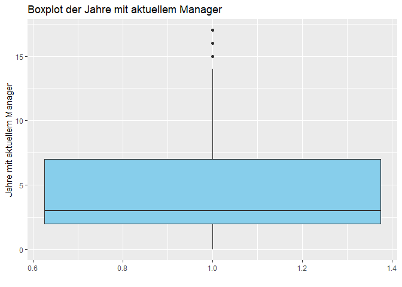
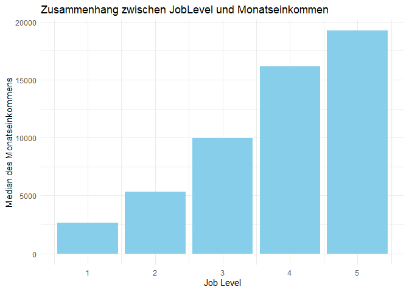

# 1. Business Understanding

## 1.1 Zielsetzung

Das übergeordnete Ziel dieses Berichts ist es, die Faktoren zu identifizieren und zu analysieren, die die Jobzufriedenheit von Mitarbeitern beeinflussen. Dabei möchten wir insbesondere verstehen, wie verschiedene Aspekte wie Gehalt, Arbeitsbedingungen, Mitarbeiterbeziehungen und anerkannte Arbeitsleistung die Zufriedenheit am Arbeitsplatz beeinflussen. Die Ergebnisse dieser Analyse sollen als Grundlage für HR-Entscheidungen und -Strategien dienen, um die Mitarbeiterzufriedenheit und -bindung zu verbessern.

## 1.2 Fragen, die beantwortet werden sollen

* Welche Faktoren haben den größten Einfluss auf die Jobzufriedenheit?  
* Wie korrelieren Gehalt, Arbeitsbedingungen und andere Variablen mit der Jobzufriedenheit?  
* Welche Empfehlungen können wir für die Personalabteilung ableiten, um die Mitarbeiterzufriedenheit zu verbessern?  

## 1.3 Aktualisierte These

Die zentrale These dieses Berichts lautet:  

**"Mitarbeiter, die ein höheres Gehalt erhalten, bessere Arbeitsbedingungen vorfinden, positive Mitarbeiterbeziehungen pflegen und deren Arbeitsleistung anerkannt wird bzw. deren Arbeitsanforderungen erfüllbar sind, haben eine höhere Jobzufriedenheit."**  

In diesem Zusammenhang werden spezifische Variablen wie **"MonthlyIncome"**, **"WorkLifeBalance"**, **"RelationshipSatisfaction"** und andere näher betrachtet und analysiert.

## 1.4 Methodik

Dieser Bericht wird nach dem **Cross-Industry Standard Process for Data Mining (CRISP-DM)** entwickelt. Dieses standardisierte Vorgehensmodell ermöglicht eine strukturierte und effiziente Analyse von Datensätzen und ist branchenübergreifend anerkannt. 

Der CRISP-DM-Leitfaden (Cross-Industry Standard Process for Data Mining) wurde ursprünglich im Jahr 1999 veröffentlicht. Dieser Leitfaden stellt ein Rahmenwerk für den Prozess der Datenanalyse und des Data Mining vor und hat zum Ziel, den gesamten Lebenszyklus eines Data-Mining-Projekts zu strukturieren. Der Leitfaden wurde von einem Konsortium entwickelt, das Unternehmen wie IBM, NCR Corporation und DaimlerChrysler AG umfasste.

**Der CRISP-DM-Leitfaden ist in sechs Phasen unterteilt:**

1. Business Understanding: Verständnis für die geschäftlichen Anforderungen und Ziele  
2. Data Understanding: Verständnis für die verfügbaren Daten und ihre Qualität  
3. Data Preparation: Vorbereitung und Aufbereitung der Daten für die Analyse  
4. Modeling: Auswahl und Anwendung von Data-Mining-Techniken und -Modellen  
5. Evaluation: Bewertung der Modelle in Bezug auf ihre Effektivität und Geschäftsnutzen  
6. Deployment: Implementierung der Modelle in die geschäftliche Praxis  

Dieser Leitfaden hat sich als sehr nützlich und anwendungsorientiert erwiesen und wird häufig in der Industrie sowie im akademischen Bereich verwendet. Er bietet eine strukturierte Herangehensweise, um Data-Mining-Projekte effizient und effektiv zu managen.

Jede dieser Phasen wird in diesem Bericht ausführlich behandelt, um einen ganzheitlichen Überblick und fundierte Schlussfolgerungen zu ermöglichen.


# 2. Data Understanding

## 2.1 Einführung in den HR_Analytics-Datensatz

Der HR_Analytics-Datensatz ist eine reichhaltige Informationsquelle, welcher eine Vielzahl von Datenpunkten zur Belegschaft eines Unternehmens enthält. Dieser Datensatz ist für das Human Resource Management wichtig, da er einen detaillierten Einblick in verschiedene Aspekte des Mitarbeiterlebenszyklus gewährt. Das Spektrum der Variablen reicht von grundlegenden demografischen Informationen wie Alter ("Age") und Geschlecht ("Gender") bis hin zu komplexeren Metriken wie die Zufriedenheit mit der Arbeitsumgebung ("EnvironmentSatisfaction) und der Anzahl der Jahre im Unternehmen("YearsAtCompany").

Der zur Verfügung stehende Datensatz umfasst 38 Spalten und 1481 Zeilen.  
  
Es steht unter:  
<https://www.kaggle.com/datasets/paramitasen/powerbiproject?resource=download> zur Verfügung.  

Benutzt wird die CSV-Datei HR_Analytics unter:  
<https://www.kaggle.com/datasets/paramitasen/powerbiproject?resource=download&select=HR_Analytics.csv>.

Der Datensatz dient als Grundlage für eine breite Palette von Analysen, mit dem Ziel, die innerbetrieblichen Dynamiken besser zu verstehen. Zum Beispiel können die Daten genutzt werden, um herauszufinden, welche Faktoren die Fluktuation ("Attrition") beeinflussen oder wie sich die Entfernung zum Heim ("DistanceFromHome") auf die Zufriedenheit der Mitarbeiter auswirkt. Solche Erkenntnisse sind nicht nur für die akademische Forschung wertvoll, sondern auch für praktizierende HR-Manager, die darauf angewiesen sind, fundierte Entscheidungen auf der Grundlage solider Daten zu treffen.

Die Datenquelle könnte aus einem unternehmensinternen HR-Management-System stammen oder durch spezialisierte Umfragen und Mitarbeiterbefragungen erhoben worden sein. Die Strukturierung dieser Daten erfolgt in der Regel so, dass sie für maschinelles Lernen und fortgeschrittene statistische Analysen geeignet sind.

Zunächst importieren wir die Daten in R und nutzen die readr-Bibliothek:


```r
HR_Analytics <-read_csv("HR_Analytics.csv")
```

Um die Daten zu betrachten, verwenden wir die head()-Funktion:


```r
head(HR_Analytics)
```

<div data-pagedtable="false">
  <script data-pagedtable-source type="application/json">
{"columns":[{"label":["EmpID"],"name":[1],"type":["chr"],"align":["left"]},{"label":["Age"],"name":[2],"type":["dbl"],"align":["right"]},{"label":["AgeGroup"],"name":[3],"type":["chr"],"align":["left"]},{"label":["Attrition"],"name":[4],"type":["chr"],"align":["left"]},{"label":["BusinessTravel"],"name":[5],"type":["chr"],"align":["left"]},{"label":["DailyRate"],"name":[6],"type":["dbl"],"align":["right"]},{"label":["Department"],"name":[7],"type":["chr"],"align":["left"]},{"label":["DistanceFromHome"],"name":[8],"type":["dbl"],"align":["right"]},{"label":["Education"],"name":[9],"type":["dbl"],"align":["right"]},{"label":["EducationField"],"name":[10],"type":["chr"],"align":["left"]},{"label":["EmployeeCount"],"name":[11],"type":["dbl"],"align":["right"]},{"label":["EmployeeNumber"],"name":[12],"type":["dbl"],"align":["right"]},{"label":["EnvironmentSatisfaction"],"name":[13],"type":["dbl"],"align":["right"]},{"label":["Gender"],"name":[14],"type":["chr"],"align":["left"]},{"label":["HourlyRate"],"name":[15],"type":["dbl"],"align":["right"]},{"label":["JobInvolvement"],"name":[16],"type":["dbl"],"align":["right"]},{"label":["JobLevel"],"name":[17],"type":["dbl"],"align":["right"]},{"label":["JobRole"],"name":[18],"type":["chr"],"align":["left"]},{"label":["JobSatisfaction"],"name":[19],"type":["dbl"],"align":["right"]},{"label":["MaritalStatus"],"name":[20],"type":["chr"],"align":["left"]},{"label":["MonthlyIncome"],"name":[21],"type":["dbl"],"align":["right"]},{"label":["SalarySlab"],"name":[22],"type":["chr"],"align":["left"]},{"label":["MonthlyRate"],"name":[23],"type":["dbl"],"align":["right"]},{"label":["NumCompaniesWorked"],"name":[24],"type":["dbl"],"align":["right"]},{"label":["Over18"],"name":[25],"type":["chr"],"align":["left"]},{"label":["OverTime"],"name":[26],"type":["chr"],"align":["left"]},{"label":["PercentSalaryHike"],"name":[27],"type":["dbl"],"align":["right"]},{"label":["PerformanceRating"],"name":[28],"type":["dbl"],"align":["right"]},{"label":["RelationshipSatisfaction"],"name":[29],"type":["dbl"],"align":["right"]},{"label":["StandardHours"],"name":[30],"type":["dbl"],"align":["right"]},{"label":["StockOptionLevel"],"name":[31],"type":["dbl"],"align":["right"]},{"label":["TotalWorkingYears"],"name":[32],"type":["dbl"],"align":["right"]},{"label":["TrainingTimesLastYear"],"name":[33],"type":["dbl"],"align":["right"]},{"label":["WorkLifeBalance"],"name":[34],"type":["dbl"],"align":["right"]},{"label":["YearsAtCompany"],"name":[35],"type":["dbl"],"align":["right"]},{"label":["YearsInCurrentRole"],"name":[36],"type":["dbl"],"align":["right"]},{"label":["YearsSinceLastPromotion"],"name":[37],"type":["dbl"],"align":["right"]},{"label":["YearsWithCurrManager"],"name":[38],"type":["dbl"],"align":["right"]}],"data":[{"1":"RM297","2":"18","3":"18-25","4":"Yes","5":"Travel_Rarely","6":"230","7":"Research & Development","8":"3","9":"3","10":"Life Sciences","11":"1","12":"405","13":"3","14":"Male","15":"54","16":"3","17":"1","18":"Laboratory Technician","19":"3","20":"Single","21":"1420","22":"Upto 5k","23":"25233","24":"1","25":"Y","26":"No","27":"13","28":"3","29":"3","30":"80","31":"0","32":"0","33":"2","34":"3","35":"0","36":"0","37":"0","38":"0"},{"1":"RM302","2":"18","3":"18-25","4":"No","5":"Travel_Rarely","6":"812","7":"Sales","8":"10","9":"3","10":"Medical","11":"1","12":"411","13":"4","14":"Female","15":"69","16":"2","17":"1","18":"Sales Representative","19":"3","20":"Single","21":"1200","22":"Upto 5k","23":"9724","24":"1","25":"Y","26":"No","27":"12","28":"3","29":"1","30":"80","31":"0","32":"0","33":"2","34":"3","35":"0","36":"0","37":"0","38":"0"},{"1":"RM458","2":"18","3":"18-25","4":"Yes","5":"Travel_Frequently","6":"1306","7":"Sales","8":"5","9":"3","10":"Marketing","11":"1","12":"614","13":"2","14":"Male","15":"69","16":"3","17":"1","18":"Sales Representative","19":"2","20":"Single","21":"1878","22":"Upto 5k","23":"8059","24":"1","25":"Y","26":"Yes","27":"14","28":"3","29":"4","30":"80","31":"0","32":"0","33":"3","34":"3","35":"0","36":"0","37":"0","38":"0"},{"1":"RM728","2":"18","3":"18-25","4":"No","5":"Non-Travel","6":"287","7":"Research & Development","8":"5","9":"2","10":"Life Sciences","11":"1","12":"1012","13":"2","14":"Male","15":"73","16":"3","17":"1","18":"Research Scientist","19":"4","20":"Single","21":"1051","22":"Upto 5k","23":"13493","24":"1","25":"Y","26":"No","27":"15","28":"3","29":"4","30":"80","31":"0","32":"0","33":"2","34":"3","35":"0","36":"0","37":"0","38":"0"},{"1":"RM829","2":"18","3":"18-25","4":"Yes","5":"Non-Travel","6":"247","7":"Research & Development","8":"8","9":"1","10":"Medical","11":"1","12":"1156","13":"3","14":"Male","15":"80","16":"3","17":"1","18":"Laboratory Technician","19":"3","20":"Single","21":"1904","22":"Upto 5k","23":"13556","24":"1","25":"Y","26":"No","27":"12","28":"3","29":"4","30":"80","31":"0","32":"0","33":"0","34":"3","35":"0","36":"0","37":"0","38":"0"},{"1":"RM973","2":"18","3":"18-25","4":"No","5":"Non-Travel","6":"1124","7":"Research & Development","8":"1","9":"3","10":"Life Sciences","11":"1","12":"1368","13":"4","14":"Female","15":"97","16":"3","17":"1","18":"Laboratory Technician","19":"4","20":"Single","21":"1611","22":"Upto 5k","23":"19305","24":"1","25":"Y","26":"No","27":"15","28":"3","29":"3","30":"80","31":"0","32":"0","33":"5","34":"4","35":"0","36":"0","37":"0","38":"0"}],"options":{"columns":{"min":{},"max":[10]},"rows":{"min":[10],"max":[10]},"pages":{}}}
  </script>
</div>

Das Ergebnis liefert eine formatierte Tabelle der ersten sechs Zeilen des "HR_Analytics"-Datensatzes. Dadurch bekommen wir einen ersten Eindruck von den Daten bevor man die eigentliche Analyse beginnt. 


Der Datensatz hat **1480** Zeilen und **38** Spalten. Die Daten sind bereits *tidy*, das bedeutet:

1. Jede Variable bildet eine Spalte.
2. Jede Beobachtung bildet eine Zeile.
3. Jeder Zellwert repräsentiert eine Messung oder ein Merkmal.

Jede Zeile in der **HR_Analytics**-Tabelle repräsentiert einen individuellen Mitarbeiter innerhalb der Organisation, aus der die Daten stammen. Die Werte in den Spalten für jede Zeile bieten spezifische Informationen über den jeweiligen Mitarbeiter. 

Es ist wichtig zu erwähnen, dass der Datensatz zunächst einer explorativen Datenanalyse (EDA) unterzogen wurde. Dabei wurde festgestellt, dass 57 Einträge in der letzten Spalte Nullwerte aufweisen und dass es einige doppelte Einträge in der Spalte "employeeID" gibt. Diese Unregelmäßigkeiten wurden in der Datenaufbereitungsphase bereinigt.


## 2.2 Bezug zu PowerBI

Der Datensatz wird hauptsächlich verwendet, um ein Dashboard in PowerBI zu erstellen. Das Ziel ist, die Arbeitsabläufe im Unternehmen besser zu verstehen. Wir können z.B. schauen, warum Mitarbeiter gehen oder wie glücklich sie sind, wenn ihr Arbeitsplatz weit von ihrem Zuhause entfernt ist. Diese Infos sind wichtig für die Leute im Personalbereich des Unternehmens, um kluge Entscheidungen zu treffen.

Die Daten können von der Personalabteilung des Unternehmens oder aus Mitarbeiterumfragen kommen. Sie sind so aufgebaut, dass sie auch für komplexe Analysen und Computerprogramme gut zu nutzen sind.

Auch wenn wir den Datensatz hauptsächlich für ein PowerBI-Dashboard verwenden, passt er gut in den Ablauf des CRISP-DM-Modells. Das ist eine Methode, um Daten systematisch zu verstehen und zu nutzen. Besonders in der Phase, in der wir die Daten erst verstehen müssen, hilft uns dieser Datensatz dabei, das Problem, das wir lösen wollen, besser zu begreifen.


## 2.3 Beschreibung der Daten

Die Variablen im Datensatz bieten die Möglichkeit, komplexe Beziehungen und Muster zu erkennen, die für das Personalmanagement von entscheidender Bedeutung sein kann. Beispielsweise könnte eine gute Work-Life-Balance mit einer hohen Arbeitszufriedenheit korrelieren, was wiederum Auswirkungen auf die Mitarbeiterfluktuation haben könnte.

In der zweiten Phase "Data Understanding" soll ein tiefes Verständnis der Variablen und ihrer Bedeutung gelegt werden, um den Grundstein für die späteren Schritte des Data-Mining-Prozesses, insbesondere für die Datenaufbereitung und Modellierung, behandelt werden. 

Die Variablen haben folgende Bedeutungen:


```r
print(variable_definitions, n = Inf)
```

```
## # A tibble: 38 × 3
##    Variable                 Typ             Bedeutung                           
##    <chr>                    <chr>           <chr>                               
##  1 EmpID                    integer (int)   Mitarbeiter-ID                      
##  2 Age                      double (dbl)    Alter                               
##  3 AgeGroup                 character (chr) Altersgruppe                        
##  4 Attrition                character (chr) Fluktuation                         
##  5 BusinessTravel           character (chr) Geschäftsreisen                     
##  6 DailyRate                double (dbl)    Tagesrate                           
##  7 Department               character (chr) Abteilung                           
##  8 DistanceFromHome         double (dbl)    Entfernung zum Heim                 
##  9 Education                integer (int)   Bildungsgrad                        
## 10 EducationField           character (chr) Bildungsfeld                        
## 11 EmployeeCount            integer (int)   Mitarbeiteranzahl                   
## 12 EmployeeNumber           integer (int)   Mitarbeiternummer                   
## 13 EnvironmentSatisfaction  integer (int)   Zufriedenheit mit der Arbeitsumgebu…
## 14 Gender                   character (chr) Geschlecht                          
## 15 HourlyRate               double (dbl)    Stundenlohn                         
## 16 JobInvolvement           integer (int)   Arbeitsbeteiligung                  
## 17 JobLevel                 integer (int)   Joblevel                            
## 18 JobRole                  character (chr) Jobrolle                            
## 19 JobSatisfaction          integer (int)   Jobzufriedenheit                    
## 20 MaritalStatus            character (chr) Familienstand                       
## 21 MonthlyIncome            double (dbl)    Monatliches Einkommen               
## 22 SalarySlab               character (chr) Gehaltsstufe                        
## 23 MonthlyRate              double (dbl)    Monatliche Rate                     
## 24 NumCompanies             integer (int)   Anzahl der Unternehmen              
## 25 Over18                   character (chr) Über 18                             
## 26 OverTime                 character (chr) Überstunden                         
## 27 PercentSalaryHike        double (dbl)    Prozentuale Gehaltserhöhung         
## 28 PerformanceRating        integer (int)   Leistungsbewertung                  
## 29 RelationshipSatisfaction integer (int)   Zufriedenheit in der Beziehung      
## 30 StandardHours            integer (int)   Standardarbeitsstunden              
## 31 StockOptionLevel         integer (int)   Aktienoptionslevel                  
## 32 TotalWorkingYears        double (dbl)    Gesamtzahl der Arbeitsjahre         
## 33 TrainingTimesLastYear    integer (int)   Trainingszeiten im letzten Jahr     
## 34 WorkLifeBalance          integer (int)   Work-Life-Balance                   
## 35 YearsAtCompany           double (dbl)    Jahre im Unternehmen                
## 36 YearsInCurrentRole       double (dbl)    Jahre in aktueller Rolle            
## 37 YearsSinceLastPromotion  double (dbl)    Jahre seit letzter Beförderung      
## 38 YearsWithCurrManager     double (dbl)    Jahre mit aktuellem Manager
```


Zunächst verschaffen wir uns einen Überblick über die Daten.


```r
HR_Analytics %>% describe_tbl()
```

```
## 1 480 (1.5k) observations with 38 variables
## 57 observations containing missings (NA)
## 1 variables containing missings (NA)
## 3 variables with no variance
```
1. Im Datensatz gibt es 1480 Instanzen (Beobachtungen) mit 38 Variablen.
2. 57 Beobachtungen enthalten fehlende Werte (NA).
3. 1 Variable enthält fehlende Werte (NA)
4. 3 Variablen ohne Varianz.

Um diese Daten werden wir uns kümmern müssen.

Es ist wichtig, die Datenklassen (data types) und ihrem Datensatz zu kennen, da sie die Art der Operationen und Analysen bestimmen, die mit diesen Daten durchgeführt werden können. 
Obwohl die Datenklappsen bereits durch die head-Funktion sichtbar gemacht wurden, werden sie hier noch einmal hier explizit dargestellt:


```r
data_classes <- data.frame(Variable = names(HR_Analytics),
                           Class = sapply(HR_Analytics, class))
print(data_classes)
```

```
##                                          Variable     Class
## EmpID                                       EmpID character
## Age                                           Age   numeric
## AgeGroup                                 AgeGroup character
## Attrition                               Attrition character
## BusinessTravel                     BusinessTravel character
## DailyRate                               DailyRate   numeric
## Department                             Department character
## DistanceFromHome                 DistanceFromHome   numeric
## Education                               Education   numeric
## EducationField                     EducationField character
## EmployeeCount                       EmployeeCount   numeric
## EmployeeNumber                     EmployeeNumber   numeric
## EnvironmentSatisfaction   EnvironmentSatisfaction   numeric
## Gender                                     Gender character
## HourlyRate                             HourlyRate   numeric
## JobInvolvement                     JobInvolvement   numeric
## JobLevel                                 JobLevel   numeric
## JobRole                                   JobRole character
## JobSatisfaction                   JobSatisfaction   numeric
## MaritalStatus                       MaritalStatus character
## MonthlyIncome                       MonthlyIncome   numeric
## SalarySlab                             SalarySlab character
## MonthlyRate                           MonthlyRate   numeric
## NumCompaniesWorked             NumCompaniesWorked   numeric
## Over18                                     Over18 character
## OverTime                                 OverTime character
## PercentSalaryHike               PercentSalaryHike   numeric
## PerformanceRating               PerformanceRating   numeric
## RelationshipSatisfaction RelationshipSatisfaction   numeric
## StandardHours                       StandardHours   numeric
## StockOptionLevel                 StockOptionLevel   numeric
## TotalWorkingYears               TotalWorkingYears   numeric
## TrainingTimesLastYear       TrainingTimesLastYear   numeric
## WorkLifeBalance                   WorkLifeBalance   numeric
## YearsAtCompany                     YearsAtCompany   numeric
## YearsInCurrentRole             YearsInCurrentRole   numeric
## YearsSinceLastPromotion   YearsSinceLastPromotion   numeric
## YearsWithCurrManager         YearsWithCurrManager   numeric
```

Für eine detailliertere Analyse des Datensatzes, um Datentypen zu erkunden und zu kategorisieren wird der Datensatz mit der Funktion str() dargestellt. Sie bietet eine kompakte Darstellung der internen Struktur an:


```r
str(HR_Analytics)
```

```
## spc_tbl_ [1,480 × 38] (S3: spec_tbl_df/tbl_df/tbl/data.frame)
##  $ EmpID                   : chr [1:1480] "RM297" "RM302" "RM458" "RM728" ...
##  $ Age                     : num [1:1480] 18 18 18 18 18 18 18 18 19 19 ...
##  $ AgeGroup                : chr [1:1480] "18-25" "18-25" "18-25" "18-25" ...
##  $ Attrition               : chr [1:1480] "Yes" "No" "Yes" "No" ...
##  $ BusinessTravel          : chr [1:1480] "Travel_Rarely" "Travel_Rarely" "Travel_Frequently" "Non-Travel" ...
##  $ DailyRate               : num [1:1480] 230 812 1306 287 247 ...
##  $ Department              : chr [1:1480] "Research & Development" "Sales" "Sales" "Research & Development" ...
##  $ DistanceFromHome        : num [1:1480] 3 10 5 5 8 1 3 14 22 3 ...
##  $ Education               : num [1:1480] 3 3 3 2 1 3 2 3 1 1 ...
##  $ EducationField          : chr [1:1480] "Life Sciences" "Medical" "Marketing" "Life Sciences" ...
##  $ EmployeeCount           : num [1:1480] 1 1 1 1 1 1 1 1 1 1 ...
##  $ EmployeeNumber          : num [1:1480] 405 411 614 1012 1156 ...
##  $ EnvironmentSatisfaction : num [1:1480] 3 4 2 2 3 4 2 2 4 2 ...
##  $ Gender                  : chr [1:1480] "Male" "Female" "Male" "Male" ...
##  $ HourlyRate              : num [1:1480] 54 69 69 73 80 97 70 33 50 79 ...
##  $ JobInvolvement          : num [1:1480] 3 2 3 3 3 3 3 3 3 3 ...
##  $ JobLevel                : num [1:1480] 1 1 1 1 1 1 1 1 1 1 ...
##  $ JobRole                 : chr [1:1480] "Laboratory Technician" "Sales Representative" "Sales Representative" "Research Scientist" ...
##  $ JobSatisfaction         : num [1:1480] 3 3 2 4 3 4 4 3 3 2 ...
##  $ MaritalStatus           : chr [1:1480] "Single" "Single" "Single" "Single" ...
##  $ MonthlyIncome           : num [1:1480] 1420 1200 1878 1051 1904 ...
##  $ SalarySlab              : chr [1:1480] "Upto 5k" "Upto 5k" "Upto 5k" "Upto 5k" ...
##  $ MonthlyRate             : num [1:1480] 25233 9724 8059 13493 13556 ...
##  $ NumCompaniesWorked      : num [1:1480] 1 1 1 1 1 1 1 1 1 1 ...
##  $ Over18                  : chr [1:1480] "Y" "Y" "Y" "Y" ...
##  $ OverTime                : chr [1:1480] "No" "No" "Yes" "No" ...
##  $ PercentSalaryHike       : num [1:1480] 13 12 14 15 12 15 12 16 19 14 ...
##  $ PerformanceRating       : num [1:1480] 3 3 3 3 3 3 3 3 3 3 ...
##  $ RelationshipSatisfaction: num [1:1480] 3 1 4 4 4 3 3 3 4 4 ...
##  $ StandardHours           : num [1:1480] 80 80 80 80 80 80 80 80 80 80 ...
##  $ StockOptionLevel        : num [1:1480] 0 0 0 0 0 0 0 0 0 0 ...
##  $ TotalWorkingYears       : num [1:1480] 0 0 0 0 0 0 0 0 0 1 ...
##  $ TrainingTimesLastYear   : num [1:1480] 2 2 3 2 0 5 2 4 2 3 ...
##  $ WorkLifeBalance         : num [1:1480] 3 3 3 3 3 4 4 1 2 3 ...
##  $ YearsAtCompany          : num [1:1480] 0 0 0 0 0 0 0 0 0 1 ...
##  $ YearsInCurrentRole      : num [1:1480] 0 0 0 0 0 0 0 0 0 0 ...
##  $ YearsSinceLastPromotion : num [1:1480] 0 0 0 0 0 0 0 0 0 0 ...
##  $ YearsWithCurrManager    : num [1:1480] 0 0 0 0 0 0 0 0 0 0 ...
##  - attr(*, "spec")=
##   .. cols(
##   ..   EmpID = col_character(),
##   ..   Age = col_double(),
##   ..   AgeGroup = col_character(),
##   ..   Attrition = col_character(),
##   ..   BusinessTravel = col_character(),
##   ..   DailyRate = col_double(),
##   ..   Department = col_character(),
##   ..   DistanceFromHome = col_double(),
##   ..   Education = col_double(),
##   ..   EducationField = col_character(),
##   ..   EmployeeCount = col_double(),
##   ..   EmployeeNumber = col_double(),
##   ..   EnvironmentSatisfaction = col_double(),
##   ..   Gender = col_character(),
##   ..   HourlyRate = col_double(),
##   ..   JobInvolvement = col_double(),
##   ..   JobLevel = col_double(),
##   ..   JobRole = col_character(),
##   ..   JobSatisfaction = col_double(),
##   ..   MaritalStatus = col_character(),
##   ..   MonthlyIncome = col_double(),
##   ..   SalarySlab = col_character(),
##   ..   MonthlyRate = col_double(),
##   ..   NumCompaniesWorked = col_double(),
##   ..   Over18 = col_character(),
##   ..   OverTime = col_character(),
##   ..   PercentSalaryHike = col_double(),
##   ..   PerformanceRating = col_double(),
##   ..   RelationshipSatisfaction = col_double(),
##   ..   StandardHours = col_double(),
##   ..   StockOptionLevel = col_double(),
##   ..   TotalWorkingYears = col_double(),
##   ..   TrainingTimesLastYear = col_double(),
##   ..   WorkLifeBalance = col_double(),
##   ..   YearsAtCompany = col_double(),
##   ..   YearsInCurrentRole = col_double(),
##   ..   YearsSinceLastPromotion = col_double(),
##   ..   YearsWithCurrManager = col_double()
##   .. )
##  - attr(*, "problems")=<externalptr>
```

* "spec_tbl_ [1,480 x 38]" bedeutet, dass der Datensatz 1480 Zeilen und 38 Spalten besitzt.
* "(S3: spec_tbl_df/tbl_df/tbl/data.frame)" zeigt die Klassenhierarchie des Objekts an.
* Spalten und ihre Datentypen
* In "attr(*, 'spec')=" steht, welche Art von Information in jeder Spalte der Tabelle steckt.   
  Es hilft dem Computer zu verstehen, wie er die Daten behandeln soll.
* "attr(*, "problems")=<externalptr>" ist wie ein Hinweis, dass es vielleicht Probleme gab, als die      Daten in den Computer geladen wurden.   
  Es sagt aber nicht, welche Probleme das sind. Es ist wie ein Ausrufezeichen, aber ohne weitere         Erklärung.

## 2.4 Erstellen einer Kopie der Rohdaten

Bevor wir mit der detaillierten Datenanalyse beginnen, ist es wichtig, eine Kopie der Rohdaten zu erstellen. Dieser Schritt wird zu Beginn der "Data Understanding"-Phase durchgeführt, um sicherzustellen, dass die ursprünglichen Daten unverändert bleiben. Durch das Anfertigen dieser Kopie erhalten wir ein Backup und einen Referenzpunkt, auf den wir im weiteren Verlauf des Projekts zurückgreifen können.


```r
HR_Analytics_final <- HR_Analytics
```

## 2.5 Fehlende Daten

Um Fehlende Daten bzw. NAs zu finden, wird die Funktion colSums() mit der Funktion is.na() kombiniert:


```r
colSums(is.na(HR_Analytics_final))
```

```
##                    EmpID                      Age                 AgeGroup 
##                        0                        0                        0 
##                Attrition           BusinessTravel                DailyRate 
##                        0                        0                        0 
##               Department         DistanceFromHome                Education 
##                        0                        0                        0 
##           EducationField            EmployeeCount           EmployeeNumber 
##                        0                        0                        0 
##  EnvironmentSatisfaction                   Gender               HourlyRate 
##                        0                        0                        0 
##           JobInvolvement                 JobLevel                  JobRole 
##                        0                        0                        0 
##          JobSatisfaction            MaritalStatus            MonthlyIncome 
##                        0                        0                        0 
##               SalarySlab              MonthlyRate       NumCompaniesWorked 
##                        0                        0                        0 
##                   Over18                 OverTime        PercentSalaryHike 
##                        0                        0                        0 
##        PerformanceRating RelationshipSatisfaction            StandardHours 
##                        0                        0                        0 
##         StockOptionLevel        TotalWorkingYears    TrainingTimesLastYear 
##                        0                        0                        0 
##          WorkLifeBalance           YearsAtCompany       YearsInCurrentRole 
##                        0                        0                        0 
##  YearsSinceLastPromotion     YearsWithCurrManager 
##                        0                       57
```

Es wird angezeigt, wie viele fehlende Werte (NAs) es in jeder Spalte des Datensatzes gibt. In diesem Fall sind für falst alle Spalten die Werte 0, was bedeutet, dass in diesen Spalten keine fehlenden Werte vorhanden sind. Die einzige Ausnahme ist die Spalte "YearsWithCurrManager", in der 57 fehlende Werte angezeigt werden.

Ein solches Ergebnis ist wichtig, um die Qualität des Datensatzes zu beurteilen. Fehlende Werte können die Genauigkeit statistischer Analysen beeinflussen und die Interpretierbarkeit der Ergebnisse erschweren. Hier sind ein paar Punkte, die aus diesem Ergebnis hervorgehen:

### 2.5.2 Keine fehlenden Werte in den meisten Spalten

Fast alle Spalten haben 0 fehlende Werte, was darauf hindeutet, dass der Datensatz ziemlich vollständig ist. Das ist in der Regel ein gutes Zeichen, da es bedeutet, dass keine Imputation (das Ausfüllen fehlender Werte) oder andere Techniken zur Behandlung fehlender Daten erforderlich sind.

### 2.5.3 Fehlende Werte in einer spezifischen Spalte

Die Spalte "YearsWithCurrManager" hat 57 fehlende Werte. Dies könnte bedeuten, dass die Daten für diese Spalte für einige Beobachtungen nicht verfügbar sind. Dies kann je nach dem Kontext des Datensatzes und dem Ziel der Analyse problematisch sein.

Im Kontext Ihrer ersten Theorie zur Jobzufriedenheit wäre die Spalte "YearsWithCurrManager" eventuell relevant, da die Dauer der Zusammenarbeit mit dem aktuellen Manager ein Indikator für Arbeitsbedingungen und Mitarbeiterbeziehungen sein könnte. Fehlende Werte in dieser Spalte könnten daher die Analyse beeinträchtigen, indem sie ein unvollständiges Bild der Jobzufriedenheit zeichnen.

Fehlende Werte in der Spalte könnten bedeuten, dass einige Mitarbeiter vielleicht noch keinen festen Manager haben oder es eine hohe Fluktuation in der Managerposition gibt. Beides könnte sich auf die Jobzufriedenheit auswirken und sollte in der Analyse berücksichtigt werden.

**Fehlende Werte behandeln**

Das Ersetzen der fehlenden Werte durch den Median oder den Mittelwert kann sinnvoll sein, um ein umfassenderes Bild der Jobzufriedenheit zu erhalten. Ob der Median oder der Mittelwert verwendet werden sollte, hängt von der Verteilung der Daten ab:

Mittelwert: Wenn die Daten ziemlich gleichmäßig verteilt sind und keine extremen Ausreißer vorhanden sind, wäre der Mittelwert eine geeignete Methode.

Median: Wenn es extreme Werte oder eine schiefe Verteilung in der Spalte gibt, wäre der Median vorzuziehen.

Bevor Sie sich für eine Methode entscheiden, sollten die Daten genauer analysiert werden. Ein Histogramm oder ein Boxplot könnte hilfreich sein, um die Datenverteilung besser zu verstehen.

**Boxplot erstellen**


```r
ggplot(data = HR_Analytics_final, aes(x = 1, y = YearsWithCurrManager, fill = "skyblue")) +
  geom_boxplot() +
  xlab("") +
  ylab("Jahre mit aktuellem Manager") +
  ggtitle("Boxplot der Jahre mit aktuellem Manager") +
  scale_fill_manual(values = "skyblue") +
  guides(fill = FALSE)
```

```
## Warning: The `<scale>` argument of `guides()` cannot be `FALSE`. Use "none" instead as
## of ggplot2 3.3.4.
## This warning is displayed once every 8 hours.
## Call `lifecycle::last_lifecycle_warnings()` to see where this warning was
## generated.
```

```
## Warning: Removed 57 rows containing non-finite values (`stat_boxplot()`).
```

<!-- -->

Ein Boxplot ist ein grafisches Werkzeug, das die Verteilung einer Datenserie darstellt. Es zeigt den Median, die Quartile und mögliche Ausreißer im Datensatz. In unserem Fall untersuchten wir eine spezielle Spalte, in der die "YearsWithCurrManager" verzeichnet sind. Der Boxplot zeigte, dass der Mittelwert bei 3 Jahren und der Median bei 4 Jahren liegt. Zudem gab es drei Ausreißer bei 15, 16 und 17 Jahren, und der obere Schnurrbart des Boxplots reichte bis zu 13 Jahren.

Die Abzissenwerte zwischen 0.6 und 1.4 sind eine konventionelle Möglichkeit, die Breite der Box darzustellen und nicht mit den eigentlichen Datenwerten zu verwechseln.

Wenn es darum geht, fehlende Daten zu ersetzen, ist es wichtig, den am besten geeigneten Wert zu wählen. Der Mittelwert ist anfällig für Verzerrungen durch Ausreißer, während der Median eine robustere Metrik ist, insbesondere wenn der Datensatz Ausreißer enthält. Im Kontext der vorliegenden Daten und der Ausreißer wäre es daher angebrachter, den Median als Ersatz für fehlende Werte zu verwenden.

Aufgrund der Robustheit gegenüber Ausreißern und der besseren Darstellung der zentralen Tendenz der Daten, wird der Median von 4 Jahren als der geeignetste Wert für die Ersetzung fehlender Daten eingesetzt.

Mit der mutate()-Funktion aus dem dplyr-Paket werden die Daten modifiziert. Mit der Bedingung "is.na(YearsWithCurrManager)" wird festgestellt, ob ein Wert fehlt. Falls er fehlt, wird er durch den Medianwert "4" ersetzt. Andernfalls bleibt der Wert unverändert.


```r
HR_Analytics_final <- HR_Analytics_final %>%
  mutate(YearsWithCurrManager = ifelse(is.na(YearsWithCurrManager), 4, YearsWithCurrManager))
```

Mit colSums() überprüfen wir noch einmal die Ergebnisse:


```r
colSums(is.na(HR_Analytics_final))
```

```
##                    EmpID                      Age                 AgeGroup 
##                        0                        0                        0 
##                Attrition           BusinessTravel                DailyRate 
##                        0                        0                        0 
##               Department         DistanceFromHome                Education 
##                        0                        0                        0 
##           EducationField            EmployeeCount           EmployeeNumber 
##                        0                        0                        0 
##  EnvironmentSatisfaction                   Gender               HourlyRate 
##                        0                        0                        0 
##           JobInvolvement                 JobLevel                  JobRole 
##                        0                        0                        0 
##          JobSatisfaction            MaritalStatus            MonthlyIncome 
##                        0                        0                        0 
##               SalarySlab              MonthlyRate       NumCompaniesWorked 
##                        0                        0                        0 
##                   Over18                 OverTime        PercentSalaryHike 
##                        0                        0                        0 
##        PerformanceRating RelationshipSatisfaction            StandardHours 
##                        0                        0                        0 
##         StockOptionLevel        TotalWorkingYears    TrainingTimesLastYear 
##                        0                        0                        0 
##          WorkLifeBalance           YearsAtCompany       YearsInCurrentRole 
##                        0                        0                        0 
##  YearsSinceLastPromotion     YearsWithCurrManager 
##                        0                        0
```

### 2.5.4 Falsche Werte in spezifischer Spalte

Alle Mitarbeiter arbeiten acht Stunden am Tag (StandardHours), was aber hier mit der Zahl 80 angegeben wurde. Das muß korrigiert werden und auf 8,0 gesetzt werden.

Eine andere Lösung würde keinen Sinn ergeben. 80 Stunden wären zu viel in einer Woche und zu wenig in einem Monat. 


```r
HR_Analytics_final$StandardHours <- 8
```

Um die Änderungen anzuzeigen, wird noch einmal die Spalte mit der head-Funktion angezeigt.


```r
head(HR_Analytics_final$StandardHours)
```

```
## [1] 8 8 8 8 8 8
```


## 2.6 Erste Datenexploration

**Einleitung**

Die Phase des Data Understanding ist ein kritischer Schritt im Datenanalyseprozess. Sie hilft uns, die Qulaität und Struktur unserer Daten zu verstehen und bereitet uns darauf vor, fundierte Entscheidungen für die nachfolgenden Phasen zu treffen. Die erste Datenexploration bietet einen umfassenden Einblick in die Daten und identifiziert potenzielle Herausforderungen, wie fehlende Werte und Ausreißer.

**Warum im Data Understanding?**

Bevor man in tiefgehende Analysen eintaucht, ist es entscheidend, ein klares Verständnis für die Daten zu haben. Eine vorläufige Untersuchung kann uns wesentliche Informtationen liefern, die uns bei der Entscheidung helfen, welche Methoden und Techniken in späteren Phasen angewendet werden sollten. 

### 2.6.1 Die Grundgesamtheit

**Ziel**

Das Ziel dieses ersten Schrittes ist es, einen groben Überblick über den geamten Datensatzu zu erhalten. Dies ist nützlich, um ein erstes Verständnis für die Daten zu bekommen und mögliche Probleme frühzeitig zu erkennen.  

**Vorgehen**

Es wird die "summary"-Funktion auf den gesamten Datensatz "HR_Analytics_final" angewendet. 


```r
summary(HR_Analytics_final)
```

```
##     EmpID                Age          AgeGroup          Attrition        
##  Length:1480        Min.   :18.00   Length:1480        Length:1480       
##  Class :character   1st Qu.:30.00   Class :character   Class :character  
##  Mode  :character   Median :36.00   Mode  :character   Mode  :character  
##                     Mean   :36.92                                        
##                     3rd Qu.:43.00                                        
##                     Max.   :60.00                                        
##  BusinessTravel       DailyRate       Department        DistanceFromHome
##  Length:1480        Min.   : 102.0   Length:1480        Min.   : 1.00   
##  Class :character   1st Qu.: 465.0   Class :character   1st Qu.: 2.00   
##  Mode  :character   Median : 800.0   Mode  :character   Median : 7.00   
##                     Mean   : 801.4                      Mean   : 9.22   
##                     3rd Qu.:1157.0                      3rd Qu.:14.00   
##                     Max.   :1499.0                      Max.   :29.00   
##    Education     EducationField     EmployeeCount EmployeeNumber  
##  Min.   :1.000   Length:1480        Min.   :1     Min.   :   1.0  
##  1st Qu.:2.000   Class :character   1st Qu.:1     1st Qu.: 493.8  
##  Median :3.000   Mode  :character   Median :1     Median :1027.5  
##  Mean   :2.911                      Mean   :1     Mean   :1031.9  
##  3rd Qu.:4.000                      3rd Qu.:1     3rd Qu.:1568.2  
##  Max.   :5.000                      Max.   :1     Max.   :2068.0  
##  EnvironmentSatisfaction    Gender            HourlyRate     JobInvolvement
##  Min.   :1.000           Length:1480        Min.   : 30.00   Min.   :1.00  
##  1st Qu.:2.000           Class :character   1st Qu.: 48.00   1st Qu.:2.00  
##  Median :3.000           Mode  :character   Median : 66.00   Median :3.00  
##  Mean   :2.724                              Mean   : 65.85   Mean   :2.73  
##  3rd Qu.:4.000                              3rd Qu.: 83.00   3rd Qu.:3.00  
##  Max.   :4.000                              Max.   :100.00   Max.   :4.00  
##     JobLevel       JobRole          JobSatisfaction MaritalStatus     
##  Min.   :1.000   Length:1480        Min.   :1.000   Length:1480       
##  1st Qu.:1.000   Class :character   1st Qu.:2.000   Class :character  
##  Median :2.000   Mode  :character   Median :3.000   Mode  :character  
##  Mean   :2.065                      Mean   :2.725                     
##  3rd Qu.:3.000                      3rd Qu.:4.000                     
##  Max.   :5.000                      Max.   :4.000                     
##  MonthlyIncome    SalarySlab         MonthlyRate    NumCompaniesWorked
##  Min.   : 1009   Length:1480        Min.   : 2094   Min.   :0.000     
##  1st Qu.: 2922   Class :character   1st Qu.: 8051   1st Qu.:1.000     
##  Median : 4933   Mode  :character   Median :14220   Median :2.000     
##  Mean   : 6505                      Mean   :14298   Mean   :2.687     
##  3rd Qu.: 8384                      3rd Qu.:20461   3rd Qu.:4.000     
##  Max.   :19999                      Max.   :26999   Max.   :9.000     
##     Over18            OverTime         PercentSalaryHike PerformanceRating
##  Length:1480        Length:1480        Min.   :11.00     Min.   :3.000    
##  Class :character   Class :character   1st Qu.:12.00     1st Qu.:3.000    
##  Mode  :character   Mode  :character   Median :14.00     Median :3.000    
##                                        Mean   :15.21     Mean   :3.153    
##                                        3rd Qu.:18.00     3rd Qu.:3.000    
##                                        Max.   :25.00     Max.   :4.000    
##  RelationshipSatisfaction StandardHours StockOptionLevel TotalWorkingYears
##  Min.   :1.000            Min.   :8     Min.   :0.0000   Min.   : 0.00    
##  1st Qu.:2.000            1st Qu.:8     1st Qu.:0.0000   1st Qu.: 6.00    
##  Median :3.000            Median :8     Median :1.0000   Median :10.00    
##  Mean   :2.709            Mean   :8     Mean   :0.7919   Mean   :11.28    
##  3rd Qu.:4.000            3rd Qu.:8     3rd Qu.:1.0000   3rd Qu.:15.00    
##  Max.   :4.000            Max.   :8     Max.   :3.0000   Max.   :40.00    
##  TrainingTimesLastYear WorkLifeBalance YearsAtCompany   YearsInCurrentRole
##  Min.   :0.000         Min.   :1.000   Min.   : 0.000   Min.   : 0.000    
##  1st Qu.:2.000         1st Qu.:2.000   1st Qu.: 3.000   1st Qu.: 2.000    
##  Median :3.000         Median :3.000   Median : 5.000   Median : 3.000    
##  Mean   :2.798         Mean   :2.761   Mean   : 7.009   Mean   : 4.228    
##  3rd Qu.:3.000         3rd Qu.:3.000   3rd Qu.: 9.000   3rd Qu.: 7.000    
##  Max.   :6.000         Max.   :4.000   Max.   :40.000   Max.   :18.000    
##  YearsSinceLastPromotion YearsWithCurrManager
##  Min.   : 0.000          Min.   : 0.000      
##  1st Qu.: 0.000          1st Qu.: 2.000      
##  Median : 1.000          Median : 3.000      
##  Mean   : 2.182          Mean   : 4.114      
##  3rd Qu.: 3.000          3rd Qu.: 7.000      
##  Max.   :15.000          Max.   :17.000
```

**Interpretation**

Die Ausgabe zeigt grundlegende statistische Kennzahlen für jede Variabe, wie das arithmetische Mittel, Median, Min- und Max-Werte und die Quartile an. Fehlende Daten und NAs sind nicht mehr vorhanden.

**Diskrete Daten**

Diskrete Daten sind oft das Ergebnis einer Zählung. Dadurch können sie nur bestimmte Werte annehmen und sind endlich oder zählbar unendlich. 

Es gibt Variablen, welche nominale oder ordinale Eigenschaften haben. Auch metrische Daten sind dabei. 

Darüber hinaus können für diskrete Daten auch die Häufigkeiten der verschiedenen einzigartigen Werte dargestellt werden.

**Tidy Data**

Der Datensatz hat **1480** Zeilen und **38** Spalten. Die Daten sind bereits *tidy*, das bedeutet:

1. Jede Variable bildet eine Spalte.
2. Jede Beobachtung bildet eine Zeile.
3. Jeder Zellwert repräsentiert eine Messung oder ein Merkmal.

Jede Zeile in der **HR_Analytics**-Tabelle repräsentiert einen individuellen Mitarbeiter innerhalb der Organisation, aus der die Daten stammen. Die Werte in den Spalten für jede Zeile bieten spezifische Informationen über den jeweiligen Mitarbeiter. 

### 2.6.2 Kategorisierung der Daten

Wenn man die Daten sortieren oder eine Rangfolge erstellen kann, sie aber nicht sinnvoll addieren oder subtrahieren kann, handelt es sich wahrscheinlich um ordinale Daten.

Wenn die Daten nur kategorisiert werden können und keine Reihenfolge oder metrische Eigenschaften haben, sind sie nominale Daten.

Wenn man sinnvolle arithmitische Operationen (wie Addition und Subtraktion) auf die Daten anwenden kann, handelt es sich wahrscheinlich um metrische Daten.

Sicherlich kann die Einteilung je nach Kontext variieren, um manchmal können Daten als entweder metrisch oder ordinal betrachtet werden, abhängig von der Forschungsfrage oder Analysemethode.  

Die Kategorisierung von Daten ist nicht immer strikt festgelegt. Sie hängt oft vom Kontext ab. Man könnte das Bildungsniveau als ordinal betrachten, wenn man lediglich daran interessiert ist, ob höhere Bildung mit einem höheren Einkommen korreliert. In einer anderen Analyse könnte man jedoch die Anzahl der Schuljahre als metrische Daten betrachten, wenn man eine genauere Quantifizierung des Zusammenhangs zwischen Bildung und Einkommen anstrebt.  

**Einfachheit oder Genauigkeit**

Für den Anfang könnte man eine vereinfachte Einteilung wählen, um den Analyseprozess zu erleichtern und erste Einblicke zu gewinnen. Die Kategorisierung ist oft eine Frage des praktischen Vorgehens und dient der Einfachheit halber. 

Es ist wichtig zu betonen, dass die anfängliche Entscheidung für eine bestimmt Datenkategorisierung nicht endgültig ist. Je nachdem, welche spezifischen Fragen in späteren Phasen des Projekts aufkommen oder welche spezifischen Analysemethoden angewendet werden sollen, kann eine Neubewertung der Datenart notwendig sein. Dies ist im Laufe der Explorativen Datenanalyse durchaus möglich, insbesondere wenn neue Thesen entwickelt werden.

Die anfängliche Kategorisierung der Daten dient als Ausgangspunkt, der je nach den Bedürfnissen der Thesen flexibel angepasst erden kann. 

**Ordinale Daten**

* **"AgeGroup"**: Altergruppen sind ordinal, da es eine klare und sinnvolle Reihenfolge gibt.
* **"Education"**: Das Bildungsniveau scheint in numerischer Form kategorisiert zu sein, könnte aber eine Reichenfolge haben (z. B. 1 = keine Ausbildung, 2 = Grundschule, usw.).
* **"EnvironmentSatisfaction"**: Zufriedenheit mit der Arbeitsumgebung scheint ordinal zu sein, da sich numerisch kategorisiert und wahrscheinlich sortierbar ist. 
* **"JobInvolvement"**: wird ebenfalls numerisch kategorisiert und ist wahrscheinlich sortierbar.
* **"JobLevel"**: Joblevel könnte auch ordinal sein, da es eine Rangfolge darstellt. 
* **"JobSatisfaction"**: wird ebenfalls numerisch kategorisiert und ist wahrscheinlich sortierbar.
* **"PerformanceRating"**: wird ebenfalls numerisch kategorisiert und ist wahrscheinlich sortierbar.
* **"RelationshipSatisfaction"**: wird ebenfalls numerisch kategorisiert und ist wahrscheinlich sortierbar.
* **"WorkLifeBalance"**: wird ebenfalls numerisch kategorisiert und ist wahrscheinlich sortierbar.

**Nominale Daten**

* **"EmpID"**: Mirarbeiter-ID ist nominal, da sie eine individuelle Kennung oder Reihenfolge ist.
* **"Attrition"**: Abwanderung (ja/Nein) ist eine nominale Kategorie.
* **"BusinessTravel"**: Art der Geschäftsreise ist nominal.
* **"Department"**: Abteilungen sind in der Regel nominal.
* **"Gender"**: Geschlecht ist nominal. 
* **"JobRole"**: Job-Rollen sind nominal.
* **"MaritalStatus"**: Familienstand ist nominal.
* **"Over18"**: Über 18 (Ja/Nein) ist nominal. 
* **"OverTime"**: Überstunden (Ja/Nein) ist nominal.
* **"SalarySlab"**: Gehaltsklasse ist nominal. 

**Metrische Daten**

* **"Age"**: Alter ist ein metrisches Merkmal.
* **"DailyRate"**: Tagesrate ist metrisch.
* **"DistanceFromHome"**: Entfernung von Zuhause ist metrisch.
* **"EmployeeCount"**: Anzahl der Mitarbeiter könnte als metrisch betrachtet werden, obwohl es in diesem Datensatz wahrscheinlich immer 1 ist.
* **"EmployeeNumber"**: Mitarbeiter-Nummer ist eigentlich nominal, da es aber in einer bestimmten Weise vergeben ist, wird es als metrisch betrachtet.
* **"HourlyRate"**: Stundenrate ist metrisch.
* **"MonthlyIncome"**: Monatseinkommen ist metrisch.
* **"MonthlyRate"**: Monatsrate ist metrisch.
* **"NumCompaniesWorked"**: Anzahl der gearbeiteten Unternehmen ist metrisch.
* **"PercentSalaryHike"**: Prozentsatz der Gehaltserhöhung ist metrisch.
* **"StandardHours"**: Standardstunden können als metrisch betrachtet werden. Jeder arbeitet 8 Stunden am Tag.
* **"StockOptionLevel"**: Aktienoptionslevel ist metrisch.
* **"TotalWorkingYears"**: Gesamte Berufsjahre ist metrisch.
* **"TrainingTimesLastYear"**: Trainingszeiten im letzten Jahr ist metrisch.
* **"YearsAtCompany"**: Jahre im Unternehmen ist metrisch.
* **"YearsInCurrentRole"**: Jahre in der aktuellen Rolle ist metrisch.
* **"YearsSinceLastPromotion"**: Jahre seit der letzten Beförderung ist metrisch.
* **"YearsWithCurrManager"**: Jahre mit aktuellem Manager ist metrisch.

## 2.7 Datenqualitätsprüfung

### 2.7.1 Fehlende Werte

Fehlende Daten bzw. NAs oder Nullen sind in Kapitel 2.5 behandelt worden.

### 2.7.2 Dubletten

Der Datensatz kann mit der Funktion duplicated() überprüft werden. Sie gibt einen logischen Vektor zurück, der True für jede Zeile im Datensatz ist, die eine Duplikat der vorhergehenden Zeile ist.


```r
# Überprüfung auf doppelte Zeilen
duplikate <- duplicated(HR_Analytics_final)

# Anzahl der doppelten Zeilen ermitteln
anzahl_duplikate <- sum(duplikate)

# Ausgabe der Anzahl der doppelten Zeilen
print(paste("Anzahl der doppelten Zeilen: ", anzahl_duplikate))
```

```
## [1] "Anzahl der doppelten Zeilen:  7"
```
Die Anzahl der doppelten Zeilen ist 7. 

Mit dem Ausdruck HR_Analytics_final <-[!dublicated(HR_Analytics_final),] wird der Datensatz gefiltert. Nur die Zeilen, für die der logische Vektor "TRUE" ist, bleiben im Datensatz erhalten. 


```r
# Entfernen der doppelten Zeilen
HR_Analytics_final <- HR_Analytics_final[!duplicated(HR_Analytics_final), ]
```

Nun wird noch einmal auf Dubletten überprüft:


```r
# Überprüfung auf doppelte Zeilen
duplikate <- duplicated(HR_Analytics_final)

# Anzahl der doppelten Zeilen ermitteln
anzahl_duplikate <- sum(duplikate)

# Ausgabe der Anzahl der doppelten Zeilen
print(paste("Anzahl der doppelten Zeilen: ", anzahl_duplikate))
```

```
## [1] "Anzahl der doppelten Zeilen:  0"
```

Keine Dubletten mehr vorhanden.

### 2.7.3 Outliers (Ausreißer)

Die Identifizierung und Behandlung von Ausreißern ist ein wichtiger Schritt in der Datenanalyse. Es soll entschieden werden, ob diese entfernt, transformiert oder beibehalten werden sollen. In R gibt es verschiedene Methoden, um Ausßreißer zu identifizieren und zu behandeln.

Um Ausreißer zu identifizieren können Boxplots oder Scatterplots erstellt werden.

**Warum ein Boxplot weniger hilfreich ist**

Ein Boxplot kann zwar Ausreißer in den Daten anzeigen, jedoch nur im Kontext der Variable selbst. Er zeigt nicht, wie diese Ausreißer im Kontext anderer Variablen stehen. Deshalb könnte es weniger informativ sein, wenn die Beziehungen zwischen mehreren Variablen untersucht werden sollen. Hier könnten Scatterplots, die zwei Variablen miteinander vergleichen, nützlicher sein.

Für den Vergleich wurde sich für die Variable **"MonthlyIncome"** aus mehreren Gründen entschieden:

* Durch die **Variabilität** der Gehälter können sie eine große Bandbreite abdecken. Von Einsteigerpositionen bis hin zu Führungspositionen. Diese große Bandbreite kann dazu führen, dass extreme Werte eher auftreten. 
* Gehälter sind oft eng mit anderen Variablen verbunden und haben daher **Einfluss auf andere Variablen**. Die Variablen wie "JobLevel", "YearsAtCompany", oder "Age" korrelieren. Ausreißer bei "MonthlyIncome" könnten also auf Ausreißer oder Besonderheiten bei anderen Varablen hinweisen.
* Es gibt eine **wirtschaftliche Bedeutung**. Hohe oder niedrige Gehälter können die Interpretation anderer Variablen, wie z. B. "JobSatisfaction". beeinflussen. Ein ungewöhnlich hohes Gehalt könnte beispielsweise eine niedrige Jobzufriedenheit kompensieren.
* Das Gehalt kann durch seine **Komplexität** durch viele verschiedene Faktoren beeinflusst werden, einschließlich Bildung, Erfahrung, Standort, Abteilung usw. Dies macht es zu einer komplexen Variable, die sich gut für die Erkennung von Ausreißern eignet.


**Scatterplots der numerischen Werte**

Die fünf Variablen EmployeeCount, Over18, StandardHours, JobRole und OverTime sollten aus folgenden Gründen ausgeschlossen werden:  
  
  * Eine **geringe Varianz** der Variablen für alle Beobachtungen. Da sie nur einen Wert haben, fügen sie wenig bis keine Information zur Analyse hinzu. Deshalb zeigen die Scatterplots eine Linie oder einen Punkt, was nicht hilfreich ist.
  * Die fünf Variablen sind **irrelevant für die Datenqualitätsprüfung**. Die Variablen haben keinen Einfluss auf die Frage, ob es Ausreißer gibt und ob man sie entfernen oder transformieren sollte.
  * Durch das Entfernen unwichtiger Variabeln wird der Datensatz übersichtlicher und einfacher zu interpretieren, besonders wenn viele Scatterplots erzeugt werden.


```r
# Daten einfügen 
data <- HR_Analytics_final

# Liste der Variablen, die ausgeschlossen werden sollen
exclude_vars <- c("EmployeeCount", "Over18", "StandardHours", "JobRole", "OverTime")

# Liste der numerischen Variablen (ohne MonthlyIncome und ohne auszuschließende Variablen)
numerical_vars <- setdiff(names(data), c("MonthlyIncome", exclude_vars))
numerical_vars <- numerical_vars[sapply(data[, numerical_vars], is.numeric)]

# Entfernen von NA-Werten aus numerical_vars
numerical_vars <- numerical_vars[!is.na(numerical_vars)]

# Teilen der numerischen Variablen in Gruppen zu je zwei Plots
groups <- split(numerical_vars, ceiling(seq_along(numerical_vars)/2))

# Erstellen und speichern der Scatterplots
plots <- lapply(groups, function(vars) {
  scatterplots <- lapply(vars, function(var) {
    if (!is.na(var) && !is.null(var) && var != "") { # Bedingung hinzugefügt
      ggplot(data, aes(x = !!sym(var), y = MonthlyIncome)) +
        geom_point(color = "skyblue") +
        labs(x = var, y = "MonthlyIncome") +
        theme_minimal() +
        theme(legend.position = "none")  
    }
  })
  # Entfernen der NULL-Elemente aus der Liste
  scatterplots <- Filter(Negate(is.null), scatterplots)
  
  do.call(grid.arrange, c(scatterplots, ncol = 2))
})
```

<!-- --><!-- --><!-- --><!-- --><!-- --><!-- --><!-- --><!-- --><!-- --><!-- --><!-- --><!-- -->


### 2.7.4 Inkonsistente Daten

Nach folgenden Sachen wurde bereits überprüft oder ist obsolet:

* Es gibt keine fehlenden Daten mehr in dem Datensatz HR_Analytics_final. Die Daten sind valide.
* Es gibt keine NAs mehr im Datensatz HR_Analytics_final.
* Es gibt keine Variable mit Datumsangaben. Das Überprüfen ist obsolet.
* Es gibt keine unerwarteten Kategorien. Die Daten sind bereinigt.
* Alle numerischen Variablen liegen in einem sinnvollen Bereich.
* Es gibt keine Dubletten.
* Die Datentypen passen zum Datensatz. Dies wurde mit der Funktion str(HR_Analytics_final) überprüft.

**Prüfen auf Texteinheitlichkeit**

Die Überprüfung der Texteinheitlichkeit ist entscheidend für die Qualität und Genauigkeit von Datenanalysen. Inkonsistenzen in Textdaten können zu doppelten Kategorien, ungenauen Aggregationen und fehlerhaften Analysen führen. Text sollte in einem einheitlichen Format sein, um sicherzustellen, dass die Datenanalyse genau ist.

Es werden alle Zeichenketten-Spalten(char_cols) des Datensatzes HR_Analytics_final auf Texteinheitlichkeit überprüft. Dafür wird die Funktion tolower() auf alle Zeichenketten-Variablen angewendet und zeigt die einzigartigen Werte jeder Spalte an.

Die Spalte "EmpID" wird dabei ausgeschlossen. 


```r
# Finden aller charakter-Variablen
char_cols <- names(HR_Analytics_final)[sapply(HR_Analytics_final, is.character)]

# Entfernen der 'EmpID' aus der Liste der charakter-Variablen
char_cols <- setdiff(char_cols, "EmpID")

# Wenden der 'tolower()'-Funktion auf alle verbleibenden charakter-Variablen an
HR_Analytics_final[char_cols] <- lapply(HR_Analytics_final[char_cols], tolower)

# Zeigt die einzigartigen Werte jeder verbleibenden charakter-Variablen an
lapply(HR_Analytics_final[char_cols], unique)
```

```
## $AgeGroup
## [1] "18-25" "26-35" "36-45" "46-55" "55+"  
## 
## $Attrition
## [1] "yes" "no" 
## 
## $BusinessTravel
## [1] "travel_rarely"     "travel_frequently" "non-travel"       
## [4] "travelrarely"     
## 
## $Department
## [1] "research & development" "sales"                  "human resources"       
## 
## $EducationField
## [1] "life sciences"    "medical"          "marketing"        "technical degree"
## [5] "other"            "human resources" 
## 
## $Gender
## [1] "male"   "female"
## 
## $JobRole
## [1] "laboratory technician"     "sales representative"     
## [3] "research scientist"        "human resources"          
## [5] "manufacturing director"    "sales executive"          
## [7] "healthcare representative" "research director"        
## [9] "manager"                  
## 
## $MaritalStatus
## [1] "single"   "divorced" "married" 
## 
## $SalarySlab
## [1] "upto 5k" "5k-10k"  "10k-15k" "15k+"   
## 
## $Over18
## [1] "y"
## 
## $OverTime
## [1] "no"  "yes"
```
Durch das Ausschließen von "EmpID" wird sichergestellt, dass die Eindeutigkeit dieser Identifikator-Spalte erhalten bleibt, während der Rest des Datensatzes auf Textkonsistenz überprüft wird.

Die Daten sind standardisiert. Es müssen keine zusätzlichen Zeichen hinzugefügt, oder entfernt werden.

### 2.7.5 Kardinalität

Die Überprüfung der Kardinalität in einem Datensatz bezieht sich auf die Anzahl der einzigartigen Werte, die in jeder Spalte vorhanden sind. Kardinalität ist in vielen Aspekten der Datenanalyse und des Maschinenlernens wichtig:

* Wenn eine Spalte nur wenige einzigartige Werte enthält (z.B. Geschlecht, mit nur den Werten "männlich" und "weiblich"), dann könnte sie als kategorische Variable betrachtet werden. Diese Informationen könnten für die Datenanalyse nützlich sein. Man spricht von einer **geringen Kardinalität**.
* Eine **hohe Kardinalität** ist dann gegeben, wenn eine Spalte eine hohe Anzahl von einzigartigen Werten enthält (z. B. "EmpID"). Diese könnte dann als Identifikator fungieren. Solche Spalten sind oft weniger nützlich für Modelle, die Vorhersagen treffen, aber wichtig für die Datenverknüpfungen oder -identifikation.
* Spalten, welche kategorische als auch kontinuierliche Eigenschaften haben, besitzen eine **mittelgroße Kardinalität** und erfordern eine genauere Untersuchung, um ihre Bedeutung zu verstehen. 

Spalten mit sehr höher Kardinalität können die Leistung von Algorithmen für das Maschinenlernen beeinträchtigen und sind oft schwer interpretierbar. Die Kardinalität kann dazu verwendet werden, um neue Merkmale zu erstellen, die das Modell verbessern können.


```r
# Entfernen der 'EmpID' aus der Liste der Spalten
cols_to_check <- setdiff(names(HR_Analytics_final), "EmpID")

# Überprüfen der Kardinalität jeder Spalte
kardinalitaet <- sapply(HR_Analytics_final[cols_to_check], function(col) length(unique(col)))

# Anzeigen der Kardinalität jeder Spalte
print(kardinalitaet)
```

```
##                      Age                 AgeGroup                Attrition 
##                       43                        5                        2 
##           BusinessTravel                DailyRate               Department 
##                        4                      886                        3 
##         DistanceFromHome                Education           EducationField 
##                       29                        5                        6 
##            EmployeeCount           EmployeeNumber  EnvironmentSatisfaction 
##                        1                     1470                        4 
##                   Gender               HourlyRate           JobInvolvement 
##                        2                       71                        4 
##                 JobLevel                  JobRole          JobSatisfaction 
##                        5                        9                        4 
##            MaritalStatus            MonthlyIncome               SalarySlab 
##                        3                     1349                        4 
##              MonthlyRate       NumCompaniesWorked                   Over18 
##                     1427                       10                        1 
##                 OverTime        PercentSalaryHike        PerformanceRating 
##                        2                       15                        2 
## RelationshipSatisfaction            StandardHours         StockOptionLevel 
##                        4                        1                        4 
##        TotalWorkingYears    TrainingTimesLastYear          WorkLifeBalance 
##                       40                        7                        4 
##           YearsAtCompany       YearsInCurrentRole  YearsSinceLastPromotion 
##                       37                       19                       16 
##     YearsWithCurrManager 
##                       18
```

Die Überprüfung der Kardinalität ist ein wichtiger Schritt, um die Struktur des Datensatzes zu verstehen. Sie kann helfen, informierte Entscheidungen über die Datenvorbereitung, das Feature Engineering und die Modellierung zu treffen. Sie sollte auch im Kontext der erwarteten Daten betrachtet werden; eine Kardinalität, die viel höher oder niedriger ist als erwartet, könnte ein Anzeichen für ein Datenqualitätsproblem sein.

Die Kardinalität eines Datensatzes bietet Einblick in die Vielfalt der Werte in jeder Spalte. Beispielsweise zeigt eine Kardinalität von 43 für das Alter an, dass es 43 verschiedene Altersgruppen in diesem Datensatz gibt, was als mittlere Kardinalität betrachtet werden kann. Ebenso weisen Variablen wie Attrition und PerformanceRating mit nur zwei einzigartigen Werten sehr niedrige Kardinalitäten auf und sind wahrscheinlich binäre Merkmale.

Im Gegensatz dazu weisen DailyRate und MonthlyIncome hohe Kardinalitäten auf, was darauf hinweist, dass diese Werte stark variieren und daher als numerische Variablen mit hoher Kardinalität betrachtet werden können. Auf der anderen Seite haben Variablen wie EmployeeCount und Over18 eine Kardinalität von 1, was bedeutet, dass sie für die Analyse möglicherweise nicht sehr informativ. Diese beiden Variablen werden aus HR_Analytics_final entfernt:


```r
# Entfernen der Spalten Over18 und EmployeeCount
HR_Analytics_final <- HR_Analytics_final %>% 
  select(-Over18, -EmployeeCount)
```


Es gibt auch Variablen mit niedriger Kardinalität wie BusinessTravel oder NumCompaniesWorked, die als kategorische Variablen betrachtet werden könnten und möglicherweise durch Techniken wie One-Hot-Encoding in ein format umgewandelt werden könnten, das für maschinelles Lernen besser geeignet ist. Variablen mit hoher Kardinalität, insbesondere Identifikationsvariablen wie EmployeeNumber, könnten nützlich für die Identifikation sein, bieten jedoch für die meisten Arten der statistischen Analyse wahrscheinlich keinen Mehrwert.


## 2.8 Exporative Datenanalyse (EDA)

Die explorative Datenanalyse, kurz EDA, stellt einen initialen Prozess in der umfassenden Datenanalyse dar. Sie zielt darauf ab, die zentralen Charakteristika eines Datensatzes visuell oder statistisch zu erfassen. Anstatt sich auf formelle Modelle oder Hypothesenprüfungen zu konzentrieren, versucht die EDA, die Struktur und die Beziehungen in den Daten intuitiv greifbar zu machen. Grundlegende statistische Kennzahlen wie der Durchschnitt, der Median und die Standardabweichung werden oft als erste Anlaufstellen genutzt, um ein grundlegendes Verständnis der Daten zu gewinnen.

Visualisierungen wie Histogramme oder Boxplots sind weit verbreitet und ermöglichen eine rasche Einschätzung der Verteilung der Daten. Darüber hinaus können Korrelationsanalysen und Streudiagramme aufzeigen, wie verschiedene Variablen miteinander verknüpft sind. 

Der Prozess der EDA ist flexibel und anpassbar, abhängig von den spezifischen Anforderungen des jeweiligen Analyseprojekts. Sie dient als solide Grundlage für weitere, tiefgreifende Analysen und Modellierungen und kann wegweisende Erkenntnisse für die folgenden Untersuchungsschritte liefern.

Es ist wichtig zu betonen, wie die EDA durchgeführt wird. Laut Benndorf wird:

>"Zur Beschreibung der statistischen Eigenschaften der Zielvariable(n) innerhalb des betrachteten Gebietes wird nicht das gesamte Objekt, oder statistisch gesprochen die Grundgesamtheit, analysiert. Aus Effzienzgründen erfolgt eine repräsentative Probenahme, wobei die Anzahl der Probewerte sich nach den Anforderungen der Anwendung richtet. Die resultierende Stichprobe wird einer EDA unterzogen, um so Rückschlüsse auf die statistischen Eigenschaften der Zielvariablen im Zielobjekt zu ziehen (siehe Abb. 2.1 im Original). Es sollte sich immer vor Augen gehalten werden, dass sich die statistischen Kennwerte auf die Stichprobe beziehen. Erst die Annahme, dass diese Stichprobe repräsentativ für die Grundgesamtheit ist, erlaubt es, Ergebnisse der EDA auf letztere zu beziehen." [@Geostatistik]  
  
  

```r
knitr::include_graphics("Angewandte_Geodatenanalyse.png")
```

<!-- -->
Aus Effizienzgründen wird aus der gesamten Datengrundlage eine repräsentative Stichprobe analysiert, um statistische Eigenschaften einer Zielvariablen in einem bestimmten Bereich zu untersuchen. Die Ergebnisse der Stichprobe werden dann auf die Gesamtheit übertragen, vorausgesetzt, die Stichprobe ist repräsentativ. 

**Erstellen der Stichprobe**

Die Stichprobe wird aus dem endgültigen Datensatz HR_Analytics_final genommen, da dies der bereinigte Datensatz ist, um nur die für die These relevanten Variablen zu behalten. Das vereinfacht den Analyseprozess und man konzentriert sich nur auf die wichtigen Variablen. 


```r
# Auswahl der relevanten Variablen für die These
HR_Analytics_selected <- HR_Analytics_final %>%
  select(EmpID, MonthlyIncome, HourlyRate, DailyRate, OverTime,
         WorkLifeBalance, EnvironmentSatisfaction, JobInvolvement, JobLevel, JobSatisfaction, 
         RelationshipSatisfaction, PerformanceRating, JobRole, PercentSalaryHike)
```


### 2.8.1 Deskriptive Statistik

Die deskriptive Statistik ist der erste Schritt in der explorativen Datenanalyse, da sie einen ersten Überblick über die Datenstruktur und -eigenschaften bietet. Folgende Fragen können damit beantwortet werden:

* Wie sieht die Datenverteilung aus?
* Gibt es Ausreißer?
* Wie variabel sind die Daten?

Diese Informationen sind wertvoll, um zu entscheiden, welche Art von Datenbereinigung oder -transformation erforderlich ist und welche Art von statistischen Tests oder Modellen später angewendet werden könnten.

Die Auswahl der Variablen basiert auf der These, die beantwortet werden soll. In diesem Fall sind wir besonders an Themen wie Gehalt, Arbeitsbedingungen, Mitarbeiterbeziehungen und Arbeitsleistung interessiert. Die ausgewhälten Variablen: "MonthlyIncome", "HourlyRate", "WorkLifeBalance", "EnvironmentSatisfaction" etc.) sind direkt relevant für diese Themen.

Insbesondere die Kennzahlen **Mittelwert**, **Median** und **Modus** bieten eine solide Grundlage, um ein erstes Verständnis für die Daten zu entwickeln.

Der Mittelwert dient als ein erster Anhaltspunkt, um zu verstehen, wo die Mehrheit der Datenpunkte in einer bestimmten Variable liegt. Allerdings sollte man beachten, dass der Mittelwert anfällig für Ausreißer ist. Deshalb wird häufig auch der Median herangezogen, der als mittlerer Wert einer sortierten Datenserie dient und wesentlich robuster gegenüber Ausreißern ist.  

Um das am häufigsten vorkommende Merkmal in einer Datenreihe zu identifizieren, eignet sich der Modus. Dies ist besonders bei der Analyse kategorischer Variablen hilfreich, da er aufzeigt, welche Kategorie am vorherrschenden ist.  

Ergänzend dazu ist die **Frequenzverteilung** ein weiteres mächtiges Werkzeug in der deskriptiven Statistik. Sie zeigt die Häufigkeit der einzelnen Kategorien einer kategorischen Variable und ist somit besonders wichtig, um das Verständnis für die Verteilung von Variablen wie "WorkLifeBalance" und "EnvironmentSatisfaction" zu vertiefen. Durch das Verständnis dieser grundlegenden statistischen Eigenschaften können wir die Daten besser aufbereiten, für weitere Analysen auswählen und letztendlich fundiertere Entscheidungen treffen.


#### 2.8.1.1 Mittelwert, Median und Quartile

Durch die aufgestellte These und der zugehörigen explorativen Datenanalyse werden bestimmte Variablen spezifisch und themenorientiert untersucht. Folgende Schritte werden für die numerischen Variaben durchgeführt:  

1. Monatliches Einkommen ("MonthlyIncome")


```r
summary(HR_Analytics_selected$MonthlyIncome)
```

```
##    Min. 1st Qu.  Median    Mean 3rd Qu.    Max. 
##    1009    2911    4908    6500    8380   19999
```


```r
ggplot(HR_Analytics_selected, aes(y=MonthlyIncome)) +
  geom_boxplot(fill="skyblue") +
  ggtitle("Boxplot für MonthlyIncome") +
  ylab("MonthlyIncome")
```

<!-- -->


2. Stündlicher Tarif ("HourlyRate")


```r
summary(HR_Analytics_selected$HourlyRate)
```

```
##    Min. 1st Qu.  Median    Mean 3rd Qu.    Max. 
##   30.00   48.00   66.00   65.83   83.00  100.00
```


```r
ggplot(HR_Analytics_selected, aes(y=HourlyRate)) +
  geom_boxplot(fill="skyblue") +
  ggtitle("Boxplot für HourlyRate") +
  ylab("HourlyRate")
```

<!-- -->


3. Tagesrate(DailyRate)


```r
summary(HR_Analytics_selected$DailyRate)
```

```
##    Min. 1st Qu.  Median    Mean 3rd Qu.    Max. 
##   102.0   465.0   802.0   802.7  1157.0  1499.0
```


```r
ggplot(HR_Analytics_selected, aes(y=DailyRate)) +
  geom_boxplot(fill="skyblue") +
  ggtitle("Boxplot für DailyRate") +
  ylab("DailyRate")
```

<!-- -->


4. Gehaltserhöhung(PercentSalaryHike)


```r
summary(HR_Analytics_selected$PercentSalaryHike)
```

```
##    Min. 1st Qu.  Median    Mean 3rd Qu.    Max. 
##   11.00   12.00   14.00   15.21   18.00   25.00
```


```r
ggplot(HR_Analytics_selected, aes(y=PercentSalaryHike)) +
  geom_boxplot(fill="skyblue") +
  ggtitle("Boxplot für PercentSalaryHike") +
  ylab("PercentSalaryHike")
```

<!-- -->


#### 2.8.1.2 Frequenzverteilung

Eine Frequenzverteilung ist eine Tabelle oder ein Diagramm, das die Häufigkeit der verschiedenen Kategorien einer kategorischen Variable anzeigt. Dadurch bekommt man einen schnellen Überblick über die Verteilung von kategorischen Variabelen, was hilft, die Analyse fokussiert und zielgerichteter zu gestalten. 

**OverTime**

Im Fall der Variable Überstunden (OverTime) würde man sehen, wie viele Mitarbeiter angegeben haben, Überstunden zu machen und wie viele das nicht tun.  

Wenn eine überwältigende Mehrheit der Mitarbeiter Überstunden macht, könnte das ein Indikator für ein Arbeitsklima sein, in dem Überstunden als notwendig oder sogar erwartet angesehen werden. Wenn dies im Widerspruch zu anderen Varablen wie "WorkLifeBalance" oder "JobSatisfaction" steht, könnte das ein interessanter Punkt für eine tiefere Untersuchung sein.  

Andererseits könnte es auch der Fall sein, dass nur eine Minderheit der Mitarbeiter Überstunden macht. Dies könnte wiederum bedeuten, dass Überstunden in dieser speziellen Arbeitsumgebung nicht die Norm sind, oder dass sie vielleicht besser vergütet werden und deshalb nicht als problematisch angesehen werden.  

In speziellen Fall, wo die These lautet: **"Mitarbeiter, die ein höheres Gehalt erhalten, bessere Arbeitsbedingungen vorfinden, positive Mitarbeiterbeziehungen pflegen und deren Arbeitsleistung anerkannt wird bzw. deren Arbeitsanforderungen erfüllbar sind, haben eine höhere Jobzufriedenheit."** kann die Information über Überstunden nützlich sein. Zum Beispiel, wenn Überstunden häufig vorkommen, aber nicht extra vergütet werden, könnte das die Jobzufriedenheit negativ beeinflussen.


```r
table(HR_Analytics_selected$OverTime)
```

```
## 
##   no  yes 
## 1057  416
```


```r
ggplot(HR_Analytics_selected, aes(x=OverTime)) +
  geom_histogram(stat="count", fill="skyblue") +
  ggtitle("Histogramm für Overtime") +
  xlab("Overtime") +
  ylab("Anzahl der Mitarbeiter")
```

```
## Warning in geom_histogram(stat = "count", fill = "skyblue"): Ignoring unknown
## parameters: `binwidth`, `bins`, and `pad`
```

<!-- -->

Das Ergebnis für die Variable "OverTime" zeigt, dass von den erfassten Mitarbeitern 1057 Personen keine Überstunden machen, während 416 Personen angegeben haben, Überstunden zu leisten. Diese Daten könnten darauf hindeuten, dass ein signifikanter Anteil der Belegschaft keine Überstunden macht, was je nach Kontext und Unternehmenskultur als positiv oder negativ interpretiert werden könnte.

**WorkLifeBalance**

Eine Frequenzverteilung dieser Variable würde zeigen, wie die Mitarbeiter ihre Work-Life-Balance einschätzen. Wenn eine große Mehrheit der Mitarbeiter eine gute Work-Life-Balance angibt, könnte das ein Indikator für eine Arbeitsumgebung sein, die auf das Wohl der Mitarbeiter achtet. Im Gegensatz dazu könnte eine schlechte Work-Life-Balance auf Probleme wie Überstunden, Stress oder mangelnde Flexibilität hinweisen, die alle die Jobzufriedenheit negativ beeinflussen können.


```r
table(HR_Analytics_selected$WorkLifeBalance)
```

```
## 
##   1   2   3   4 
##  80 344 896 153
```


```r
ggplot(HR_Analytics_selected, aes(x=WorkLifeBalance)) +
  geom_histogram(stat="count", fill="skyblue") +
  ggtitle("Histogramm für WorkLifeBalance") +
  xlab("WorkLifeBalance") +
  ylab("Anzahl der Mitarbeiter")
```

```
## Warning in geom_histogram(stat = "count", fill = "skyblue"): Ignoring unknown
## parameters: `binwidth`, `bins`, and `pad`
```

<!-- -->
Die Verteilung der Work-Life-Balance-Bewertungen unter den Mitarbeitern zeigt, dass die Mehrheit (896 Mitarbeiter) eine mittlere Bewertung hat, was auf generelle Zufriedenheit hindeuten könnte. Es gibt jedoch auch eine signifikante Gruppe (344 Mitarbeiter) mit einer niedrigen Bewertung, die Anlass zur Sorge geben könnte. Nur eine kleine Anzahl von Mitarbeitern (153) erreicht die höchste Bewertung, was auf Verbesserungspotenzial hinweist. Eine weitere Analyse könnte diese Ergebnisse in Bezug auf Jobzufriedenheit und andere Faktoren vertiefen.

**EnvironmentSatisfaction**

Das Ergebnis liefert, wie zufrieden die Mitarbeiter mit ihrer Arbeitsumgebung sind. Ein hoher Grad an Zufriedenheit könnte auf eine angenehme, sichere und unterstützende Arbeitsumgebung hinweisen. Wenn jedoch viele Mitarbeiter unzufrieden sind, könnte das ein Signal für Probleme sein, die direkt oder indirekt die Jobzufriedenheit beeinflussen, wie zum Beispiel schlechte Teamdynamik, mangelhafte Einrichtungen oder unzureichende Ressourcen.


```r
table(HR_Analytics_selected$WorkLifeBalance)
```

```
## 
##   1   2   3   4 
##  80 344 896 153
```


```r
ggplot(HR_Analytics_selected, aes(x=EnvironmentSatisfaction)) +
  geom_histogram(stat="count", fill="skyblue") +
  ggtitle("Histogramm für EnvironmentSatisfaction") +
  xlab("EnvironmentSatisfaction") +
  ylab("Anzahl der Mitarbeiter")
```

```
## Warning in geom_histogram(stat = "count", fill = "skyblue"): Ignoring unknown
## parameters: `binwidth`, `bins`, and `pad`
```

<!-- -->

Die Verteilung der Bewertungen für die Work-Life-Balance zeigt, dass der Großteil der Mitarbeiter (896 Personen) eine mittlere Zufriedenheit aufweist. Es gibt jedoch eine beachtliche Anzahl von Mitarbeitern (344 Personen), die niedrige Werte angaben, was auf mögliche Probleme hinweisen könnte. Nur eine relativ kleine Gruppe (153 Personen) gab die höchste Zufriedenheitsstufe an. Es gibt ebenfalls eine kleine Gruppe (80 Personen), die die niedrigste Stufe der Work-Life-Balance angibt, was Anlass zur Sorge sein könnte. Insgesamt scheint die Work-Life-Balance für viele Mitarbeiter akzeptabel zu sein, aber es gibt Raum für Verbesserungen.

**JobInvolvement**

Diese Variable zeigt, wie engagiert oder involviert die Mitarbeiter in ihrer Arbeit sind. Ein hohes Maß an Jobinvolvement ist oft ein Zeichen für Motivation und Zufriedenheit im Job. Niedrige Werte könnten dagegen ein Zeichen für Demotivation oder eine Kluft zwischen den Fähigkeiten des Mitarbeiters und den Anforderungen des Jobs sein, was sich negativ auf die Jobzufriedenheit auswirken könnte.


```r
table(HR_Analytics_selected$JobInvolvement)
```

```
## 
##   1   2   3   4 
##  83 377 868 145
```


```r
ggplot(HR_Analytics_selected, aes(x=JobInvolvement)) +
  geom_histogram(stat="count", fill="skyblue") +
  ggtitle("Histogramm für JobInvolvement") +
  xlab("JobInvolvement") +
  ylab("Anzahl der Mitarbeiter")
```

```
## Warning in geom_histogram(stat = "count", fill = "skyblue"): Ignoring unknown
## parameters: `binwidth`, `bins`, and `pad`
```

<!-- -->

Die Daten für die Jobbeteiligung (JobInvolvement) zeigen, dass der Großteil der Mitarbeiter (868 Personen) eine mittlere Beteiligung am Arbeitsplatz hat. Eine kleinere Gruppe (377 Personen) weist eine geringere Beteiligung auf, während nur 145 Personen die höchste Beteiligungsstufe erreichen. Es gibt auch eine kleine Anzahl von Mitarbeitern (83 Personen), die die niedrigste Beteiligungsstufe angaben, was möglicherweise Anlass zur Besorgnis sein könnte. Insgesamt lässt sich sagen, dass die meisten Mitarbeiter eine moderate bis hohe Arbeitsbeteiligung haben, aber es gibt Verbesserungspotenzial.

**RelationshipSatisfaction**

RelationshipSatisfaction gibt an, wie zufrieden die Mitarbeiter mit ihren Beziehungen zu Kollegen und Vorgesetzten sind. Gute Beziehungen am Arbeitsplatz können die Jobzufriedenheit erheblich steigern. Wenn die Frequenzverteilung jedoch zeigt, dass viele Mitarbeiter unzufrieden sind, könnte das auf Probleme wie schlechte Kommunikation, Mobbing oder andere interpersonelle Konflikte hinweisen, die die Jobzufriedenheit mindern könnten.


```r
table(HR_Analytics_selected$RelationshipSatisfaction)
```

```
## 
##   1   2   3   4 
## 277 303 460 433
```


```r
ggplot(HR_Analytics_selected, aes(x=RelationshipSatisfaction)) +
  geom_histogram(stat="count", fill="skyblue") +
  ggtitle("Histogramm für RelationshipSatisfaction") +
  xlab("RelationshipSatisfaction") +
  ylab("Anzahl der Mitarbeiter")
```

```
## Warning in geom_histogram(stat = "count", fill = "skyblue"): Ignoring unknown
## parameters: `binwidth`, `bins`, and `pad`
```

<!-- -->

Die Daten für die Beziehungszufriedenheit (RelationshipSatisfaction) zeigen eine recht ausgeglichene Verteilung über die verschiedenen Zufriedenheitsstufen. Die meisten Mitarbeiter (460 Personen) geben an, eine mittlere Beziehungszufriedenheit zu haben. Eine ähnlich hohe Anzahl von Mitarbeitern (433 Personen) sind sehr zufrieden mit ihren Beziehungen am Arbeitsplatz. Dagegen gibt es 277 Personen mit niedriger und 303 mit geringfügig höherer Beziehungszufriedenheit. Insgesamt deutet die Verteilung darauf hin, dass die Mehrheit der Mitarbeiter zumindest moderate bis hohe Beziehungszufriedenheit erlebt, aber es gibt auch Raum für Verbesserungen.

#### 2.8.1.3 weitere Variablen

**JobLevel**

JobRole bezieht sich auf die spezifische Rolle oder Position, die ein Mitarbeiter innerhalb des Unternehmens einnimmt. Diese Rolle kann einen erheblichen Einfluss auf die Jobzufriedenheit haben, da sie oft mit Verantwortlichkeiten, Gehalt und Karriereentwicklungsmöglichkeiten verknüpft ist. Ein Histogramm dieser Variable kann Einblicke in die Verteilung der Rollen im Unternehmen bieten. Wenn zum Beispiel eine bestimmte Rolle besonders häufig vorkommt und mit niedriger Jobzufriedenheit korreliert, könnte dies ein Hinweis darauf sein, dass diese spezifische Rolle innerhalb des Unternehmens überarbeitet werden sollte.


```r
ggplot(HR_Analytics_selected, aes(x=JobRole)) +
  geom_histogram(stat="count", fill="skyblue") +
  theme(axis.text.x=element_text(angle=45, hjust=1)) +
  ggtitle("Histogramm für JobRole")
```

```
## Warning in geom_histogram(stat = "count", fill = "skyblue"): Ignoring unknown
## parameters: `binwidth`, `bins`, and `pad`
```

<!-- -->


```r
# Zählt die Anzahl der Mitarbeiter für jedes JobLevel
table(HR_Analytics_final$JobLevel)
```

```
## 
##   1   2   3   4   5 
## 544 535 219 106  69
```
Dies deutet auf eine relativ hohe Konzentration von Mitarbeitern in den unteren JobLevels (1 und 2) hin. Die Anzahl der Mitarbeiter nimmt mit steigendem JobLevel ab, was typisch für viele Organisationsstrukturen ist. Nur eine kleinere Gruppe hat es zu den höheren JobLevels (4 und 5) geschafft, was auf eine höhere Verantwortung und möglicherweise auch auf ein höheres Gehalt für diese Mitarbeiter hindeutet.

**PercentSalaryHike**

PercentSalaryHike gibt an, um wie viel Prozent das Gehalt eines Mitarbeiters im Vergleich zum Vorjahr gestiegen ist. Dieser Wert kann als Indikator für die finanzielle Anerkennung und Wertschätzung dienen, die ein Mitarbeiter im Unternehmen erfährt. Zusätzlich zur finanziellen Anerkennung kann ein höherer PercentSalaryHike auch als Ausdruck der anerkannten Arbeitsleistung eines Mitarbeiters interpretiert werden. In anderen Worten, wenn ein Mitarbeiter eine Gehaltserhöhung erhält, kann dies ein Zeichen dafür sein, dass seine Arbeitsleistung nicht nur bemerkt, sondern auch wertgeschätzt und belohnt wird. Daher kann der PercentSalaryHike als eine Art Proxy für die Qualität der Arbeitsleistung sowie der Zufriedenheit des Arbeitgebers mit dieser Leistung gesehen werden. In diesem Kontext könnte eine höhere Erhöhung des Gehalts mit einer höheren Jobzufriedenheit korrelieren, da der Mitarbeiter sich in seiner Arbeit anerkannt und geschätzt fühlt. 


```r
table(HR_Analytics_selected$PercentSalaryHike)
```

```
## 
##  11  12  13  14  15  16  17  18  19  20  21  22  23  24  25 
## 210 198 209 201 102  78  83  90  76  55  48  56  28  21  18
```

```r
summary(HR_Analytics_selected$PercentSalaryHike)
```

```
##    Min. 1st Qu.  Median    Mean 3rd Qu.    Max. 
##   11.00   12.00   14.00   15.21   18.00   25.00
```

```r
ggplot(data = HR_Analytics_final, aes(x = "", y = PercentSalaryHike)) +
  geom_boxplot(fill = "skyblue") +
  theme_minimal() +
  labs(title = "Boxplot von PercentSalaryHike",
       x = "",
       y = "PercentSalaryHike")
```

<!-- -->

Die statistische Auswertung der Variablen PercentSalaryHike zeigt, dass die Gehaltserhöhungen zwischen 11% und 25% variieren. Der Median von 14% deutet darauf hin, dass die Hälfte der Mitarbeiter eine Erhöhung von diesem Wert oder darunter erhalten hat. Mit einem Durchschnitt von etwa 15,21% liegen die meisten Gehaltserhöhungen in einem moderaten Bereich, wobei die obere Quartilsgrenze bei 18% liegt. Diese Zahlen bieten einen Einblick in die Gehaltspolitik des Unternehmens und könnten Grundlage für weitere Analysen sein. Dies könnte darauf hindeuten, dass das Unternehmen in der Regel moderatere Gehaltserhöhungen anbietet, wobei Ausnahmen eher selten sind.

**JobLevel**

JobLevel stellt den Hierarchiegrad oder die Ebene der beruflichen Position eines Mitarbeiters im Unternehmen dar. Höhere Joblevel sind oft mit mehr Verantwortung, höherem Gehalt und besseren Karrierechancen verbunden, können aber auch mehr Stress und höhere Erwartungen mit sich bringen. Ein Histogramm dieser Variable könnte Aufschluss darüber geben, wie Joblevel mit der Jobzufriedenheit korrelieren.  

Beispielsweise könnte eine Konzentration von Unzufriedenheit auf einem bestimmten Joblevel darauf hindeuten, dass die Erwartungen oder der Arbeitsaufwand für diese Ebene nicht angemessen sind.


```r
# Aggregiere die Daten, um den Median des MonthlyIncome für jedes JobLevel zu finden
agg_data <- HR_Analytics_final %>%
  group_by(JobLevel) %>%
  summarise(Median_MonthlyIncome = median(MonthlyIncome))

# Erstelle ein Histogramm
ggplot(agg_data, aes(x = JobLevel, y = Median_MonthlyIncome)) +
  geom_bar(stat = "identity", fill = "skyblue") +
  xlab("Job Level") +
  ylab("Median des Monatseinkommens") +
  ggtitle("Zusammenhang zwischen JobLevel und Monatseinkommen") +
  theme_minimal()
```

<!-- -->

Dieses Histogramm würde die Mediane der Monatseinkommen für die verschiedenen Joblevel zeigen. Ein steigender Trend würde bestätigen, dass höhere Joblevel mit höheren Einkommen assoziiert sind, was für die meisten Organisationen zu erwarten wäre. 


```r
# Durchschnittliche Jobzufriedenheit pro JobLevel
agg_data <- HR_Analytics_final %>%
  group_by(JobLevel) %>%
  summarise(Avg_JobSatisfaction = mean(JobSatisfaction))

print(agg_data)
```

```
## # A tibble: 5 × 2
##   JobLevel Avg_JobSatisfaction
##      <dbl>               <dbl>
## 1        1                2.72
## 2        2                2.76
## 3        3                2.67
## 4        4                2.73
## 5        5                2.74
```

```r
# Boxplot zur Darstellung der Verteilung der Jobzufriedenheit pro JobLevel
ggplot(HR_Analytics_final, aes(x = as.factor(JobLevel), y = JobSatisfaction)) +
  geom_boxplot(fill = "skyblue") +
  xlab("Job Level") +
  ylab("Jobzufriedenheit") +
  ggtitle("Verteilung der Jobzufriedenheit nach JobLevel") +
  theme_minimal()
```

<!-- -->

```r
# Spearman's Rho Korrelationstest
cor.test(HR_Analytics_final$JobLevel, HR_Analytics_final$JobSatisfaction, method = "spearman")
```

```
## Warning in cor.test.default(HR_Analytics_final$JobLevel,
## HR_Analytics_final$JobSatisfaction, : Kann exakten p-Wert bei Bindungen nicht
## berechnen
```

```
## 
## 	Spearman's rank correlation rho
## 
## data:  HR_Analytics_final$JobLevel and HR_Analytics_final$JobSatisfaction
## S = 533682123, p-value = 0.9418
## alternative hypothesis: true rho is not equal to 0
## sample estimates:
##          rho 
## -0.001903434
```
Die Boxplot-Visualisierung soll die Verteilung der Jobzufriedenheit über verschiedene Joblevel darstellen, bietet jedoch ohne konkrete Grafik wenig Einblick. Der Spearman's Rho Korrelationstest zeigt mit einem Wert von -0.0019 und einem hohen p-Wert von 0.9418, dass es keinen statistisch signifikanten Zusammenhang zwischen Joblevel und Jobzufriedenheit gibt. Trotz einer Warnung über Bindungen in den Daten ist das Ergebnis klar: Jobzufriedenheit und Joblevel sind im untersuchten Datensatz nicht miteinander korreliert.

Insgesamt deutet die Analyse darauf hin, dass im betrachteten Datensatz kein Zusammenhang zwischen Joblevel und Jobzufriedenheit zu finden ist, zumindest nicht einer, der statistisch signifikant wäre. Dies könnte für HR-Manager interessant sein, da es die Annahme in Frage stellt, dass höhere Joblevel automatisch zu höherer oder niedrigerer Jobzufriedenheit führen.


### 2.8.2 Roadmap für die These


---
title: "HR_Analytics_Roadmap"
output: html_document
---

<style type="text/css">

body, html {
  margin: 0;
  padding: 0;
}

.container {
  display: flex;
  justify-content: space-between;
  margin: 0;
  padding: 0;
}
.left, .right {
  width: 45%;
  margin: 0;
  padding: 0;
  box-sizing: border-box;
}
</style>

<div class="container">
  <div class="left">
    
Die Roadmap zur Untersuchung Ihrer These ist in vier Hauptbereiche unterteilt, die jeweils durch spezifische Variablen repräsentiert werden. Erstens konzentrieren wir uns auf finanzielle Aspekte wie das monatliche Einkommen, den Stundenlohn, den Tagessatz und Überstunden, um den Einfluss des Gehalts auf die Jobzufriedenheit zu analysieren. Zweitens betrachten wir Variablen wie Work-Life-Balance, Zufriedenheit mit der Arbeitsumgebung, Jobeinbindung und Joblevel, um den Einfluss der Arbeitsbedingungen auf die Zufriedenheit zu untersuchen.

Im dritten Bereich liegt der Fokus auf der Beziehungszufriedenheit, um die Wirkung positiver Mitarbeiterbeziehungen auf die Jobzufriedenheit zu bewerten. Schließlich konzentrieren wir uns im vierten Bereich auf Faktoren, die mit der Anerkennung der Arbeitsleistung und den erfüllbaren Arbeitsanforderungen in Verbindung stehen. Hierzu gehören Leistungsbewertungen, die jeweilige Jobrolle, Jobeinbindung, Überstunden und Gehaltserhöhungen. Jeder dieser Bereiche und die dazugehörigen Variablen werden systematisch analysiert, um ein umfassendes Bild der Faktoren zu erhalten, die die Jobzufriedenheit beeinflussen könnten.
  </div>
  <div class="right">
  <html>
<head>
  <style>
    body {
      font-family: ADLaM Display, sans-serif;
    }
    .main-category {
      font-size: 11px;
      font-weight: bold;
      margin-top: 10px;
    }
    .sub-category {
      font-size: 12px;
      font-weight: bold;
      margin-left: 30px;
      margin-top: 8px;
    }
    .variable {
      font-size: 11px;
      margin-left: 60px;
      margin-top: 8px;
    }
  </style>
</head>
<body>

  <div class="main-category">Fokus auf These-relevante Variablen</div>
  
  <div class="sub-category">Gehalt</div>
  <div class="variable">MonthlyIncome</div>
  <div class="variable">HourlyRate</div>
  <div class="variable">DailyRate</div>
  <div class="variable">Overtime</div>

  <div class="sub-category">Bessere Arbeitsbedingungen</div>
  <div class="variable">WorkLifeBalance</div>
  <div class="variable">EnvironmentSatisfaction</div>
  <div class="variable">JobInvolvement</div>
  <div class="variable">JobLevel</div>

  <div class="sub-category">Positive Mitarbeiterbeziehungen</div>
  <div class="variable">RelationshipSatisfaction</div>

  <div class="sub-category">Anerkannte Arbeitsleistung / erfüllbare Arbeitsanforderungen</div>
  <div class="variable">PerformanceRating</div>
  <div class="variable">JobRole</div>
  <div class="variable">JobInvolvement</div>
  <div class="variable">Overtime</div>
  <div class="variable">PercentSalaryHike</div>

</body>
</html>
  </div>
</div>

#### 2.8.2.1 Gehalt

Der "MonthlyIncome" wird in vier gleiche Intervalle eingeteilt:

1. Intervall: Gehälter zwischen 1009 und 5523,5.
2. Intervall: Gehälter zwischen 5523,5 und 10038, also alle Gehälter im zweiten Viertel dieses Bereichs.
3. Intervall: Gehälter zwischen 10038 und 14552,5, also alle Gehälter im dritten Viertel dieses Bereichs.
4. Intervall: Gehälter zwischen 14552,5 und 19999, also alle Gehälter im letzten Viertel dieses Bereichs.

Die Intervalle wurden berechnet, indem der gesamte Bereich der Gehälter von 1009 bis 19999 in vier gleich große Teile aufgeteilt wurde. Der Code benutzt die cut-Funktion, um die "MonthlyIncome"-Werte in diese vier Kategorien einzuteilen. Dabei wird das erste Intervall einschließlich des untersten Werts definiert (include.lowest = TRUE).


```r
# Definieren der Intervalle
intervals <- 4
range_width <- (19999 - 1009) / intervals
breaks <- seq(1009, 19999, by = range_width)

# Zuordnung der Intervalle zur IncomeCategory Variable
HR_Analytics_selected$IncomeCategory <- cut(HR_Analytics_selected$MonthlyIncome, breaks = breaks, include.lowest = TRUE)

# Definieren der Labels für die Achse
income_labels <- c("1009 - 5523.5", "5523.5 - 10038", "10038 - 14552.5", "14552.5 - 19999")

# Zuordnung der Labels zur IncomeCategory Variable
HR_Analytics_selected$IncomeLabel <- factor(HR_Analytics_selected$IncomeCategory, labels = income_labels)

# Erstellen des Plots
ggplot(HR_Analytics_selected, aes(x = IncomeLabel)) +
  geom_bar(fill = c("#ADD8E6", "#7EB9FF", "#4169E1", "#00008B")) +
  labs(title = "Anzahl der Mitarbeiter pro Einkommenskategorie",
       x = "Einkommenskategorie",
       y = "Anzahl") +
  theme_minimal() +
  theme(axis.text.x = element_text(angle = 45, hjust = 1)) # Drehen der x-Achsen-Labels für bessere Lesbarkeit
```

<!-- -->

```r
# Anzahl der Mitarbeiter in jeder Einkommenskategorie
table(HR_Analytics_selected$IncomeLabel)
```

```
## 
##   1009 - 5523.5  5523.5 - 10038 10038 - 14552.5 14552.5 - 19999 
##             887             339             115             132
```
In der durchgeführten Analyse wurde das monatliche Einkommen der Mitarbeiter in vier unterschiedliche Kategorien eingeteilt. Die erste Kategorie, die Einkommen zwischen 1009 und 5523,5 umfasst, hat die höchste Anzahl an Mitarbeitern mit 887 Personen. Dies deutet darauf hin, dass ein großer Teil der Belegschaft in der niedrigeren Einkommensgruppe angesiedelt ist.

Die zweite Kategorie, die Gehälter zwischen 5523,5 und 10.038 beinhaltet, umfasst 339 Mitarbeiter. Sie stellt eine merklich kleinere Gruppe im Vergleich zur ersten Kategorie dar.

Noch kleiner sind die Gruppen in den höheren Einkommensklassen. In der dritten Kategorie, die Gehälter zwischen 10.038 und 14.552,5 umfasst, sind nur 115 Mitarbeiter. In der höchsten Einkommensgruppe, also zwischen 14.552,5 und 19.999, gibt es 132 Mitarbeiter.

Die Verteilung zeigt, dass die Mehrheit der Mitarbeiter in der niedrigsten Einkommenskategorie liegt, während die höheren Einkommensklassen deutlich weniger Mitarbeiter umfassen.


```r
# Erstellen des Balkendiagramms
ggplot(HR_Analytics_selected, aes(x = JobSatisfaction, fill = IncomeLabel)) +
  geom_bar(position = "dodge") +
  labs(title = "Jobzufriedenheit nach Einkommenskategorien",
       x = "Jobzufriedenheit",
       y = "Anzahl der Mitarbeiter") +
  scale_fill_manual(values = c("#ADD8E6", "#7EB9FF", "#4169E1", "#00008B")) +
  theme_minimal() +
  theme(axis.text.x = element_text(angle = 0, hjust = 1))
```

<!-- -->


```r
# Erstellen der Zusammenfassungstabelle
summary_table <- HR_Analytics_selected %>%
  group_by(IncomeLabel, JobSatisfaction) %>%
  summarise(Count = n()) %>%
  arrange(IncomeLabel, JobSatisfaction)
```

```
## `summarise()` has grouped output by 'IncomeLabel'. You can override using the
## `.groups` argument.
```

```r
# Anzeigen der Tabelle
print(summary_table)
```

```
## # A tibble: 16 × 3
## # Groups:   IncomeLabel [4]
##    IncomeLabel     JobSatisfaction Count
##    <fct>                     <dbl> <int>
##  1 1009 - 5523.5                 1   177
##  2 1009 - 5523.5                 2   167
##  3 1009 - 5523.5                 3   272
##  4 1009 - 5523.5                 4   271
##  5 5523.5 - 10038                1    66
##  6 5523.5 - 10038                2    61
##  7 5523.5 - 10038                3    94
##  8 5523.5 - 10038                4   118
##  9 10038 - 14552.5               1    20
## 10 10038 - 14552.5               2    25
## 11 10038 - 14552.5               3    38
## 12 10038 - 14552.5               4    32
## 13 14552.5 - 19999               1    27
## 14 14552.5 - 19999               2    27
## 15 14552.5 - 19999               3    39
## 16 14552.5 - 19999               4    39
```


# 6. Literaturliste


